# **Hướng dẫn đăng nhập vào phần mềm hóa đơn điện tử M-invoice**

???+ Note "Nội dung"

    🎯 **Mục đích**

    Chức năng **Đăng nhập** giúp người dùng xác thực danh tính để truy cập vào hệ thống phần mềm. Việc đăng nhập đảm bảo:

    - 🔐 **Bảo mật dữ liệu** và thông tin người dùng.

    - 👥 **Phân quyền truy cập** phù hợp theo từng vai trò (Admin, Nhân viên, Khách...).

    - 🕵️‍♂️ **Theo dõi lịch sử thao tác**, lập hóa đơn của từng người dùng.

### **Bước 1: Đăng ký sử dụng hóa đơn điện tử**

📝 **Chuẩn bị:**

- **Giấy phép đăng ký kinh doanh**
- **Chữ ký số**
- **Thông tin người đại diện pháp luật**

---

🤝 **Ký hợp đồng hoặc Thỏa thuận sử dụng dịch vụ với M-Invoice.**

---

🔑 **Được cấp tài khoản, tên miền:**  
Ví dụ: `[masothue].minvoice.net`

### **Bước 2: Thiết lập ban đầu trên phần mềm để xuất được hóa chính xác nhất**

#### 1. Truy cập trình duyệt

Quý khách truy cập vào trình duyệt đang dùng:

ví dụ:

- Google Chrome
  :fontawesome-brands-chrome:
- Microsoft Edge
  :fontawesome-brands-edge:
- Cốc Cốc, ...

**Có 2 đường link mà quý khách có thể truy cập:**

1.  [hddt.minvoice.com.vn](https://hddt.minvoice.com.vn/){:target="\_blank"}

2.  Mã_số_thuế.minvoice.net

Mã_số_thuế: là mã số thuế của công ty
**VD: 0106026495.minvoice.net**

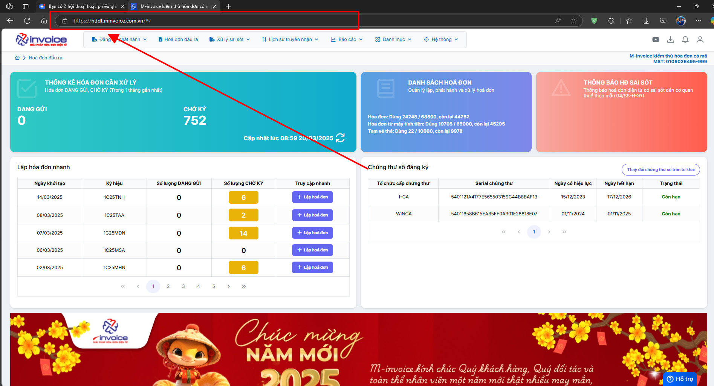

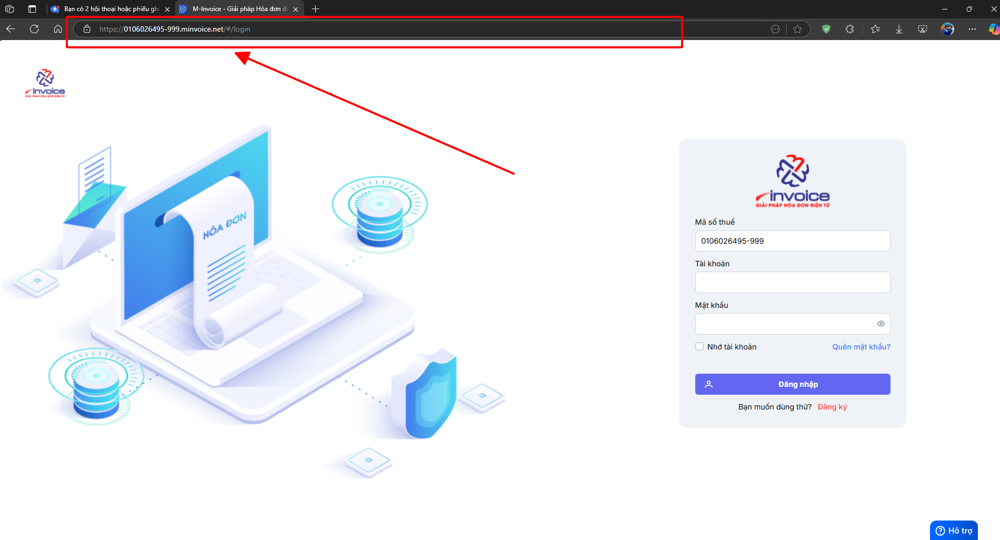

**1.1 Điền thông tin tài khoản để đăng nhập**

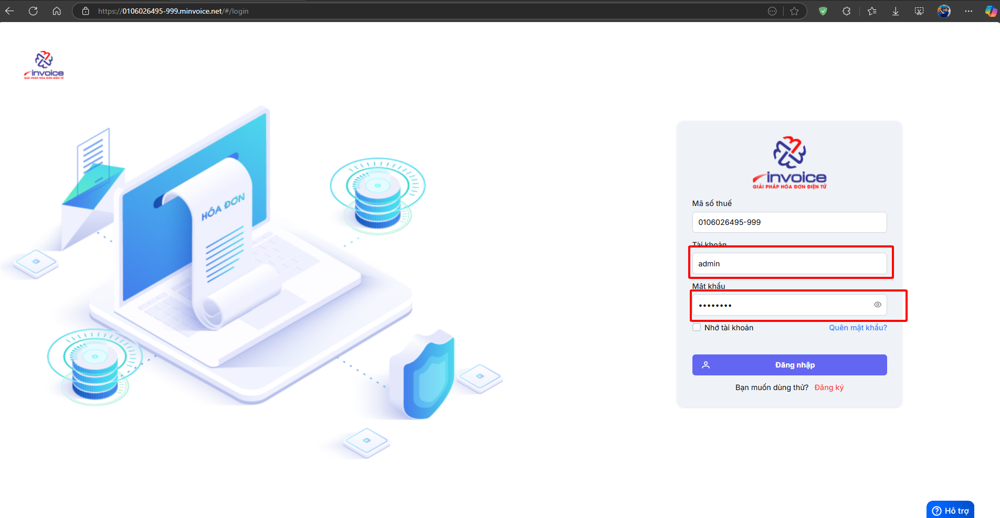

**Trường hợp quý khách quên mật khẩu thì có thể bấm vào QUÊN MẬT KHẨU để có thể lấy lại bằng 2 cách: email và chữ ký số**

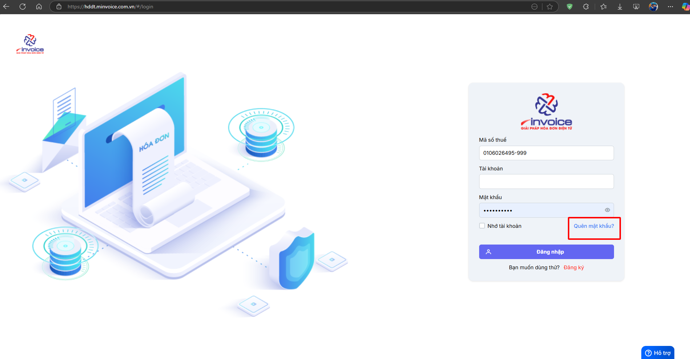

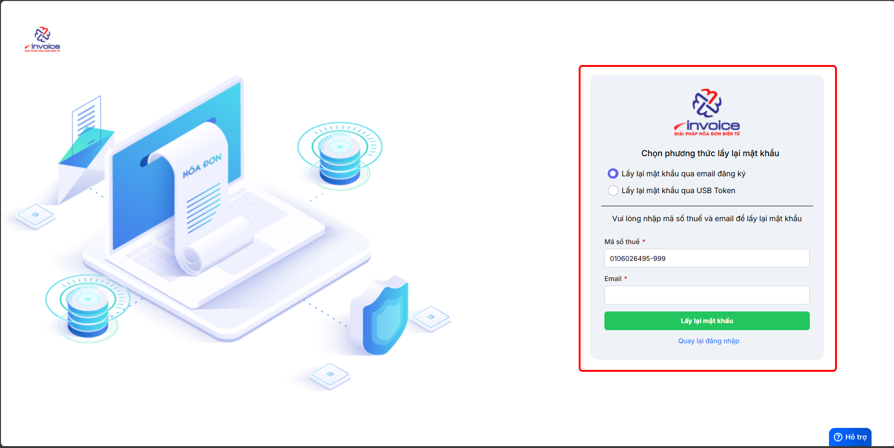

#### 2. Thông tin doanh nghiệp

**Kiểm tra các thông tin của doanh nghiệp của mình xem đã đúng hay chưa**

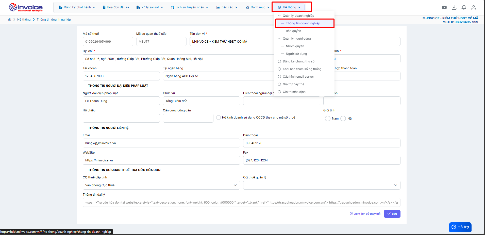

#### 3. Kí hiệu + mẫu hóa đơn.

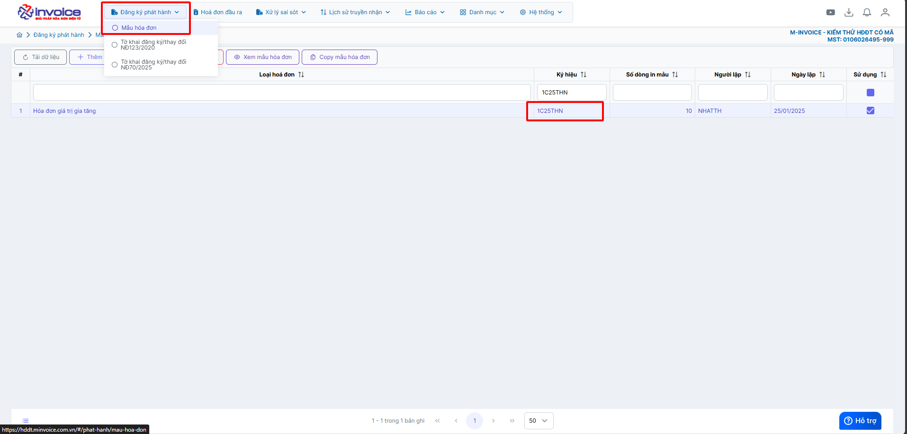

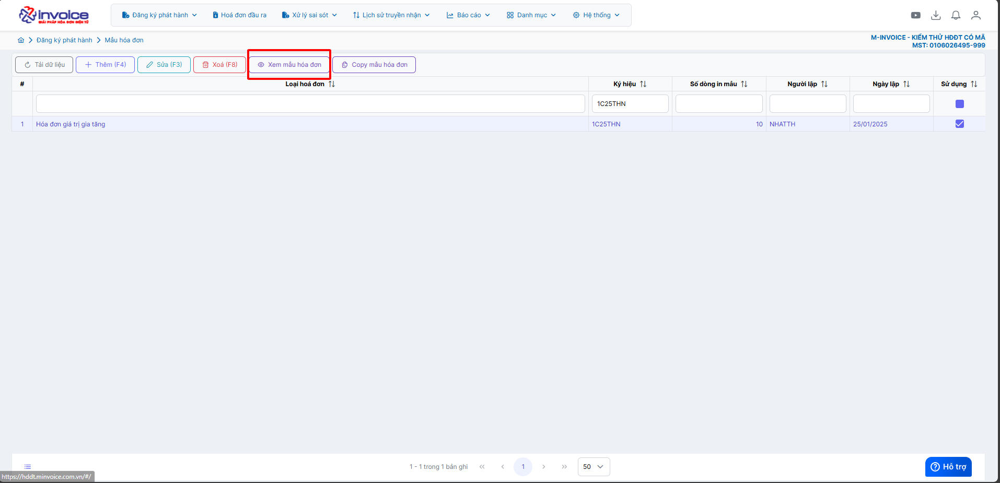

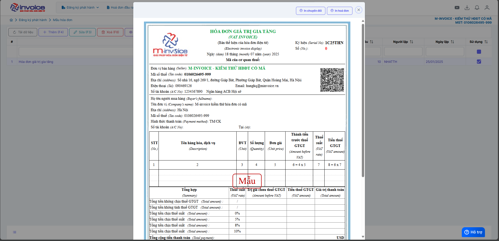

**Bấm sửa để có thể sửa mẫu hóa đơn**

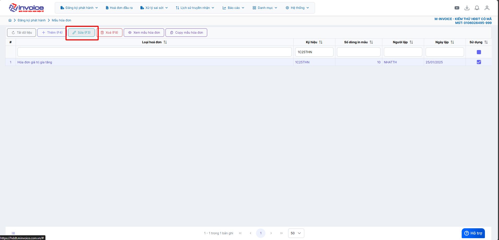

???+ Danger "Lưu ý"

    🖱️ **Click vào đây để xem hướng dẫn chỉnh sửa mẫu hóa đơn cho DN chi tiết:**

    📄 [Chỉnh sửa mẫu hóa đơn](../huong-dan/chinh-sua-mau-hoa-don.md#attribute-lists){ data-preview }

#### 4. Kiểm tra bản quyền

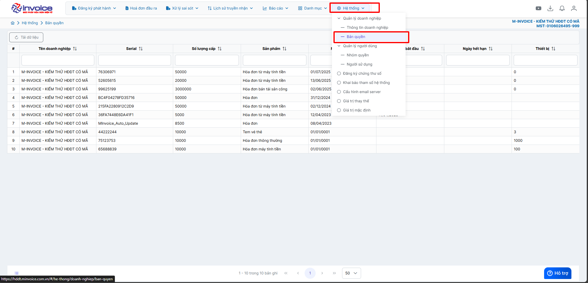

**Kiểm tra số lượng đã dùng**

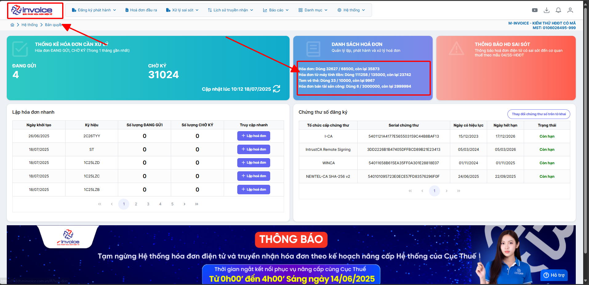

#### 5. Đổi mật khẩu (nếu cần)

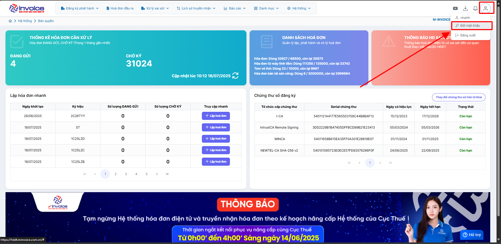

#### 6. Cài đặt công cụ ký hóa đơn

???+ Note "Ghi chú"

    Quý khách cần cài đặt công cụ cho các trường hợp sau đây

    - Lần đầu tiền sử dụng hóa đơn điện tử

    - Thực hiện ký hóa đơn bằng USB trên các thiêt bị khác

    - Sau khi cài đặt lại windows máy tính

**Bước 1: Nhấn vào biểu tượng cài đặt trên trang chủ giao diện**

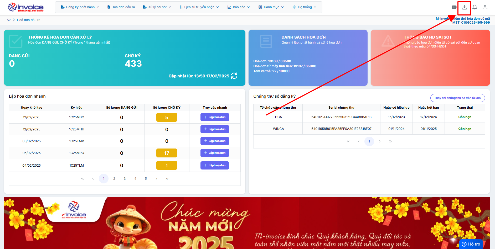

**Bước 2: Nhấn Save để tải bộ cài về**

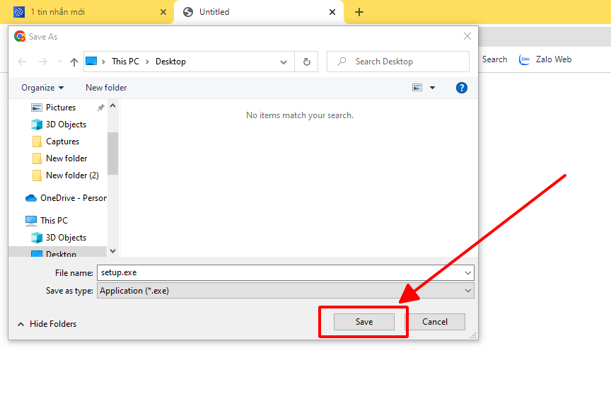

**Bước 3 : Mở bộ cài và cài đặt**

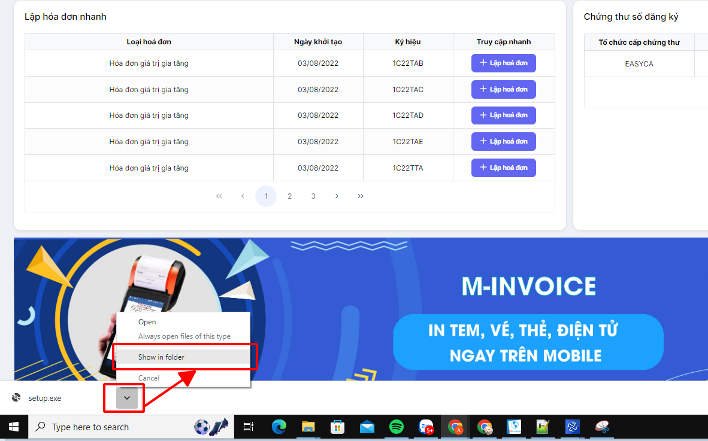

Chọn vào biểu tượng Plugin bên góc trái màn hình chọn **Show in folder**

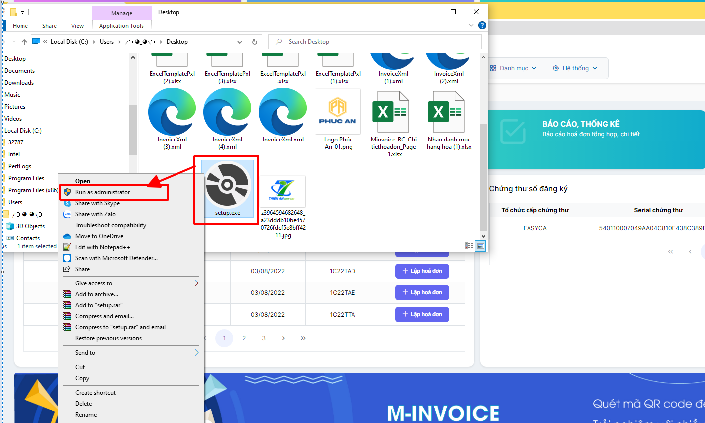

Để khi cài đặt Plugin luôn khởi động khi bật máy bạn chọn **Run as adminstrator**

Bạn chon **Install** để bắt đầu cài đặt

Bạn chờ cho bộ cài Dowload và tự động cài đặt là hoàn thành

**Bước 4 : Kiểm tra bộ cài đã được cài đặt thành công hay chưa**

Kích chuột trái vào mũi tên góc phải màn hình, nếu có biểu tượng **M-invoice Plugin Version 2.0** như thế là công cụ ký plugin đã cài đặt thành công

#### 7. Thêm cks và đăng ký/ thay đối tờ khai với CQT (bắt buộc để có thể xuất được hóa đơn)

???+ Danger "Lưu ý"

    🖱️ **Click vào đây để xem hướng dẫn thêm cks và đăng ký/ thay đối tờ khai với CQT**

    📄 [Thêm cks và nộp tờ khai](../huong-dan/dang-ky-thay-doi-to-khai-theo-ND70.md#attribute-lists){ data-preview }

#### 8. Hướng dẫn lập hóa đơn và ký gửi (sửa, xóa, sao chép hóa đơn)

???+ Danger "Lưu ý"

    🖱️ **Click vào đây để xem hướng dẫn lập hóa đơn và ký gửi**

    📄 [Hướng dẫn lập hóa đơn](../huong-dan/lap-va-phat-hanh-hoa-don.md#attribute-lists){ data-preview }

???+ info "Xin chân thành cảm ơn quý khách hàng đã tin dùng sản phẩm của M-Invoice"

    Có bất kỳ vướng mắc nào trong quá trình sử dụng hãy liên hệ với M-Invoice tại mục Hỗ trợ kỹ thuật góc phải bên dưới màn hình hoặc gọi tổng đài kỹ thuật của M-Invoice (1900.955.557 Nhánh 1)

Last updated on <strong>Aug 05, 2025</strong> by <strong>nhatth</strong>

