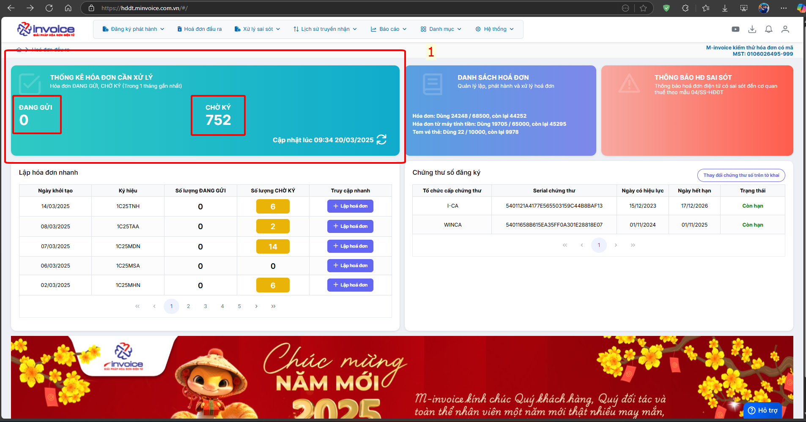
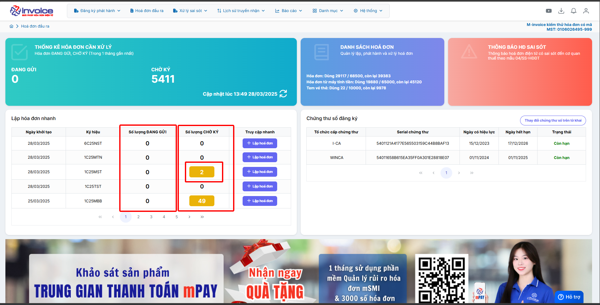
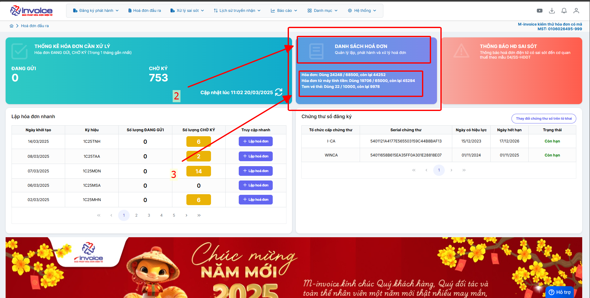
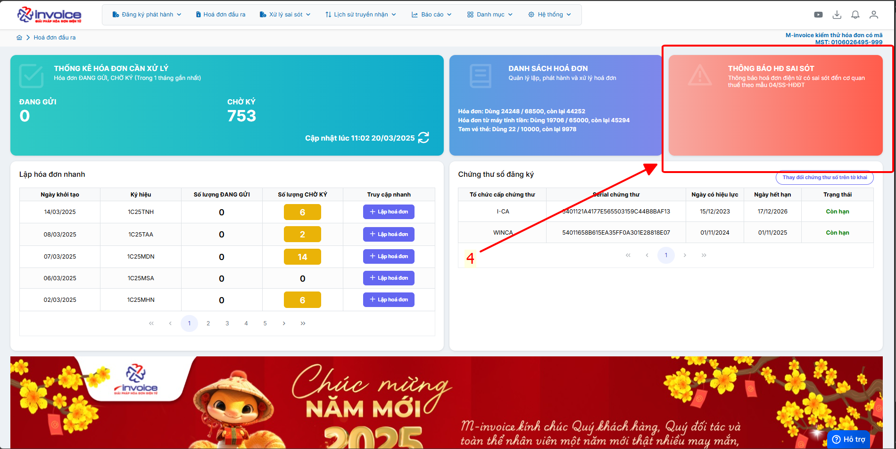
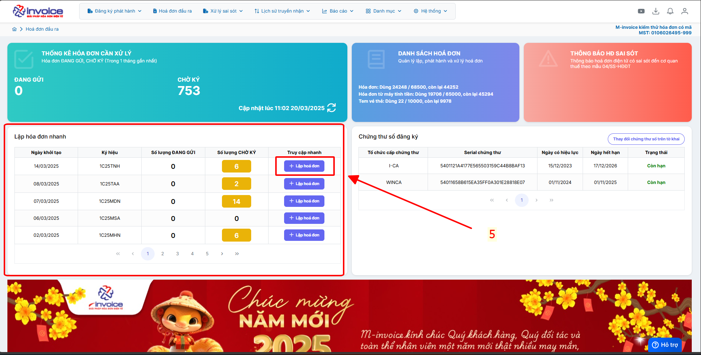
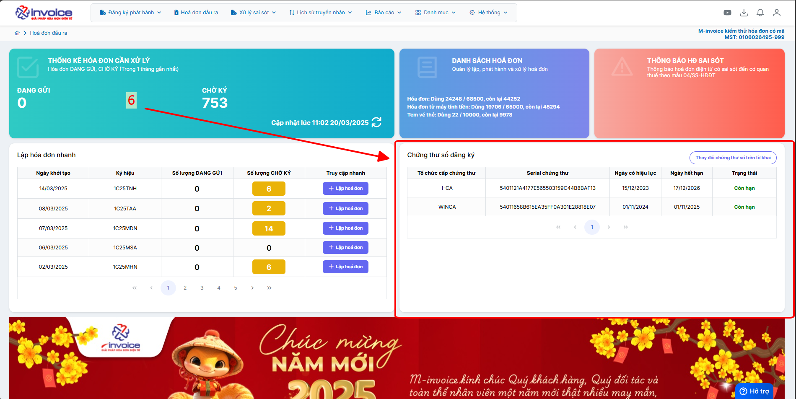

# **Dashboard 2.0**

## **Hướng dẫn truy cập nhanh trên trang chủ Dashboard**

???+ Note "Mục đích"

    Tổng quan tức thời: Hiển thị nhanh các hóa đơn cần xử lý (Đang gửi, Chờ ký, Đã ký) trong 1 tháng gần nhất

    Bản quyền số lượng hóa đơn đã dùng

    Danh sách hóa đơn thông báo 04ss

    Lập hóa đơn nhanh chóng trên ký hiệu sử dụng

    Danh sách chứng thư số đang dùng (ngày hiệu lực, thời gian hết hạn) để người dùng chủ động khi hết hạn chứng thư số

**Video giới thiệu về phần mềm hoá đơn điện tử M-invoice**

<iframe style="width: 43rem; height: 450px" src="https://www.youtube.com/embed/umLV8QLS9A4?si=Ov8UF3dCLRhXzkbf" title="YouTube video player" frameborder="0" allow="accelerometer; autoplay; clipboard-write; encrypted-media; gyroscope; picture-in-picture; web-share" referrerpolicy="strict-origin-when-cross-origin" allowfullscreen></iframe>

## **Tổng quát**

???+ Note "Số 1"

    **Xem các hoá đơn "chờ ký" và "đang gửi" trong 1 tháng gần nhất**

???+ Note "Số 2"

    **Quý khách hàng click vào sẽ ra danh sách hoá đơn**

???+ Note "Số 3"

    **Số lượng hoá đơn khách hàng đã dùng và số lượng còn lại**

???+ Note "Số 4"

    **Danh sách thông báo sai sót 04ss**

???+ Note "Số 5"

    **Bấm vào "lập hoá đơn" ở ký hiệu mới nhất để lập hoá đơn nhanh**

???+ Note "Số 6"

    **Danh sách chữ ký số đang dùng và trạng thái của chữ ký số**

    Trường hợp anh chị muốn thay đổi cks khi vừa thêm mới hoặc gia hạn thì có thể bấm vào **thay đổi chứng thư số trên tờ khai** hoặc
    xem chi tiết ở đây [Hướng dẫn thêm cks mới](them-cks-moi.md#attribute-lists){ data-preview }

???+ info "Xin chân thành cảm ơn quý khách hàng đã tin dùng sản phẩm của M-Invoice"

    Có bất kỳ vướng mắc nào trong quá trình sử dụng hãy liên hệ với M-Invoice tại mục Hỗ trợ kỹ thuật góc phải bên dưới màn hình hoặc gọi tổng đài kỹ thuật của M-Invoice (1900.955.557 Nhánh 1)

Last updated on <strong>Feb 02, 2026</strong> by <strong>NHATTH</strong>

