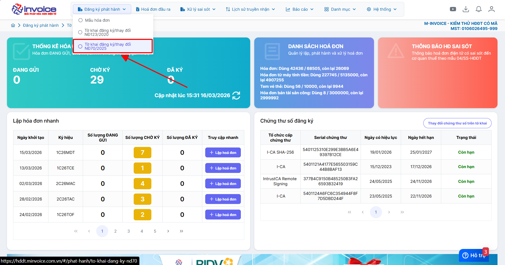
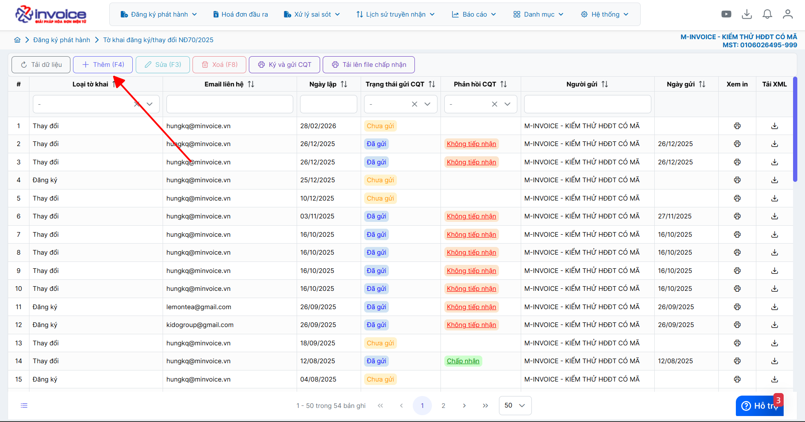
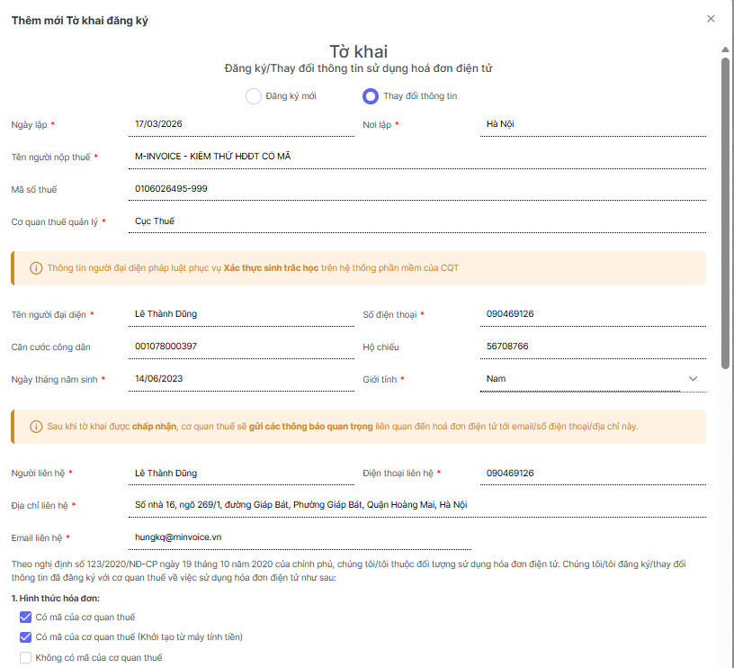
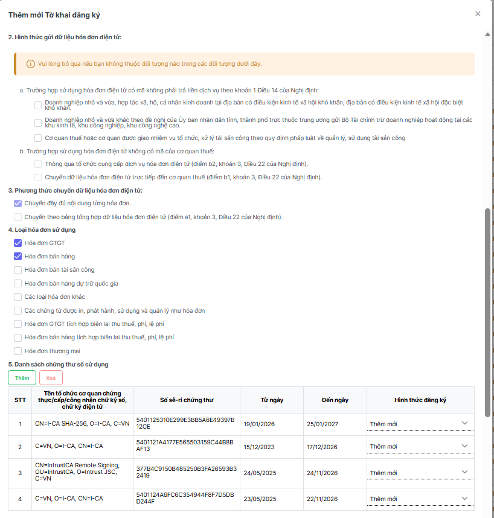
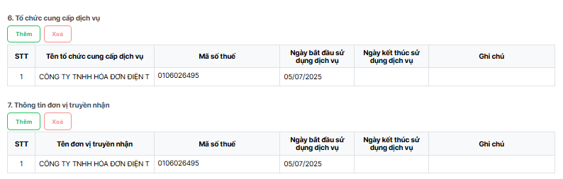
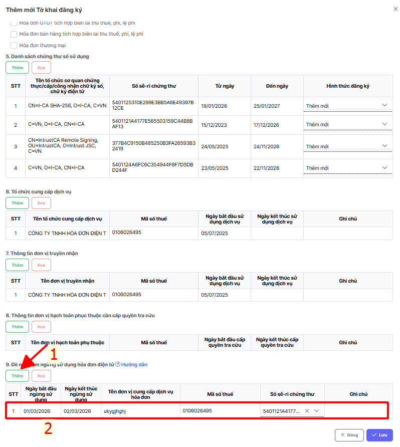

# **Hướng dẫn đề nghị tạm ngừng sử dụng hóa đơn điện tử**

???+ note "Mục đích"

    Khai báo các thông tin đăng ký tạm ngừng sử dụng hóa đơn điện tử khi:

    Doanh nghiệp tạm ngừng kinh doanh, giải thể hoặc theo yêu cầu của CQT

???+ warning "Lưu ý"

    Ngày bắt đầu và kết thúc ngừng sử dụng:
    
    - Hai thông tin này bắt buộc nhập

    - Ngày bắt đầu ngừng sử dụng phải lớn hơn ngày lập tờ khai
    
    - Ngày bắt đầu ngừng sử dụng phải nhỏ hơn ngày kết thúc ngừng sử dụng
    
    Nếu sử dụng nhiều phần mềm phát hành hóa đơn điện tử khác nhau, đơn vị cần khai báo đầy đủ thông tin của các tổ chức cung cấp dịch vụ đăng ký tạm ngừng sử dụng.

    Chỉ khai báo số sê-ri chứng thư số nếu đơn vị cần đăng ký tạm ngừng sử dụng cho 1 hoặc nhiều chứng thư số cụ thể. Trường hợp đăng ký ngừng sử dụng cho toàn bộ chứng thư số thì có thể để trống thông tin này.

### **Bước 1: Đăng ký phát hành >> Tờ khai đăng ký/thay đổi NĐ70/2025**

### **Bước 2: Chọn Tạo tờ khai (F4)**

### **Bước 3 : Điền đầy đủ các thông tin**

**- Thông tin người đại diện pháp luật**

**- Các thông tin quan trọng để cơ quan thuế sẽ gửi các thông báo quan trọng liên quan đến hoá đơn điện tử tới email/số điện thoại/địa chỉ này.**

  1. Hình thức hóa đơn

  2. Hình thức gửi dữ liệu hóa đơn điện tử

  3. Phương thức chuyển dữ liệu hóa đơn điện tử:

  4. Loại hóa đơn sử dụng

  5. Danh sách chứng thư số sử dụng

  6. Tổ chức cung cấp dịch vụ

  7. Thông tin đơn vị truyền nhận

Phần mềm sẽ mặc định lấy thông tin trên của tờ khai cũ (nếu có) -> Anh/Chị kiểm tra lại thông tin

### **Bước 4 : Điền thông tin ngừng sử dụng hóa đơn điện tử**

Kéo xuống **mục 9** -> **Thêm**

Điền các thông tin sau

Tên tổ chức cung cấp dịch vụ: tên của nhà cung cấp dịch vụ hóa đơn điện tử mà đơn vị hiện tại đang sử dụng,  Vd: M-invoice

Thời hạn sử dụng dịch vụ: 

  + **Từ ngày**: Ngày bắt đầu ngừng sử dụng phải lớn hơn ngày lập tờ khai (Ví dụ ngày lập tờ khai 13/3/2026 - thì sẽ phải điền từ ngày 14/3 trở lên)
  
  + **Đến ngày**: Ngày mà đơn vị kết thúc tạm ngừng sử dụng (đối với ngừng vĩnh viễn - đơn vị điền trên 10 năm)

  + **Số se-ri chứng thư**: Chỉ khai báo số sê-ri chứng thư số nếu đơn vị cần đăng ký tạm ngừng sử dụng cho một hoặc nhiều chứng thư số cụ thể. Trường hợp đăng ký ngừng sử dụng cho toàn bộ chứng thư số thì có thể để trống thông tin này.

### **Bước 5 : Lưu và ký gửi CQT**

???+ info "Xin chân thành cảm ơn quý khách hàng đã tin dùng sản phẩm của M-Invoice"

    Có bất kỳ vướng mắc nào trong quá trình sử dụng hãy liên hệ với M-Invoice tại mục Hỗ trợ kỹ thuật góc phải bên dưới màn hình hoặc gọi tổng đài kỹ thuật của M-Invoice (1900.955.557 Nhánh 1)

Last updated on <strong>Mar 17, 2026</strong> by <strong>NHATTH</strong>

