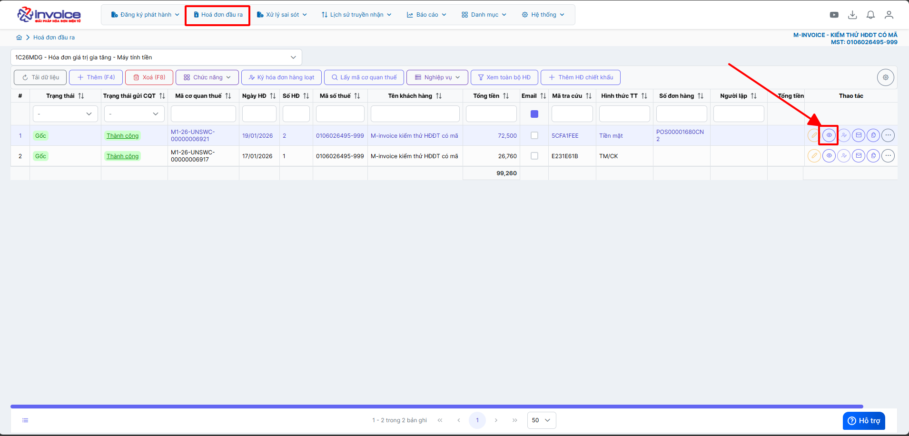
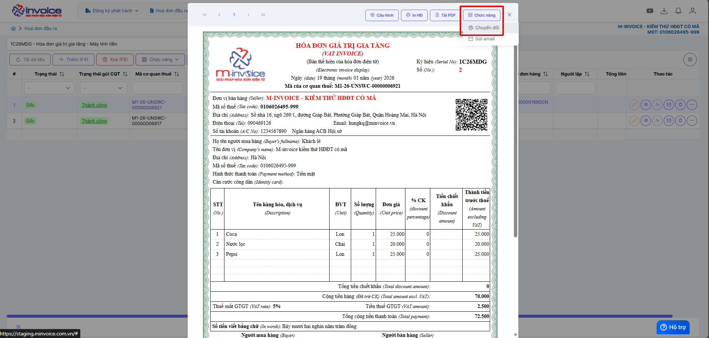
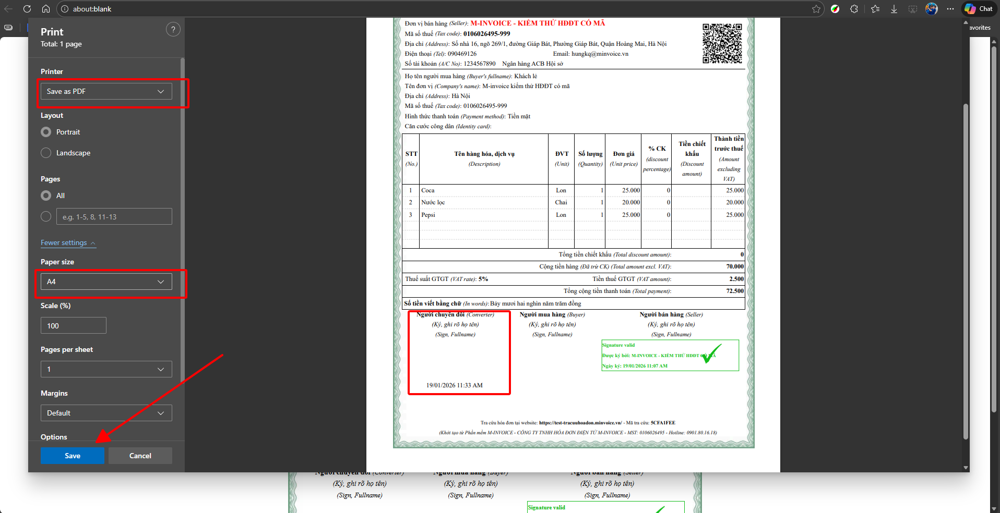

# **In chuyển đổi hóa đơn (hóa đơn giấy)**

???+ Note "Ghi chú"

    Bản in chuyển đổi (loại giấy) thường dùng để:

    📦 Kèm theo hàng hóa khi vận chuyển

    📁 Lưu hồ sơ kế toán nội bộ

    🤝 Đối chiếu, tham khảo cho khách hàng

    🧾 Trình bày khi kiểm tra nội bộ

### **Bước 1: Ở màn hình trang chủ bạn truy cập vào Hóa đơn đầu ra -> Xem in hóa đơn cần chuyển đổi**

**Chọn hình mắt để xem in**

### **Bước 2: Chọn mục Chức năng -> Chuyển đổi**

### **Bước 3: Chọn các thông số cần thiết và bấm Save as PDF để tải PDF về**

???+ info "Xin chân thành cảm ơn quý khách hàng đã tin dùng sản phẩm của M-Invoice"

    Có bất kỳ vướng mắc nào trong quá trình sử dụng hãy liên hệ với M-Invoice tại mục Hỗ trợ kỹ thuật góc phải bên dưới màn hình hoặc gọi tổng đài kỹ thuật của M-Invoice (1900.955.557 Nhánh 1)

Last updated on <strong>Jan 19, 2025</strong> by <strong>nhatth</strong>

