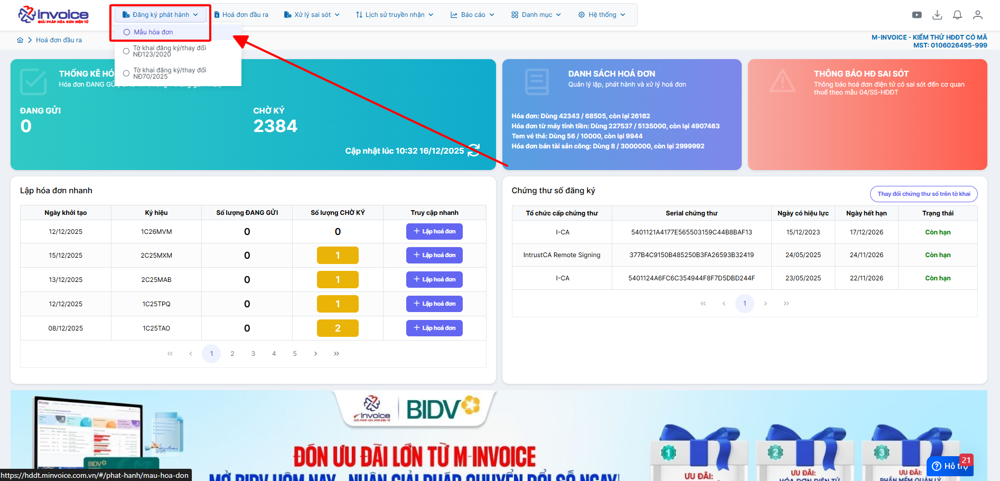
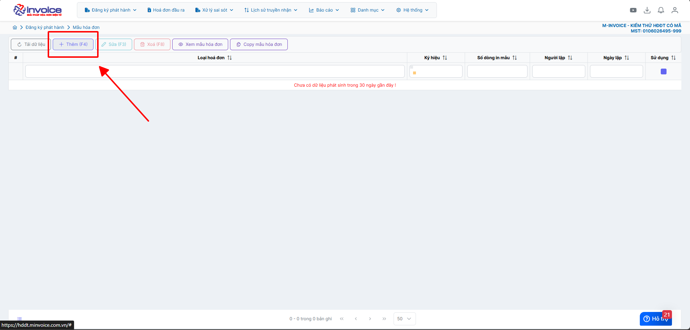
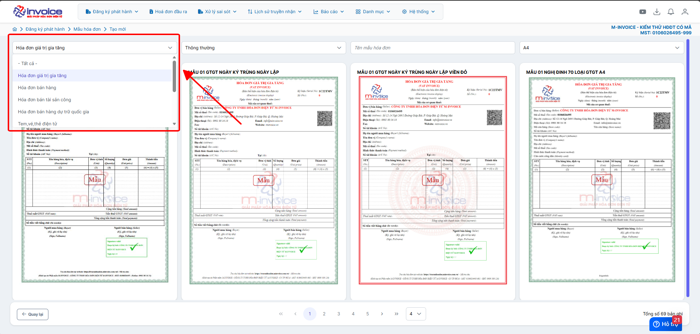
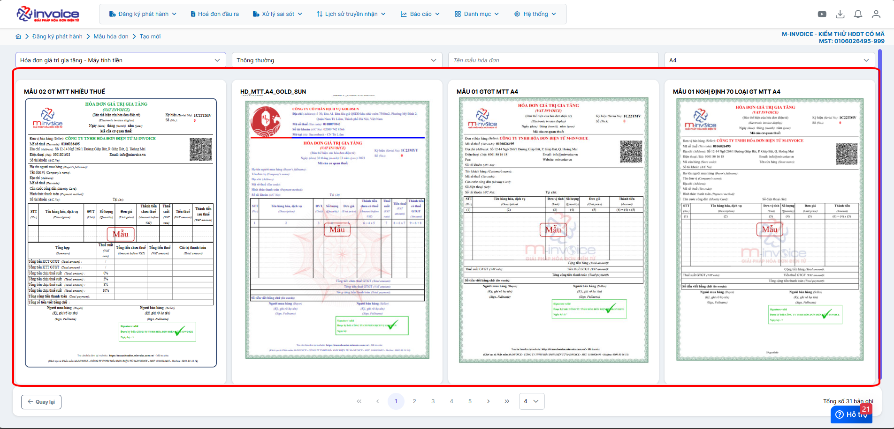
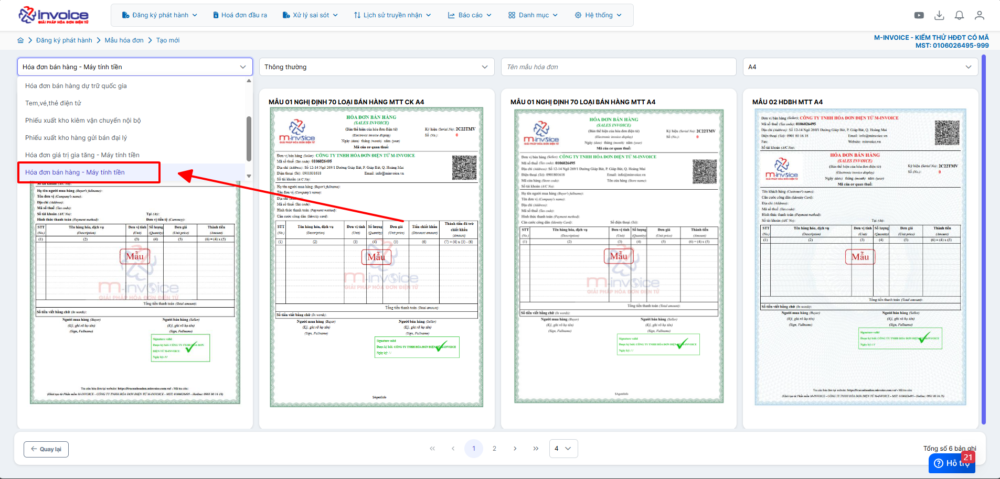
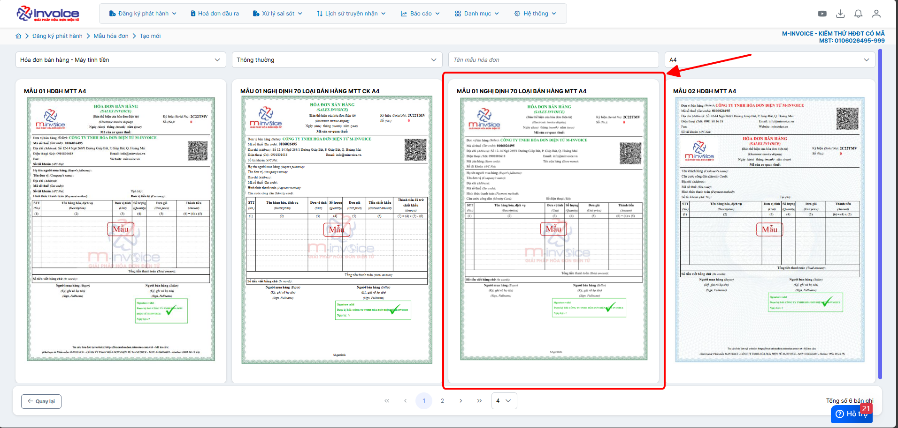
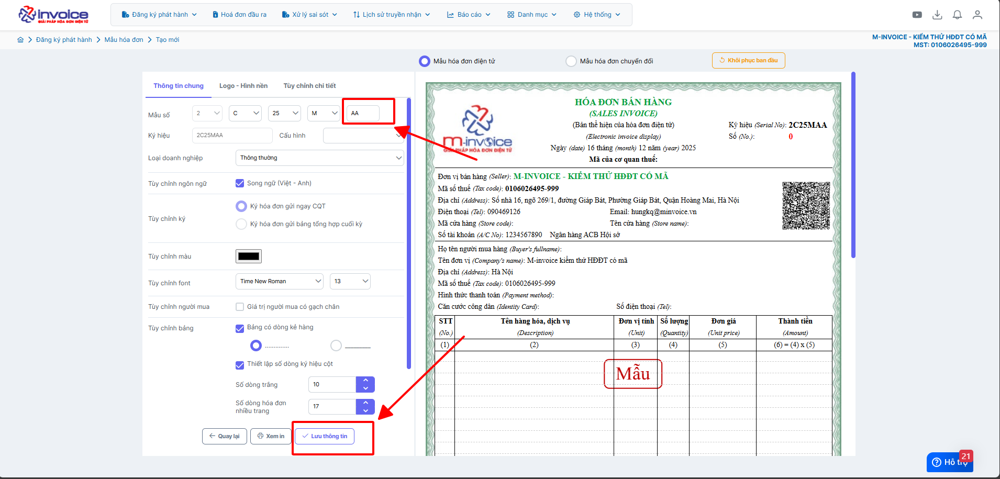

# **Tạo ký hiệu mới theo loại hóa đơn sử dụng**

???+ Note "Mục đích"

    1. Tạo ký hiệu theo loại hóa đơn muốn sử dụng
    2. Muốn tạo thêm ký hiệu hóa đơn để sử dụng

## **Hướng dẫn tạo ký hiệu mới theo loại hóa đơn sử dụng**

???+ Note "Căn cứ"

    Nghị định Nghị định 123/2020/NĐ-CP, Thông tư 32/2025/TT-BTC về HĐĐT đã ban hành một số quy định mới về hình thức hóa đơn sử dụng, mẫu số hóa đơn và ký hiệu hóa đơn.

    ??? Info "Quy định về ký hiệu, mẫu số hóa đơn điện tử"

        ## Quy định về ký hiệu, mẫu số hóa đơn điện tử
        Căn cứ theo điểm a, khoản 1, Điều 5 Thông tư 32/2025/TT-BTC có quy định ký hiệu mẫu số hóa đơn điện tử là ký tự có một chữ số tự nhiên là các số tự nhiên từ 1 đến 9, thể hiện loại hóa đơn điện tử. Cụ thể:

        | Số | Nội dung phản ánh |
        |---:|------------------|
        | 1 | Hóa đơn điện tử giá trị gia tăng |
        | 2 | Hóa đơn điện tử bán hàng |
        | 3 | Hóa đơn điện tử bán tài sản công |
        | 4 | Hóa đơn điện tử bán hàng dự trữ quốc gia |
        | 5 | Hóa đơn điện tử khác là tem điện tử, vé điện tử, thẻ điện tử, phiếu thu điện tử hoặc các chứng từ điện tử có tên gọi khác nhưng có nội dung của hóa đơn điện tử theo quy định tại Nghị định số 123/2020/NĐ-CP |
        | 6 | Chứng từ điện tử được sử dụng và quản lý như hóa đơn gồm phiếu xuất kho kiêm vận chuyển nội bộ điện tử, phiếu xuất kho hàng gửi bán đại lý điện tử |
        | 7 | Hóa đơn thương mại điện tử |
        | 8 | Hóa đơn giá trị gia tăng tích hợp biên lai thu thuế, phí, lệ phí |
        | 9 | Hóa đơn bán hàng tích hợp biên lai thu thuế, phí, lệ phí |

        **Ký hiệu hóa đơn điện tử**

        Căn cứ theo **điểm b, khoản 1, Điều 5 Thông tư 32/2025/TT-BTC** có quy định ký hiệu hóa đơn điện tử gồm **6 ký tự (chữ và số)**, thể hiện loại hóa đơn, năm lập và hình thức có mã hoặc không mã của cơ quan thuế. Cụ thể:

        **Ký tự đầu (1 chữ cái)**:

        **C:** Hóa đơn có mã của cơ quan thuế

        **K:** Hóa đơn không có mã của cơ quan thuế

        **Hai ký tự tiếp (2 chữ số)**: Thể hiện năm lập hóa đơn (2 số cuối năm dương lịch). Ví dụ: 2025 → 25

        **Ký tự thứ 4 (1 chữ cái)**: Thể hiện loại hóa đơn điện tử sử dụng:

        **T:** Hóa đơn Doanh nghiệp, tổ chức, hộ, cá nhân kinh doanh đăng ký sử dụng;

        **D:** Hóa đơn tài sản công và hóa đơn bán hàng dự trữ quốc gia hoặc hóa đơn điện tử đặc thù không nhất thiết phải có một số tiêu thức do các doanh nghiệp, tổ chức đăng ký sử dụng;

        **L:** Hóa đơn Cơ quan thuế cấp theo từng lần phát sinh;

        **M:** Hóa đơn khởi tạo từ máy tính tiền;

        **N:** Phiếu xuất kho kiêm vận chuyển nội bộ;

        **B:** Phiếu xuất kho gửi bán đại lý điện;

        **G:** Tem, vé, thẻ điện tử là hóa đơn GTGT;

        **H:** Tem, vé, thẻ điện tử là hóa đơn bán hàng;

        **X:** Hóa đơn thương mại điện tử;

        **ký tự cuối (2 chữ cái):** Do người bán tự xác định để quản lý mẫu hóa đơn. Nếu không có nhu cầu quản lý → dùng mặc định “YY”
        Tại bản thể hiện, ký hiệu hóa đơn điện tử và ký hiệu mẫu số hóa đơn điện tử được thể hiện ở phía trên bên phải của hóa đơn (hoặc ở vị trí dễ nhận biết);

        Như vậy, theo quy định tại **Thông tư 32/2025/TT-BTC** thì bản thể hiện, ký hiệu hóa đơn điện tử và ký hiệu mẫu số hóa đơn điện tử được thể hiện chung bằng 1 chuỗi bao gồm 7 ký tự. Trong đó, ký tự đầu tiên thể hiện ký hiệu mẫu số hóa đơn, 6 ký hiệu tiếp theo thể hiện ký hiệu hóa đơn điện tử.

        Ví dụ thể hiện các ký tự của ký hiệu mẫu hóa đơn điện tử và ký hiệu hóa đơn điện tử theo Thông tư 32/2025/TT-BTC:

        | Ký hiệu, mẫu số hóa đơn điện tử | Ý nghĩa |
        |-------------------------------|---------|
        | **1C25TAA** | Hóa đơn giá trị gia tăng có mã của cơ quan thuế được lập năm 2025 và là hóa đơn điện tử do doanh nghiệp, tổ chức đăng ký sử dụng với cơ quan thuế |
        | **1C25MAA** | Hóa đơn giá trị gia tăng máy tính tiền được lập năm 2025 và là hóa đơn điện tử do doanh nghiệp, tổ chức đăng ký sử dụng với cơ quan thuế |
        | **2C25TBB** | Hóa đơn bán hàng có mã của cơ quan thuế được lập năm 2025 và là hóa đơn điện tử do doanh nghiệp, tổ chức, hộ cá nhân kinh doanh đăng ký sử dụng với cơ quan thuế |
         **2C25MBB** | Hóa đơn bán hàng máy tính tiền được lập năm 2025 và là hóa đơn điện tử do doanh nghiệp, tổ chức, hộ cá nhân kinh doanh đăng ký sử dụng với cơ quan thuế |
        | **1C25LBB** | Hóa đơn giá trị gia tăng có mã của cơ quan thuế được lập năm 2025 và là hóa đơn điện tử của cơ quan thuế cấp theo từng lần phát sinh |
        | **1K25TYY** | Hóa đơn giá trị gia tăng loại không có mã được lập năm 2025 và là hóa đơn điện tử do doanh nghiệp, tổ chức đăng ký sử dụng với cơ quan thuế |
        | **1K25DAA** | Hóa đơn giá trị gia tăng loại không có mã được lập năm 2025 và là hóa đơn điện tử đặc thù không nhất thiết phải có một số tiêu thức bắt buộc do các doanh nghiệp, tổ chức đăng ký sử dụng |
        | **6K25NAB** | Phiếu xuất kho kiêm vận chuyển nội bộ điện tử loại không có mã được lập năm 2025 do doanh nghiệp đăng ký với cơ quan thuế |
        | **6K25BAB** | Phiếu xuất kho hàng gửi bán đại lý điện tử loại không có mã được lập năm 2025 do doanh nghiệp đăng ký với cơ quan thuế |
        | **7K25XAB** | Hóa đơn thương mại điện tử được lập năm 2025 do doanh nghiệp đăng ký với cơ quan thuế |

## **Tạo mẫu hóa đơn theo loại hóa đơn sử dụng trên phần mềm M-invoice**

### **Bước 1: Truy cập Đăng ký phát hành -> Mẫu hóa đơn**

Bấm **Thêm**

### **Bước 2: Chọn mẫu hóa đơn mà DN đã đăng ký với CQT**

Ở đây **M-invoice** đã có sẵn các mẫu hóa đơn để anh chị có thể chọn lựa theo phong cách của DN mình

### **Bước 3: Chọn loại hóa đơn và tạo ký hiệu kèm mẫu**

???+ Example "Ví dụ"

    Ở hướng dẫn này M-invoice sẽ ví dụ tạo ký hiệu **Hóa đơn bán hàng - máy tính tiền**

    Ví dụ ký hiệu: **2C25MAA**

Tích chọn **Hóa đơn bán hàng - máy tính tiền**

Chọn mẫu theo NĐ70 để có CCCD, Mã ĐVQNHS, Số hộ chiếu

Điền 2 ký tự cuối do người bán tự xác định -> **Lưu thông tin** như vậy anh chị đã tạo ký hiệu thành công

??? danger "Trường hợp lưu thành công nhưng không thấy hiện ký hiệu ở "Hóa đơn đầu ra""

    ### Trường hợp lưu thành công nhưng không thấy hiện ký hiệu ở "Hóa đơn đầu ra"

    Truy câp **hệ thống - người sử dụng**

    

    Bấm vào tài khoản đang sử sụng -> Phân quyền

    

    Tích chọn vào ký hiệu vừa tạo  -> Bấm Lưu

    

    Load lại trang và truy cập mục Hóa đơn đầu ra để thấy ký hiệu vừa tạo

???+ info "Xin chân thành cảm ơn quý khách hàng đã tin dùng sản phẩm của M-Invoice"

    Có bất kỳ vướng mắc nào trong quá trình sử dụng hãy liên hệ với M-Invoice tại mục Hỗ trợ kỹ thuật góc phải bên dưới màn hình hoặc gọi tổng đài kỹ thuật của M-Invoice (1900.955.557 Nhánh 1)

Last updated on <strong>Jan 19, 2025</strong> by <strong>nhatth</strong>

