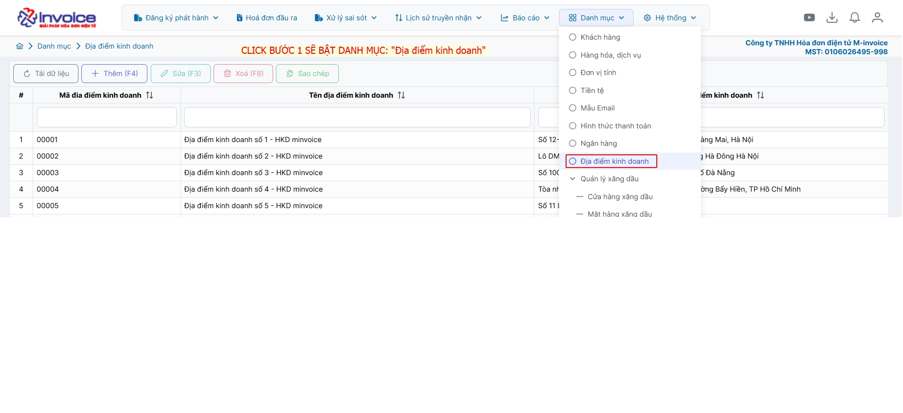
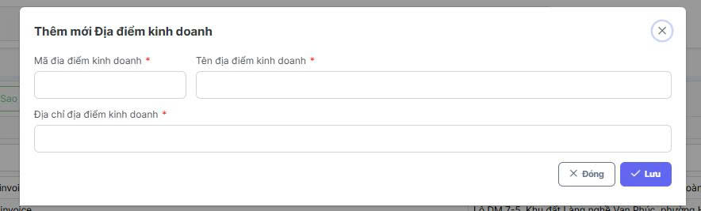
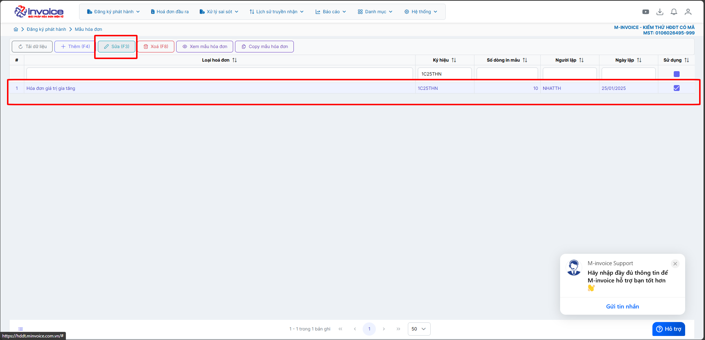
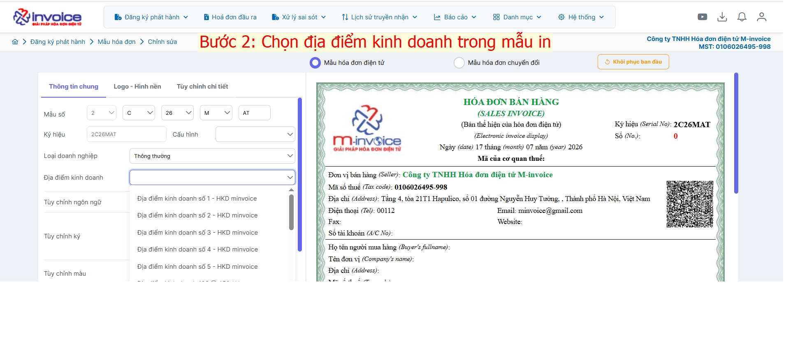
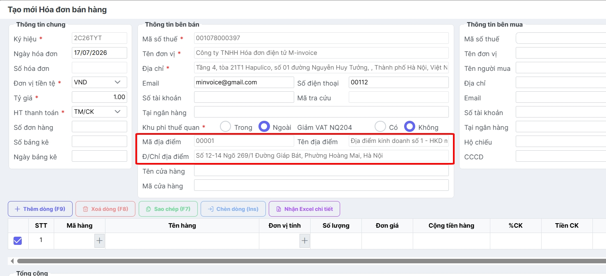

# **Hướng dẫn khai báo địa điểm kinh doanh**

Dưới đây là những hướng dẫn thao tác cơ bản trên phần mềm hóa đơn điện tử M-Invoice ở phiên bản 2.0 vô cùng mạch lạc và dễ hiểu.

## **Hướng dẫn khai báo địa điểm kinh doanh**

???+ Note "Mục đích"

    Theo khoản 2 Điều 1 Nghị định 141/2026/NĐ-CP (có hiệu lực từ 20/05/2026): rường hợp hộ kinh doanh, cá nhân kinh doanh có nhiều địa điểm kinh doanh thì sử dụng mã số thuế của hộ kinh doanh, cá nhân kinh doanh cho tất cả các cửa hàng và phải ghi rõ mã địa điểm kinh doanh trên hóa đơn.

Hướng dẫn chi tiết để khách hàng có thể khai báo địa điểm kinh doanh 

### **Bước 1: Vào danh mục --> Địa điểm kinh doanh**

### **Bước 2: Nhập thông tin địa điểm kinh doanh của người dùng => Bấm lưu**

### **Bước 3: Chọn Đăng ký phát hành => Mẫu hóa đơn**

### **Bước 4: Chọn mẫu hóa đơn đang và muốn sử dụng => Bấm Sửa**

### **Bước 5: Chọn Địa điểm kinh doanh trong mẫu in => Bấm lưu**

### **Bước 6: Quay lại hóa đơn đầu ra để kiểm tra lại thông tin nhập liệu**

Như vậy bạn đã hoàn thành việc khai báo địa điểm kinh doanh trên hóa đơn

???+ info "Xin chân thành cảm ơn quý khách hàng đã tin dùng sản phẩm của M-Invoice"

    Có bất kỳ vướng mắc nào trong quá trình sử dụng hãy liên hệ với M-Invoice tại mục Hỗ trợ kỹ thuật góc phải bên dưới màn hình hoặc gọi tổng đài kỹ thuật của M-Invoice (1900.955.557 Nhánh 1)

Last updated on <strong>Jun 5, 2025</strong> by <strong>nhatth</strong>

