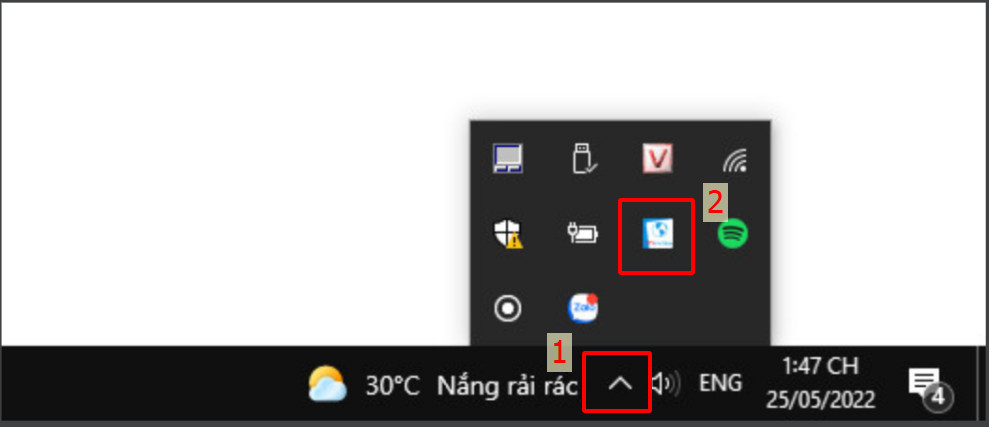
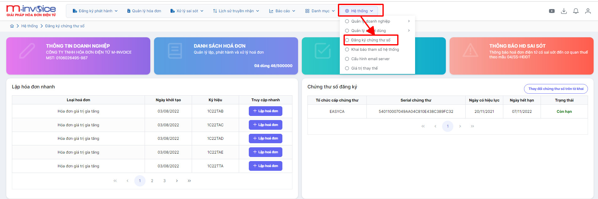
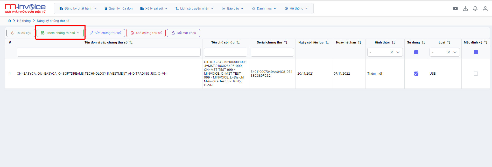
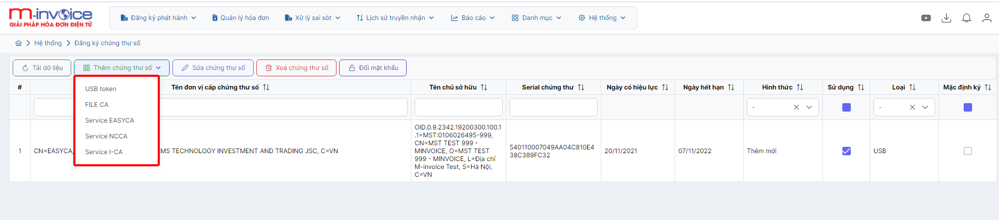
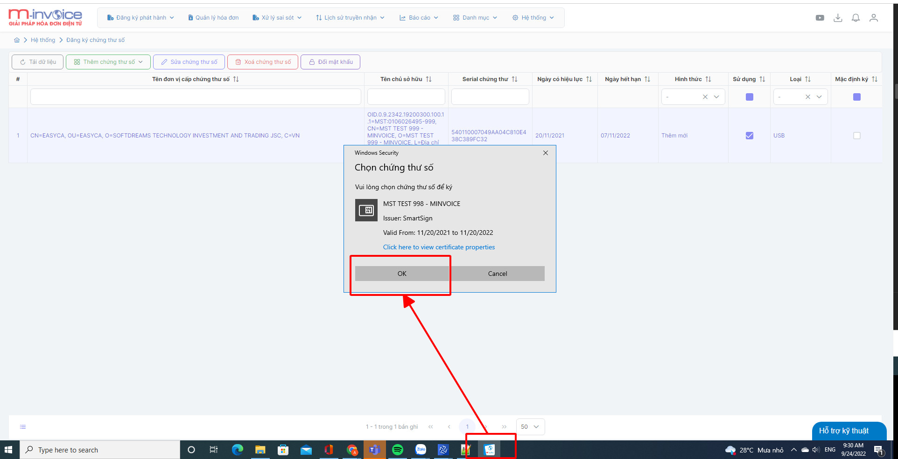
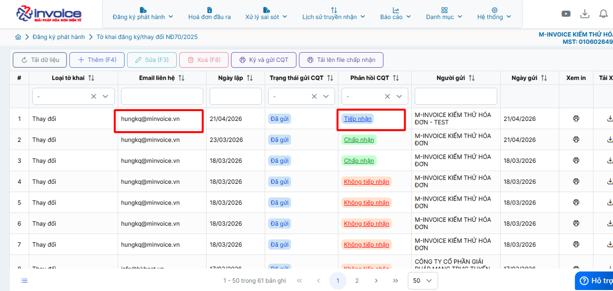
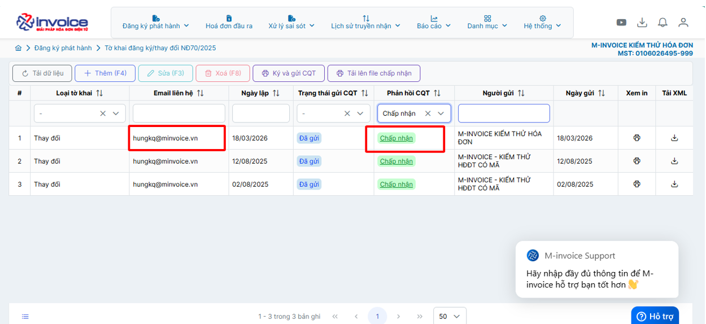
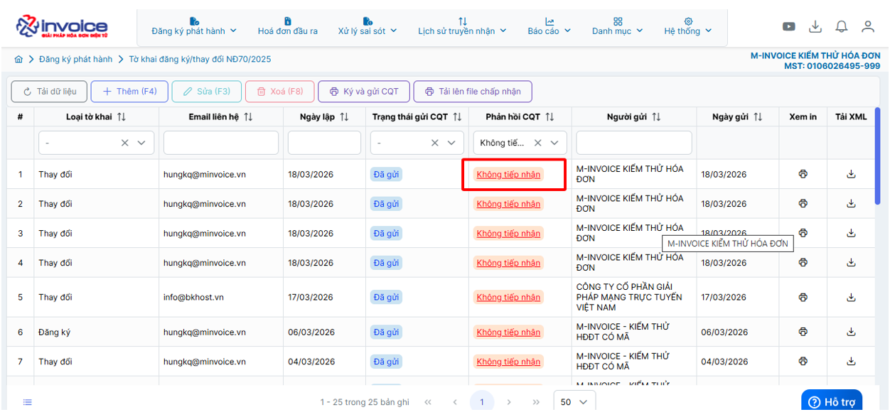
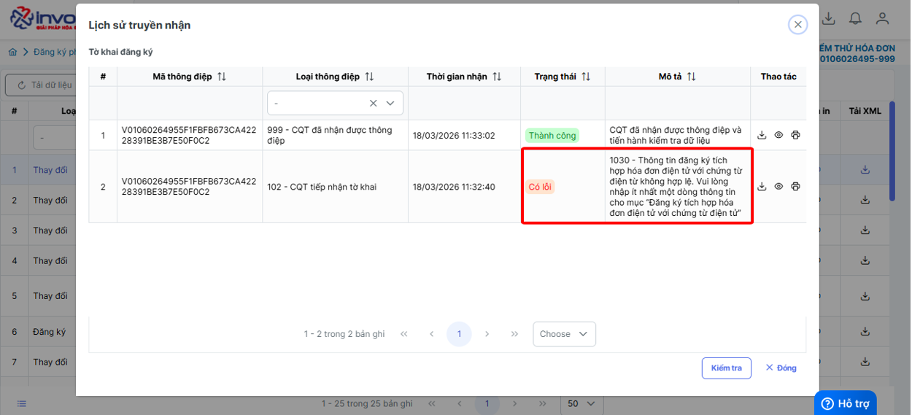

# **Thay đổi chữ ký số (CKS) hoặc thêm chữ ký số (CKS) mới vào phần mềm theo NĐ70**

## **Hướng dẫn Thay đổi CKS hoặc thêm CKS mới vào phần mềm và nộp tờ khai theo NĐ70 đáp ứng xác thực sinh trắc học của Cục Thuế**

<iframe style="width: 50rem; height: 480px" src="https://www.youtube.com/embed/10tfqMP7Zec?si=rL1BMWD5zb82nF6b" title="YouTube video player" frameborder="0" allow="accelerometer; autoplay; clipboard-write; encrypted-media; gyroscope; picture-in-picture; web-share" referrerpolicy="strict-origin-when-cross-origin" allowfullscreen></iframe>

???+ warning "Lưu ý: cần phải làm xác thực sinh trắc học sau khi nộp tờ khai thay đổi với CQT"

    **Từ Nghị định 70/2025/NĐ-CP phải xác thực sinh trắc học khi đăng ký/thay đổi thông tin sử dụng hóa đơn điện tử** <strong>(trường hợp CQT duyệt trạng thái `Chấp nhận` luôn thì bỏ quả bước này)</strong>

    
<strong>❌ Lưu ý:</strong> 
    Nếu sau <strong>24h</strong> mà NNT <strong>không xác thực</strong> hoặc xác thực <strong>không thành công</strong>, <strong>tờ khai sẽ bị hủy</strong>.

    
<strong>👉 Để tránh gián đoạn</strong> trong quá trình sử dụng hóa đơn điện tử, NNT cần <strong>chủ động xác thực ngay sau khi gửi tờ khai!</strong>

    🖱️ **Click vào đây để xem:**
    📄 [Xác thực sinh trắc học trên eTax Mobile](https://youtu.be/JZ8b6bfL0aM?si=Dr6Rrhc7yF5qjsWf){ target=_blank }

**Hướng dẫn sử dụng bằng hình ảnh nếu Quý khách không xem được video**

### **Bước 1: Cắm CKS vào máy tính, kiểm tra xem plugin đã được bật chưa (nếu đang ký được hóa đơn thì bỏ qua bước này)**

!!! note ""

    Click vào biểu tượng **HIDE** (hay dẫu mũi tên chỉ lên) (1) nếu có biểu tượng Plugin của Minvoice như thế plugin đã bật thành công

    Nếu chưa, bạn chỉ cần gõ vào ô tìm kiếm của window ( window + S) tìm kiếm **Minvoice - Plugin Version 2.0** rồi bật  lên là được.

### **Bước 2: Thêm CKS vào phần mềm hóa đơn**

Các bạn vào **Hệ thông --> Đăng ký chữ ký số --> Thêm chứng thư số**

Click vào loại **CKS** đúng còn hạn của DN

Ở thanh Taskbar sẽ hiển thị lên biểu tượng của công cụ **Plugin Minvoice** các bạn chọn vào đó để thêm **CKS** mới của mình

??? Bug "Các lỗi thường gặp khi thực hiện nộp thay đổi tờ khai thay đổi chữ ký số"

    **<strong style="color: red;">Trường hợp 1:</strong> Máy tính LAPTOP, PC chưa nhận chữ ký số**

    **<strong style="color: red;">Trường hợp 2:</strong> Plugin chưa được bật** phút `1:49` trong video

    **<strong style="color: red;">Trường hợp 3:</strong> Lỗi không hiển thị chữ ký số mặc dù đã thêm chữ ký số lên phần mềm. <strong style="color: red;">(Số serialNumber chứng thư số đã tồn tại trên phần mềm)</strong>** phút `2:32` trong video

    <iframe style="width: 50rem; height: 580px" src="https://www.youtube.com/embed/hLoBmZ3_EOs?si=Wm401Ibp2RWLLxqZ" title="YouTube video player" frameborder="0" allow="accelerometer; autoplay; clipboard-write; encrypted-media; gyroscope; picture-in-picture; web-share" referrerpolicy="strict-origin-when-cross-origin" allowfullscreen></iframe>

### **Bước 3 : Làm tờ khai 01**

Các bạn vào phần **Đăng ký phát hành >> Tờ khai đăng ký/thay đổi NĐ70/2025 >> Thêm (F4)**

!!! note ""

    Ở phần **Đăng ký/Thay đổi thông tin sử dụng hóa đơn điện tử**

    + Chọn **Đăng ký mới** nếu bạn chưa từng sử dụng hóa đơn theo nghị định 123 (Hóa đơn có mã của CQT)

    + Chọn **Thay đổi** thông tin nếu bạn muốn thay đổi địa chỉ, tên doanh nghiệp, hay thêm CKS mới vào phần mềm

???+ note "Thông tin người đại diện pháp luật"

    Ở phần này các bạn điền đẩy đủ các phần như sau

    **Tên người đại diện**: tên giám đốc

    **Đia chỉ liên hệ** : địa chỉ công ty

    **Số điện thoại** : số điện thoại

    **Căn cước công dân**

    **Hộ chiếu**

???+ note "Thông tin người nhận các thông báo quan trọng liên quan đến hóa đơn điện tử (trường sẽ là thông tin của kế toán, kế toán trưởng)"

    Ở phần này các bạn điền đẩy đủ các phần như sau

    **Người liên hệ**: tên kế toán, ...

    **Đia chỉ liên hệ** : địa chỉ nhận thông báo nếu có

    **điện thoại liên hệ** : số điện thoại nhận thông báo

    **Email liên hệ**: mail nhận thông báo từ thuế

1,2,3,4,Các bạn tích chọn vào các loại hóa đơn phù hợp với hình thức doanh nghiệp mình sử dụng

5, chọn **Thêm** để thêm cks hay để Add CKS mới thay đổi vào tờ khai **nếu có rồi thì k cần làm bước này**

6, Thông tin tổ chức chức cung cấp dịch vụ và truyền nhận (sẽ mặc định là: CÔNG TY TNHH HÓA ĐƠN ĐIỆN TỬ M-INVOICE)

7, Sau khi add xong CKS, quý khách nhấn Lưu để **lưu** lại dữ liệu tờ khai 01 này

### **Bước 4 : Sau khi hoàn thành, các bạn chọn tờ khai mình vừa lập chọn Ký và gửi CQT**

??? Abstract "Các trạng thái của tờ khai"

    **Các trạng thái của tờ khai**
    ???+ info "Tiếp nhận"
        
        Đối với tờ khai đang ở trạng thái “tiếp nhận” ,anh chị truy cập etaxmobile bằng thông tin người đại diện để xác thực OTP, cụ thể anh chị xem chi tiết tại **Bước 5** dưới đây

        

    ???+ success "Chấp nhận"

        Đối với tờ khai sau khi nộp được “chấp nhận” luôn và nhận được mail chấp nhận của thuế, anh chị có thể tiếp tục xuất hóa đơn bình thường 

        

    ???+ Failure "Không tiếp nhận"

        Đối với tờ khai sau khi nộp báo “Không tiếp nhận” anh chị bấm vào chữ “không tiếp nhận” để kiểm tra kết quả của thuế gửi về để xử lý sau đó lập lại tờ khai mới

        [Tra cứu các phản hồi không tiếp nhận từ CQT](../cac-loi-thuong-gap/tong-hop-loi-truyen-nhan-thong-diep-cqt.md)

        

        

### **Bước 5 :  Xác thực tờ khai đăng ký/ thay đổi**

!!! warning Lưu ý

    Từ đêm ngày 14/05/2026, các trường hợp sau sẽ yêu cầu xác thực sinh trắc học đối với Người đại diện pháp luật khi thực hiện trên hệ thống eTax:

      • Đăng ký mới sử dụng hóa đơn điện tử

      • Thay đổi thông tin đăng ký sử dụng HĐĐT có liên quan đến Người đại diện pháp luật, bao gồm:

          + Họ và tên
          + Số CCCD
          + Ngày sinh
    Đối với các thay đổi thông tin khác không liên quan đến Người đại diện pháp luật, hệ thống sẽ thực hiện xác thực bằng mã OTP gửi đến tài khoản đăng ký.

??? abstract "Cách 1: Xác thực OTP tờ khai đăng ký/thay đổi thông tin sử dụng hóa đơn điện tử theo yêu cầu của Cơ quan thuế"
    

    **QUY TRÌNH XỬ LÝ TỜ KHAI ĐĂNG KÝ THEO NĐ70**

    

    <strong style="font-size: 16px; color: #1a237e;">📌 Tóm tắt trình tự thực hiện đăng ký sử dụng hóa đơn</strong>

    <ol style="padding-left: 20px; margin-top: 10px;">
    <li style="margin-bottom: 10px;">
      <strong>Gửi tờ khai đăng ký sử dụng hóa đơn mẫu 01/ĐKSD-HDDT</strong> 
      (qua tổ chức dịch vụ hóa đơn điện tử) 
      <em>Lưu ý:</em> Kê khai <strong>chính xác thông tin người đại diện pháp luật</strong> so với thông tin đã đăng ký kinh doanh.
    </li>

    <li style="margin-bottom: 10px;">
      <strong>Nhận thông tin tiếp nhận đăng ký sử dụng hóa đơn</strong> 
      Bao gồm:
      <ul style="margin: 6px 0 6px 20px;">
        <li>Mã hồ sơ</li>
        <li>Mã giao dịch thủ tục hành chính</li>
      </ul>
      Hiện đang áp dụng phương thức OTP cho người đại diện pháp luật là người Việt Nam. 
      Sẽ mở rộng xác thực <strong>sinh trắc học</strong> và xác thực cho <strong>người nước ngoài</strong> theo lộ trình của <strong>Bộ Công an</strong>.
    </li>

    <li style="margin-bottom: 10px;">
      <strong>Thông báo từ hệ thống</strong> 
      Hệ thống sẽ gửi email và hiển thị thông báo trên ứng dụng <strong>etaxmobile</strong> của người đại diện pháp luật.
    </li>

    <li>
      <strong>Xác thực OTP trên etaxmobile</strong> 
      Đăng nhập bằng tài khoản <strong>định danh điện tử cá nhân</strong> (qua <strong>VNeID</strong>). 
      Nhấn vào thông báo trong ứng dụng để thực hiện xác thực OTP.
    </li>

    </ol>
    

    

    ???+ note "Nội dung"

        Hướng dẫn thực hiện xác thực OTP tờ khai đăng ký/thay đổi thông tin sử dụng hóa đơn điện tử theo yêu cầu của Cơ quan thuế trên app eTax mobile.

    

      <strong style="font-size: 16px; color: #1e3a8a;">📌 Trình tự bắt buộc để được sử dụng hoá đơn điện tử</strong>

      <ol style="padding-left: 20px; margin-top: 12px;">
    <li style="margin-bottom: 10px;">
      <strong>Bước 1:</strong> Giám đốc phải có <strong>tài khoản định danh điện tử VNeID cấp 2</strong>.
    </li>

    <li style="margin-bottom: 10px;">
      <strong>Bước 2:</strong> Doanh nghiệp phải được <strong>định danh thành công trên ứng dụng VNeID</strong>. 
      👉 <em>Lưu ý:</em> Việc định danh này <strong>có thể ủy quyền</strong>.
    </li>

    <li style="margin-bottom: 10px;">
      <strong>Bước 3:</strong> Giám đốc phải có <strong>tài khoản đăng nhập ứng dụng eTaxMobile</strong>.
    </li>

    <li>
      <strong>Bước 4:</strong> Sau khi <strong>gửi tờ khai đăng ký sử dụng</strong> hoặc <strong>thay đổi thông tin</strong> trên phần mềm hóa đơn điện tử: 
      🔐 <strong>Giám đốc phải trực tiếp</strong> đăng nhập eTaxMobile để duyệt và gửi tờ khai đến cơ quan thuế. 
      ❌ <em style="color: #c62828;">Việc này không thể ủy quyền.</em>
    </li>

    </ol>

      

    <strong>🔎 Lưu ý:</strong>  
    Những <strong>công ty mới thành lập</strong> bắt buộc phải làm định danh thì mới được sử dụng hóa đơn. 
    Các <strong>công ty đang sử dụng hóa đơn điện tử</strong> cũng cần thực hiện lại các bước trên nếu:  
    - Chữ ký số hết hạn  
    - Thay đổi tên hoặc địa chỉ doanh nghiệp  
    

    
<strong>✅ Kết luận:</strong> 100% Giám đốc cần chuẩn bị sẵn 2 ứng dụng:

    <ul style="margin-top: 6px; padding-left: 20px;">
    <li><strong>VNeID</strong> – để định danh điện tử</li>
    <li><strong>eTaxMobile</strong> – để xác nhận tờ khai với cơ quan thuế</li>
    </ul>
    
➡️ Giúp quá trình đăng ký hóa đơn diễn ra <strong>nhanh chóng và thuận tiện</strong>.

    

    **Hướng dẫn thực hiện**

    **1. Cơ quan thuế gửi email thông báo việc tờ khai đăng ký/thay đổi thông tin sử dụng hóa đơn điện tử cần xác thực OTP trong vòng 01 ngày làm việc.**

    

    **2. Đăng nhập app etax mobile**

    {: style="height:650px"}

    **3. Chọn mục Hóa đơn điện tử.**

    {: style="height:650px"}

    **4. Nhấn vào mục Tờ khai chờ xác thực.**

    {: style="height:650px"}

    **5. Thực hiện xác thực.**

    {: style="height:650px"}

    **Sau khi thực hiện xong bước xác thực OTP, tức tờ khai đã được xử lý đến mục tích xanh sau đây trên quy trình tờ khai. Đơn vị chờ Cơ quan thuế phản hồi các thông điệp tiếp theo.**

    {: style="width:780px"}

    **6. Quay về phần mềm hóa đơn điện tử M-invoice để kiểm tra tờ khai tại cột Phản hồi CQT trên danh sách tờ khai.**

    

??? abstract "Cách 2: Xác thực Khuôn mặt tờ khai đăng ký/thay đổi thông tin sử dụng hóa đơn điện tử theo yêu cầu của Cơ quan thuế"

    **Bước 1:**Người đại diện đăng nhập vào eTax moblie. Tìm **"Danh sách nhóm dịch vụ"** chọn **"Hóa đơn điện tử"**

    <figure markdown="span">
        
    </figure>

    **Bước 2:** Chọn **"Tờ khai chờ xác thực"**

    <figure markdown="span">
        {width="275"}
    </figure>

    **Bước 3:** Khi đó hệ thống sẽ hiển thị tờ khai chờ xác thực mà người dùng vừa làm. Người đại diện bấm chọn **"Sinh trắc học"**
    <figure markdown="span">
      
    </figure>

    **Bước 4:** Ứng dụng yêu cầu kết nối với ứng dụng VNeID. Người đại diện bấm **Xác nhận chia sẻ**

    <figure markdown="span">
        
    </figure>

    !!! warning

        **Tài khoản VNeID của người đại diện đã định danh mức 2**

    **Bước 5:** Nhập **passcode** => Hệ thống sẽ thông báo chia sẻ thông tin thành công

    <figure markdown="span">
        {align="left", width=275}
        {align="right", width=275}
    </figure>

    **Bước 6:** Người đại diện thực hiện xác thực gương mặt theo hướng dẫn của ứng dụng

    <figure markdown="span">
        
    </figure>

    **Bước 7:** Xác thực thành công

    <figure markdown="span">
        
    </figure>

**Về phần mềm hóa đơn điện tử M-invoice để kiểm tra tờ khai tại cột Phản hồi CQT trên danh sách tờ khai.**

???+ Danger "Chú ý"

    **Anh/Chị vui lòng chờ đến khi CQT chấp nhận tờ khai thì mới có thể lập được hóa đơn**

??? Bug "Các lỗi thường gặp khi thực hiện nộp thay đổi tờ khai thay đổi chữ ký số"
  
    ### Các lỗi thường gặp khi thực hiện nộp thay đổi tờ khai thay đổi chữ ký số

    **<strong style="color: red;">Trường hợp 1:</strong> Máy tính LAPTOP, PC chưa nhận chữ ký số**

    **<strong style="color: red;">Trường hợp 2:</strong> Plugin chưa được bật** phút `1:49` trong video

    **<strong style="color: red;">Trường hợp 3:</strong> Lỗi không hiển thị chữ ký số mặc dù đã thêm chữ ký số lên phần mềm. <strong style="color: red;">(Số serialNumber chứng thư số đã tồn tại trên phần mềm)</strong>** phút `2:32` trong video

    <iframe style="width: 50rem; height: 580px" src="https://www.youtube.com/embed/hLoBmZ3_EOs?si=Wm401Ibp2RWLLxqZ" title="YouTube video player" frameborder="0" allow="accelerometer; autoplay; clipboard-write; encrypted-media; gyroscope; picture-in-picture; web-share" referrerpolicy="strict-origin-when-cross-origin" allowfullscreen></iframe>

???+ info "Xin chân thành cảm ơn quý khách hàng đã tin dùng sản phẩm của M-Invoice"

    Có bất kỳ vướng mắc nào trong quá trình sử dụng hãy liên hệ với M-Invoice tại mục Hỗ trợ kỹ thuật góc phải bên dưới màn hình hoặc gọi tổng đài kỹ thuật của M-Invoice (1900.955.557 Nhánh 1)

Last updated on <strong>May 15, 2026</strong> by <strong>NHATTH</strong>

