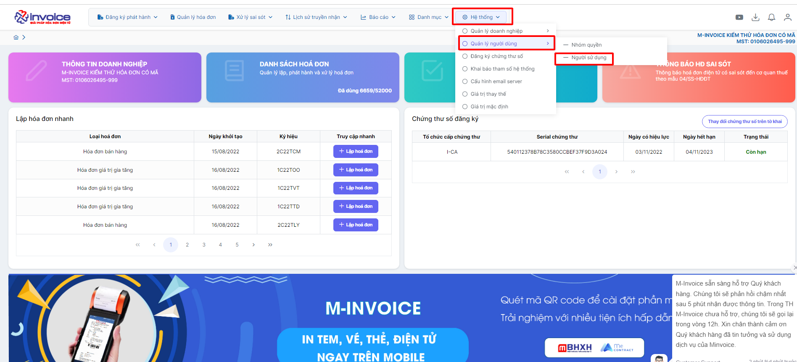
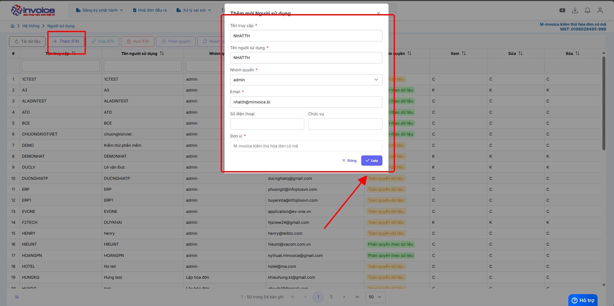

# **Thêm tài khoản người dùng**

## **Cách tạo thêm tài khoản người dùng**

???+ Note "Mục đích"

    Mục đích của việc thêm tài khoản người dùng trong hệ thống (xuất hóa đơn/phần mềm quản lý) là:

    **Phân quyền sử dụng:** Mỗi người dùng có quyền hạn riêng (xem, tạo, sửa, ký, quản trị…).

    **Bảo mật dữ liệu:** Tránh dùng chung tài khoản, giảm rủi ro lộ hoặc sửa sai dữ liệu.

    **Theo dõi lịch sử thao tác:** Ghi nhận ai tạo, sửa, phát hành hóa đơn (log, audit).

### **Bước 1: Hệ thống --> Quản lý người dùng --> Người sử dụng**

### **Bước 2: Nhấm Thêm(F4) để bắt đầu thêm người dùng mới**

!!! Note ""

    Điền đầy đủ các thông tin cần thiết như **Tên truy cập , nhóm quyền, địa chỉ mail**

    Sau khi đã điền đẩy đủ thông tin bạn nhấn **Lưu**, tài khoản và mật khẩu sẽ được gửi về mail mà bạn đăng ký

???+ info "Xin chân thành cảm ơn quý khách hàng đã tin dùng sản phẩm của M-Invoice"

    Có bất kỳ vướng mắc nào trong quá trình sử dụng hãy liên hệ với M-Invoice tại mục Hỗ trợ kỹ thuật góc phải bên dưới màn hình hoặc gọi tổng đài kỹ thuật của M-Invoice (1900.955.557 Nhánh 1)

Last updated on <strong>Feb 02, 2026</strong> by <strong>nhatth</strong>

