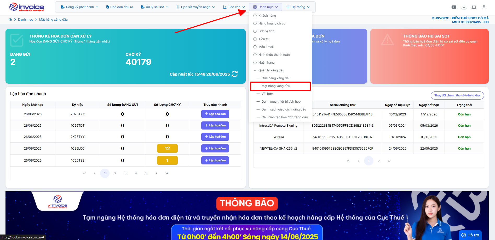
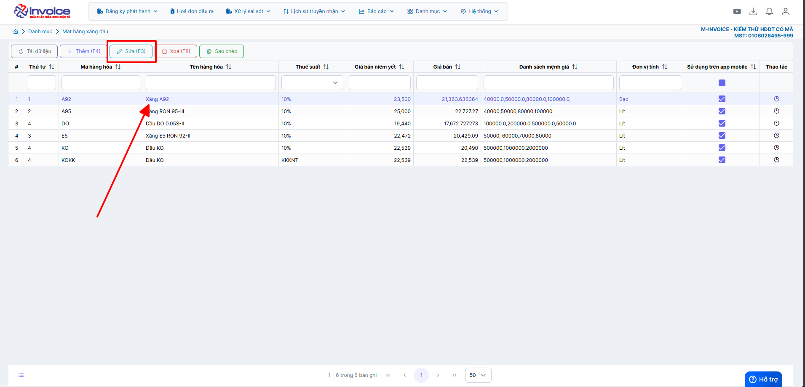
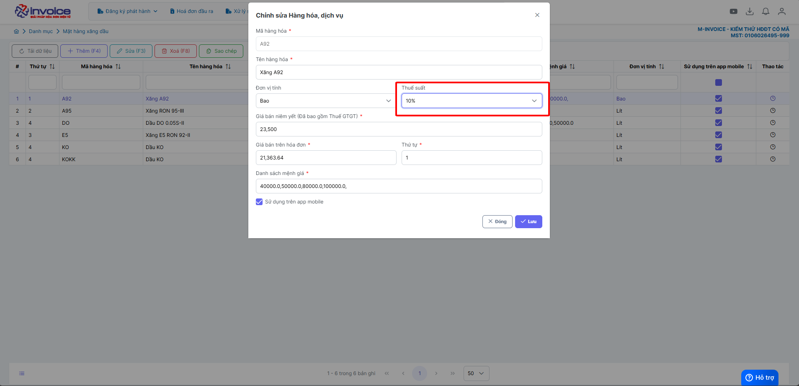
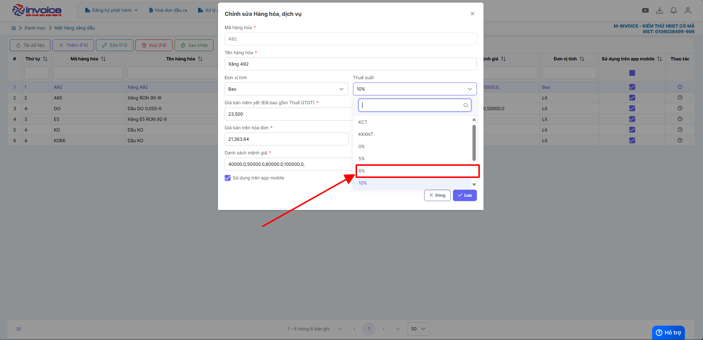
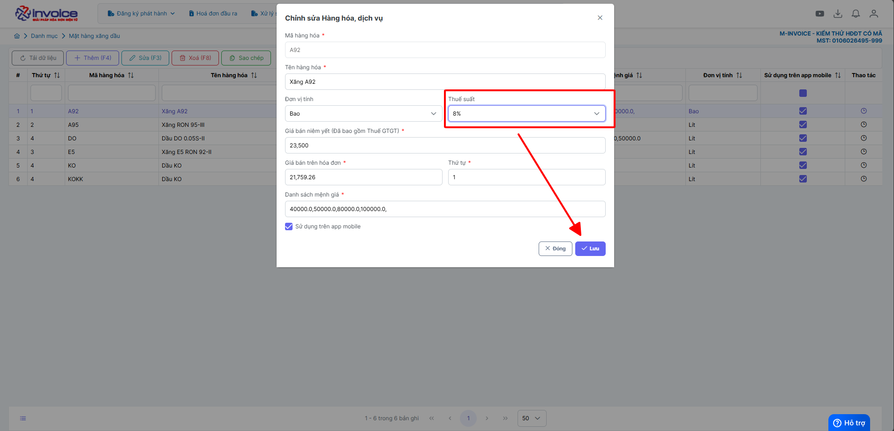
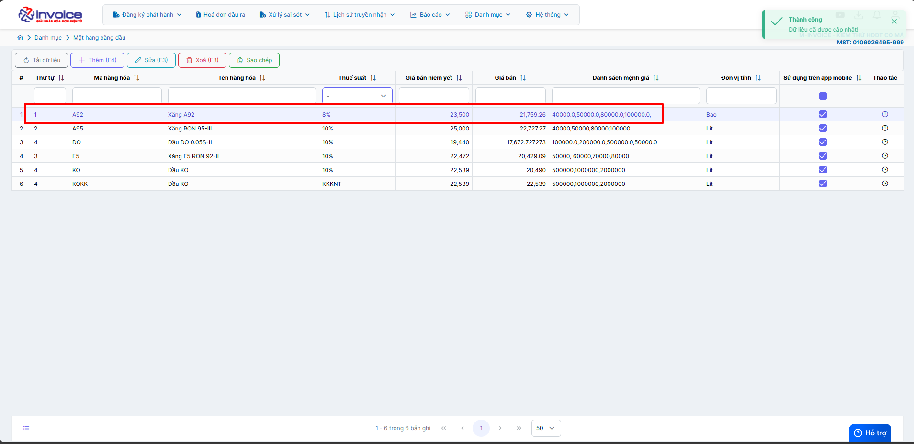

# **🧾 Hướng dẫn cập nhật giảm thuế GTGT đối với mặt hàng xăng dầu**

???+ Note "Mục đích"

    ✅ 1. Đảm bảo tuân thủ đúng quy định pháp luật hiện hành
    Giúp doanh nghiệp và người dùng phần mềm cập nhật kịp thời chính sách thuế theo nghị quyết của Chính Phủ
    Áp dụng đúng mức thuế GTGT đã được điều chỉnh đối với mặt hàng xăng dầu, theo quy định mới.

    ✅ 2. Hạn chế rủi ro sai sót khi kê khai và quyết toán thuế
    Việc không cập nhật kịp thời mức thuế mới cho mặt hàng xăng dầu có thể dẫn đến:

    • Sai lệch số liệu thuế GTGT đầu ra

    • Nguy cơ bị truy thu thuế, xử phạt hành chính khi cơ quan thuế kiểm tra

    • Gây khó khăn trong việc quyết toán thuế cuối kỳ

    ➡️ Do đó, cập nhật chính xác mức thuế suất mới cho mặt hàng xăng dầu là cần thiết để đảm bảo tuân thủ và tránh các rủi ro không đáng có.

## **Hướng dẫn áp dụng thuế suất GTGT mới**

<!-- ???+ Note "Xăng dầu được giảm 2% thuế GTGT từ ngày 01/7/2025 ?"

    Ngày 17/6/2025, Quốc hội thông qua Nghị quyết của Quốc hội về giảm thuế giá trị gia tăng, Nghị quyết có hiệu lực thi hành từ ngày **1/7/2025** đến hết **31/12/2026** [Nghị quyết của Quốc hội về giảm thuế giá trị gia tăng](https://xaydungchinhsach.chinhphu.vn/thong-qua-nghi-quyet-cua-quoc-hoi-ve-giam-thue-gia-tri-gia-tang-119250617102022144.htm){:target="\_blank"}

    Trong đó, Nghị quyết đã được thông qua với nhiều chính sách quan trọng cụ thể như việc giảm 2% thuế suất thuế GTGT, áp dụng đối với các nhóm hàng hóa, dịch vụ quy định tại khoản 3 Điều 9 Luật Thuế giá trị gia tăng 2024 (còn 8%), **trừ** một số nhóm hàng hóa, dịch vụ sau: viễn thông, hoạt động tài chính, ngân hàng, chứng khoán, bảo hiểm, kinh doanh bất động sản, sản phẩm kim loại, sản phẩm khai khoáng (trừ than), **sản phẩm hàng hóa và dịch vụ chịu thuế tiêu thụ đặc biệt (trừ xăng)**.

    **DẦU không chịu thuế TTĐB và nằm tại Khoản 3 Điều 9, Luật thuế GTGT 2024**

    **KẾT LUẬN: XĂNG DẦU ĐỀU ĐƯỢC GIẢM THUẾ GTGT, CÒN 8%**

    Như vậy, theo quy định tại Nghị quyết trên thì xăng dầu nằm trong nhóm được giảm 2% thuế GTGT nên xăng dầu sẽ được giảm 2% thuế GTGT từ ngày **01/7/2025** đến hết **31/12/2026**.

    Như vậy, điểm mới của chính sách giảm thuế GTGT 2% cho 6 tháng cuối năm 2025 và cả năm 2026 là mở rộng đối tượng áp dụng với xăng dầu và nhiều hàng hóa dịch vụ khác. -->

### **Bước 1. Trên màn hình trang chủ bấm chọn Danh mục -> Mặt hàng xăng dầu**

### **Bước 2: Chọn mặt hàng được giảm -> bấm Sửa**

### **Bước 3: Chọn mục thuế suất -> chọn thuế được giảm -> bấm Lưu**

Ở ví dụ này M-invoice hướng dẫn giảm thuế suất từ 10% xuống 8%. Đối với các trường hợp giảm từ các mức thuế suất khác, người dùng thực hiện tương tự theo hướng dẫn này.

### **Bước 4: Cập nhật giảm thuế GTGT thành công**

Nếu còn các mặt hàng xăng dầu làm tương tự các bước trên

???+ info "Xin chân thành cảm ơn quý khách hàng đã tin dùng sản phẩm của M-Invoice"

    Có bất kỳ vướng mắc nào trong quá trình sử dụng hãy liên hệ với M-Invoice tại mục Hỗ trợ kỹ thuật góc phải bên dưới màn hình hoặc gọi tổng đài kỹ thuật của M-Invoice (1900.955.557 Nhánh 1)

Last updated on <strong>Mar 26, 2026</strong> by <strong>NHATTH</strong>

