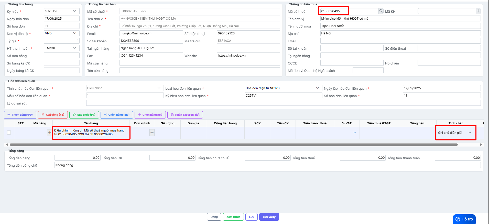
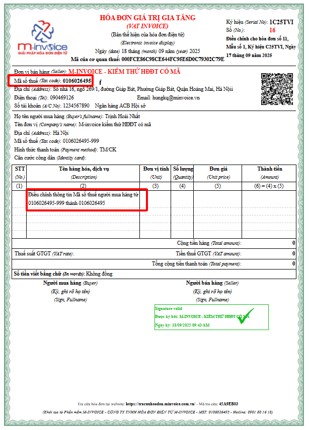

---
hide:
  - toc
tags:
  - invoice2
---

# **Cách viết thông tin trên hóa đơn điều chỉnh mã số thuế người mua hàng**

???+ Warning "Lưu ý"

    Cách ghi thông tin dưới đây không có trong quy định của CQT, đơn vị tham khảo ý kiến CQT trước khi thực hiện.

???+ Note "Khuyến nghị"

    Trường hợp sai mã thuế chưa kê khai hóa đơn Anh/Chị nên làm hóa đơn thay thế, vì hiện tại thuế quản lý hóa đơn đầu vào và đầu ra

Xem video hướng dẫn (đang cập nhật):

Lập hóa đơn điều chỉnh mã số thuế người mua hàng:

- Khai báo mã số thuế đúng của người mua hàng.
- Chọn **Tính chất** là **Ghi chú/diễn giải.**
- Sau đó nhập nội dung điều chỉnh.

Hóa đơn điều chỉnh mã số thuế người mua hiển thị thông tin điều chỉnh tương ứng.

???+ Note "Bắt buộc"

    Theo Nghị định 70/2025/NĐ-CP, việc lập Biên bản là bắt buộc trong các trường hợp làm nghiệp vụ điêu chỉnh/thay thế.

    Anh/Chị lập biên bản sau khi điều chỉnh theo hướng dẫn lập biên bản [tại đây.](lap-bien-ban-hoa-don)

Xem thêm các trường hợp khác [tại đây.](dieu-chinh-hoa-don)

???+ info "Xin chân thành cảm ơn quý khách hàng đã tin dùng sản phẩm của M-Invoice"

    Có bất kỳ vướng mắc nào trong quá trình sử dụng hãy liên hệ với M-Invoice tại mục Hỗ trợ kỹ thuật góc phải bên dưới màn hình hoặc gọi tổng đài kỹ thuật của M-Invoice (1900.955.557 Nhánh 1)

Last updated on <strong>Sep 17, 2025</strong> by <strong>nhatth</strong>

