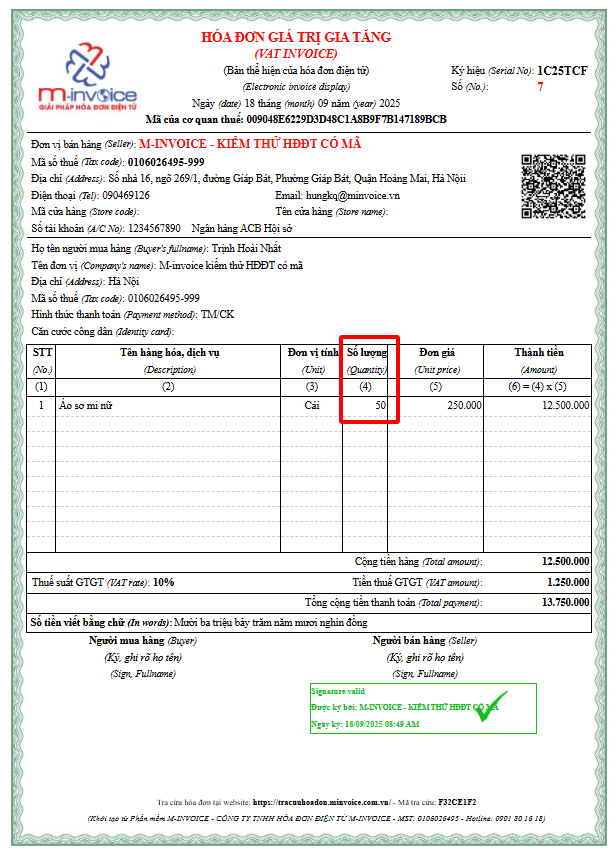
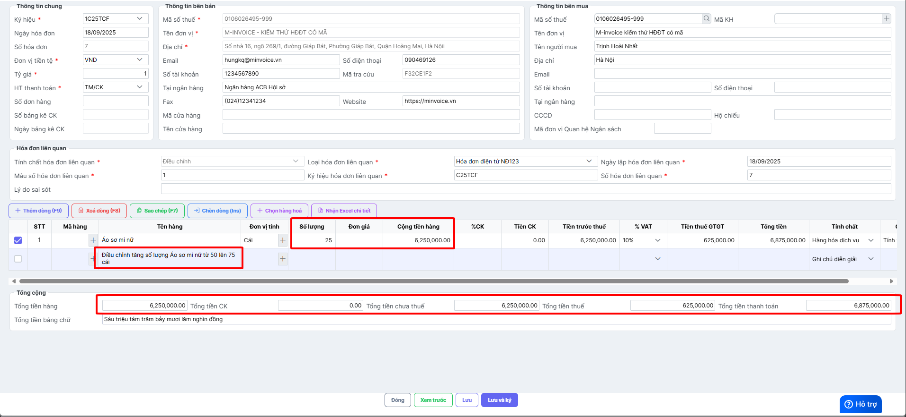
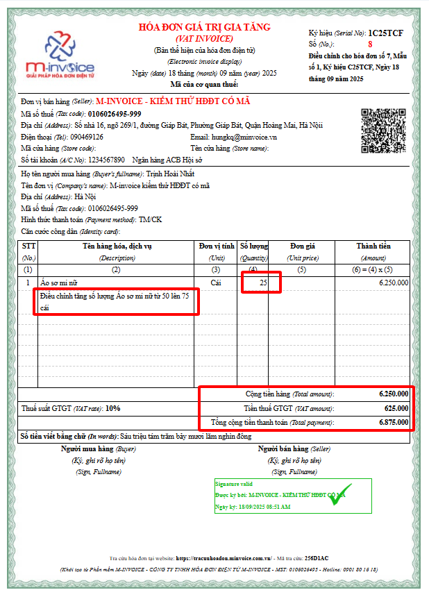

---
hide:
  - toc
tags:
  - invoice2
---

# **Cách viết thông tin trên hóa đơn điều chỉnh tăng số lượng hàng hóa**

???+ Warning "Lưu ý"

    Cách ghi thông tin dưới đây không có trong quy định của CQT, đơn vị tham khảo ý kiến CQT trước khi thực hiện.

**Xem video hướng dẫn:**

<iframe style="width: 48rem; height: 550px" src="https://www.youtube.com/embed/bmXX1FA45BM?si=TcbvmXl1cHzHuq__" title="YouTube video player" frameborder="0" allow="accelerometer; autoplay; clipboard-write; encrypted-media; gyroscope; picture-in-picture; web-share" referrerpolicy="strict-origin-when-cross-origin" allowfullscreen></iframe>

**- Hóa đơn gốc ghi sai thông tin số lượng hàng hóa: Số lượng ghi trên hóa đơn 50, số lượng đúng là 75.**

==> Lập hóa đơn điều chỉnh tăng số lượng hàng hóa lên 25. Số lượng tăng dẫn đến thành tiền theo số lượng tăng, tiền thuế tăng, tổng tiền thanh toán tăng, kế toán lập hóa đơn điều chỉnh khai báo nội dung như sau:

- Khai báo số lượng hàng hóa tăng và các giá trị liên quan thay đổi khi số lượng tăng gồm: **Thành tiền, Tổng tiền hàng, Tiền thuế GTGT, Tổng tiền thanh toán.**

- Bấm thêm dòng chọn **Tính chất** là **Ghi chú, diễn giải** điền nội dung điều chỉnh vào **Tên hàng hóa**

**Hóa đơn điều chỉnh tăng số lượng hàng hóa hiển thị các thông tin điều chỉnh tương ứng.**

???+ Note "Bắt buộc"

    Theo Nghị định 70/2025/NĐ-CP, việc lập Biên bản là bắt buộc trong các trường hợp làm nghiệp vụ điêu chỉnh/thay thế.

    Anh/Chị lập biên bản sau khi điều chỉnh theo hướng dẫn lập biên bản [tại đây.](lap-bien-ban-hoa-don)

Xem thêm các trường hợp khác [tại đây.](dieu-chinh-hoa-don)

???+ info "Xin chân thành cảm ơn quý khách hàng đã tin dùng sản phẩm của M-Invoice"

    Có bất kỳ vướng mắc nào trong quá trình sử dụng hãy liên hệ với M-Invoice tại mục Hỗ trợ kỹ thuật góc phải bên dưới màn hình hoặc gọi tổng đài kỹ thuật của M-Invoice (1900.955.557 Nhánh 1)

Last updated on <strong>Sep 17, 2025</strong> by <strong>nhatth</strong>

