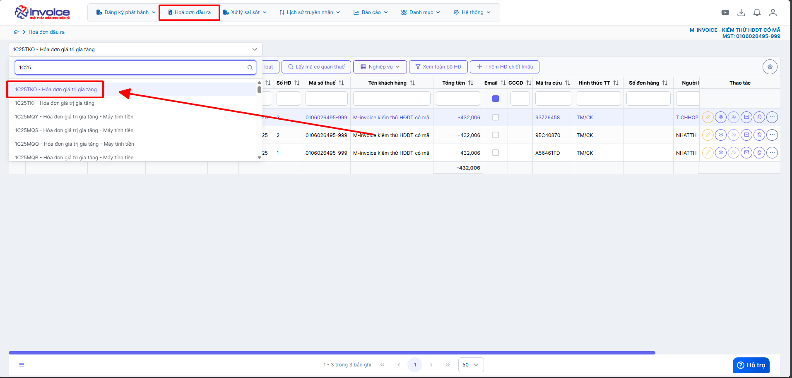
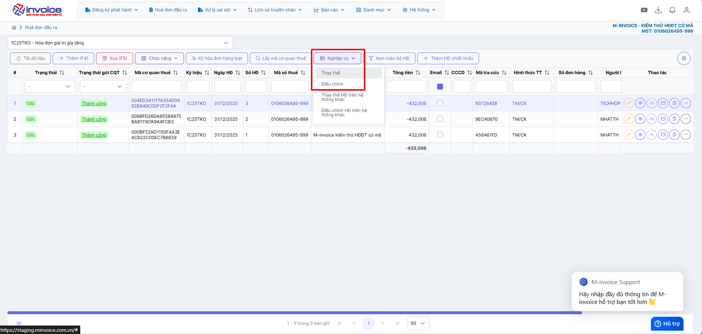
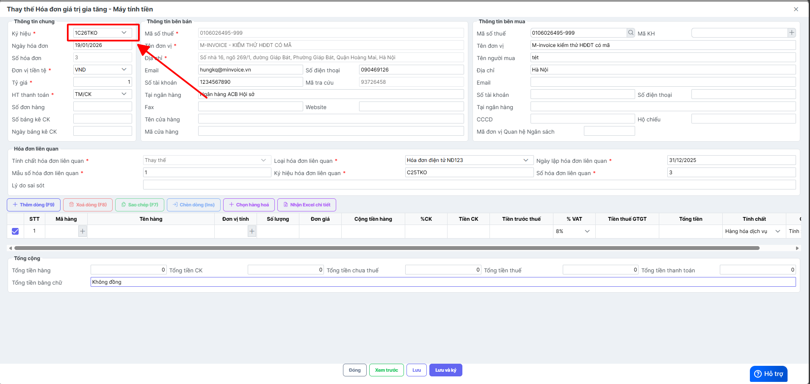
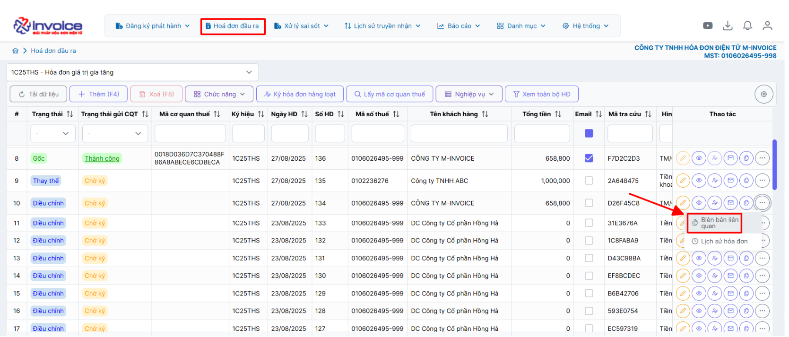
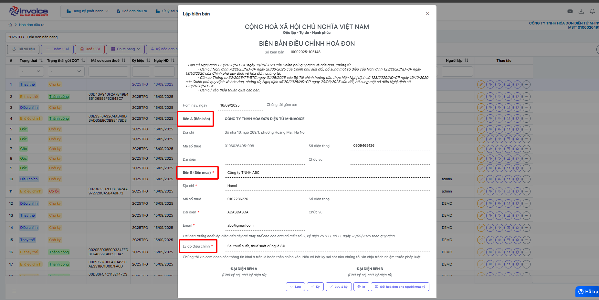
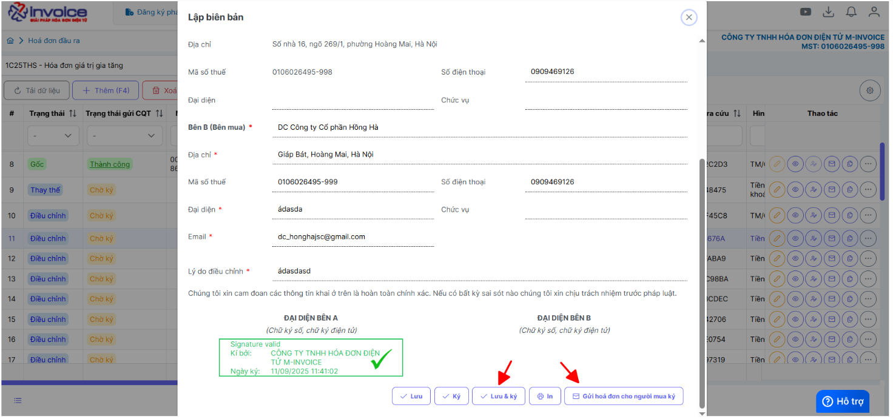
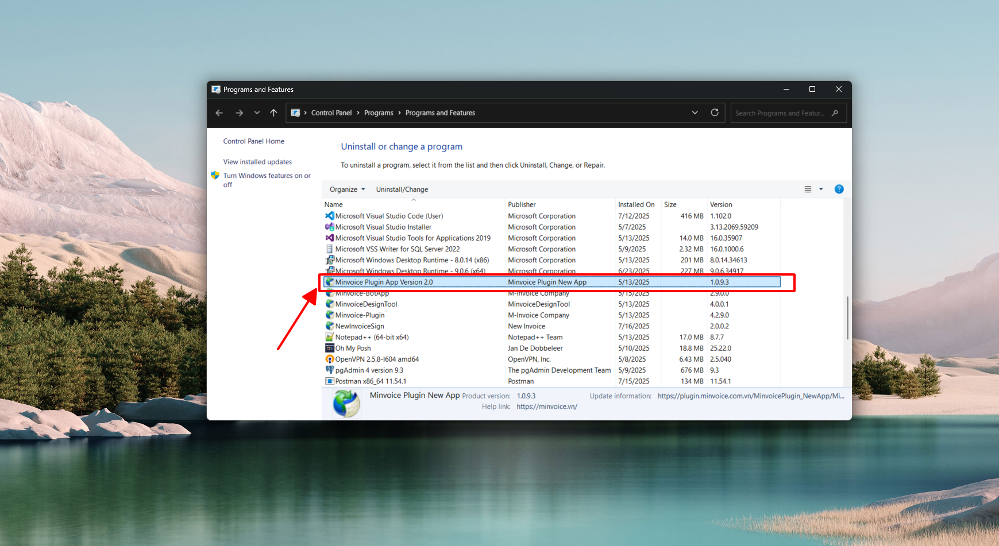
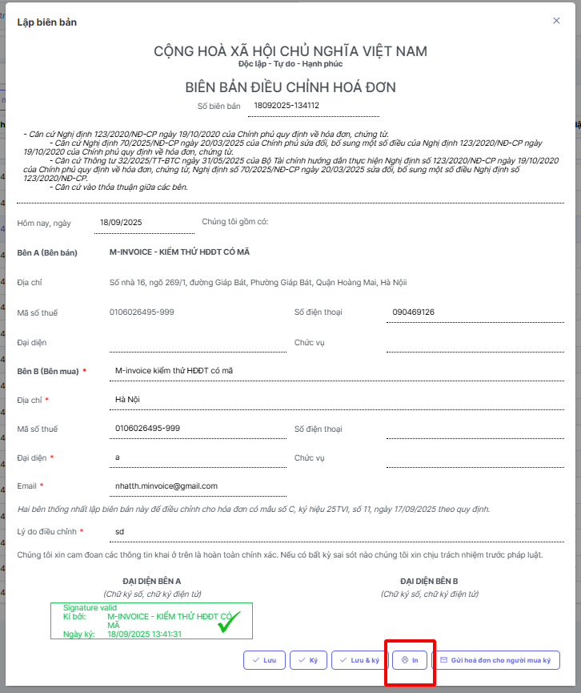
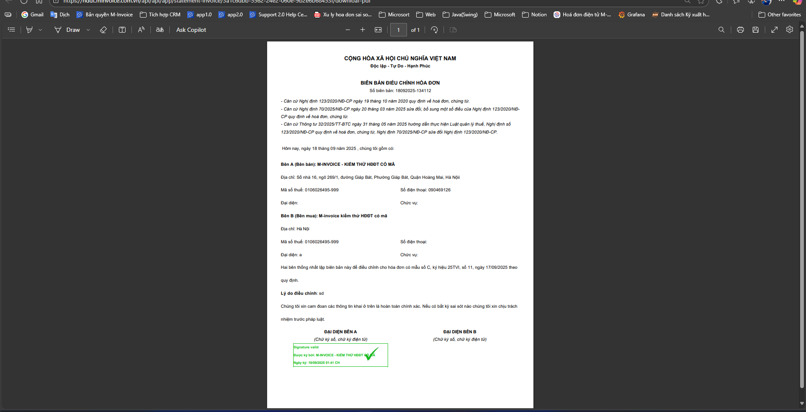
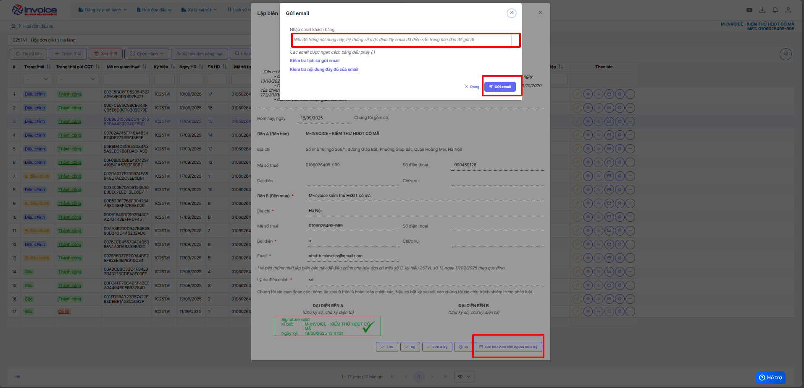

# **Điều chỉnh / Thay thế hóa đơn ở năm cũ VD: hóa đơn bị sai ở năm 2025**

???+ Note "Ghi chú"

    Khi sang năm mới (VD: 2026) anh chị muốn điều chỉnh hoặc thay thế hóa đơn ở ký hiệu năm cũ (VD: 2025)

    Hướng dẫn này sẽ hướng dẫn Anh/Chị điều chỉnh / thay thế hóa đơn ở năm cũ được xuất trên M-invoice.

    Trường hợp hóa đơn cũ của anh chị được xuất bên nhà cung cấp khác vui lòng làm theo hướng dẫn sau  [Hướng dẫn](dieu-chinh-va-thay-the-tren-he-thong-khac.md#attribute-lists){ data-preview }

???+ Tip "Điều kiện"

    Đã tạo ký hiệu năm mới (năm 2026)

    Trường hợp anh chị chưa tạo có thể làm theo hướng dẫn sau [Hướng dẫn tạo ký hiệu theo năm tài chính](../huong-dan/cap-nhat-ky-hieu.md#attribute-lists){ data-preview }

### **Bước 1: Truy cập vào hóa đơn đầu ra -> Chọn ký hiệu 2025**

### **Bước 2: Tìm đến hóa đơn sai sót -> Chọn nghiệp vụ -> Chọn Điều chỉnh hoặc Thay thế theo nhu cầu của Doanh nghiệp**

**Ở chỗ ký hiệu chọn sang ký hiệu mới 2026**

### **Bước 3: Sau đó Anh/Chị làm hóa đơn Điều chỉnh hoặc Thay thế cho đúng**

Xem thêm các hướng dẫn điều chỉnh [Các trường hợp điều chỉnh hóa đơn](../xu-ly-sai-sot/dieu-chinh-hoa-don.md#attribute-lists){ data-preview }

Xem thêm hướng dẫn thay thế [Hướng dẫn thay thế](../xu-ly-sai-sot/thay-the-hoa-don.md#attribute-lists){ data-preview }

## Hướng dẫn lập biên bản hoá đơn điều chỉnh / thay thế

???+ Note "Căn cứ"

    Theo Nghị định 70/2025/NĐ-CP, việc lập Biên bản là bắt buộc trong các trường hợp làm nghiệp vụ điêu chỉnh/thay thế.

    Người sử dụng có thể sử dụng thao tác này để lập biên bản khi làm nghiệp vụ thay thế hay điều chỉnh hóa đơn

!!! warning "Lưu ý"

    Chỉ lập được khi hóa đơn ở trạng thái thay thế hoặc điều chỉnh

#### Hướng dẫn bằng hình ảnh chi tiết

**Bước 1: Ở mục Hóa đơn đầu ra**

Sau khi đã làm thay thế hoặc điều chỉnh

**Chọn biên bản liên quan**

**Bước 2: Kiểm tra thông tin người bán, người mua, điền lý do thay thế hoặc lý do điều chỉnh**

**Bước 3 : Lưu biên bản thay thế, điều chỉnh hoặc lưu và ký**

???+ Danger "Lưu ý"

    Để ký được biên bản bằng cks usb máy tính phải được cài đặt plugin ký số, nếu đã cài đặt thì bỏ qua bước này

    🖱️ **Click vào đây để cài đặt:**
    📄 [Hướng dẫn tải plugin](../huong-dan/plugin.md#attribute-lists){ data-preview }

??? Bug "Trường hợp ký báo lỗi "Vui lòng nâng cấp phiên bản Plugin ký" - Anh chị bấm vào đây để xem hướng dẫn"

    Anh chị vui lòng gỡ plugin ra cài lại để có thể ký được

    Bấm 'WINDOWS + R' gõ lệnh 'appwiz.cpl'

    

    Chọn đến minvoice plugin 2.0 kích đúp để gỡ bỏ

    

    Gỡ xong bấm vào đây để xem hướng dẫn cài lại plugin

    🖱️ **Click vào đây để cài đặt:**
    📄 [Hướng dẫn tải plugin](../huong-dan/plugin.md#attribute-lists){ data-preview }

**Bước 4 : Xem in PDF và gửi mail cho người mua để ký biên bản**

Bấm nút in ở trình duyệt hoặc bấm ctrl + P để in

**Gửi mail cho người mua để người mua ký biên bản**

???+ info "Xin chân thành cảm ơn quý khách hàng đã tin dùng sản phẩm của M-Invoice"

    Có bất kỳ vướng mắc nào trong quá trình sử dụng hãy liên hệ với M-Invoice tại mục Hỗ trợ kỹ thuật góc phải bên dưới màn hình hoặc gọi tổng đài kỹ thuật của M-Invoice (1900.955.557 Nhánh 1)

Last updated on <strong>Jun 19, 2025</strong> by <strong>NHATTH</strong>

