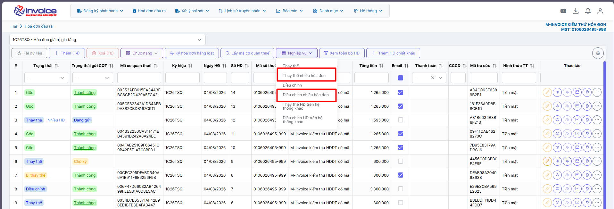
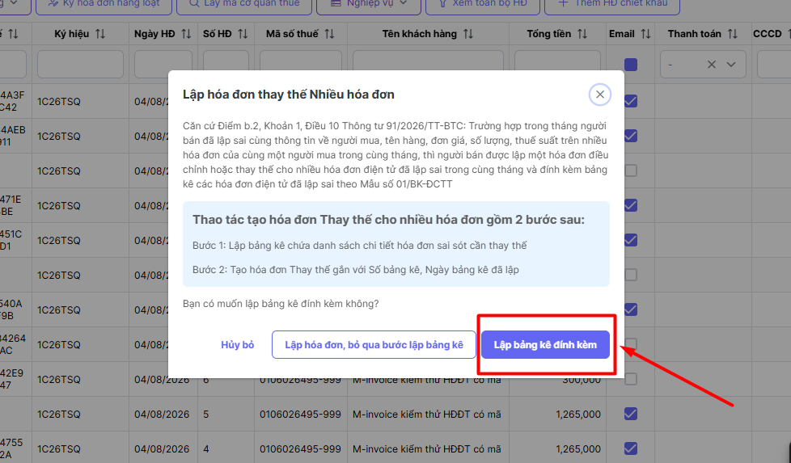
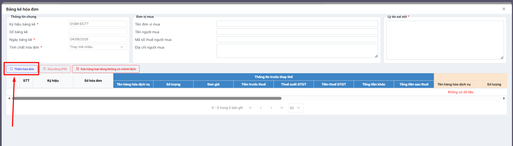
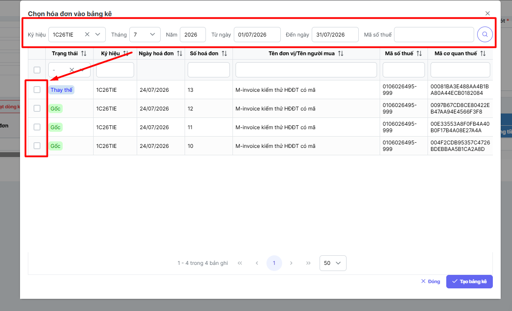
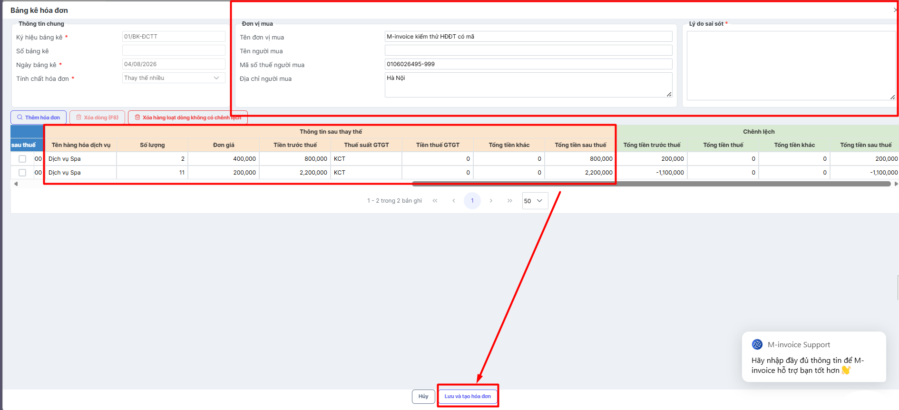
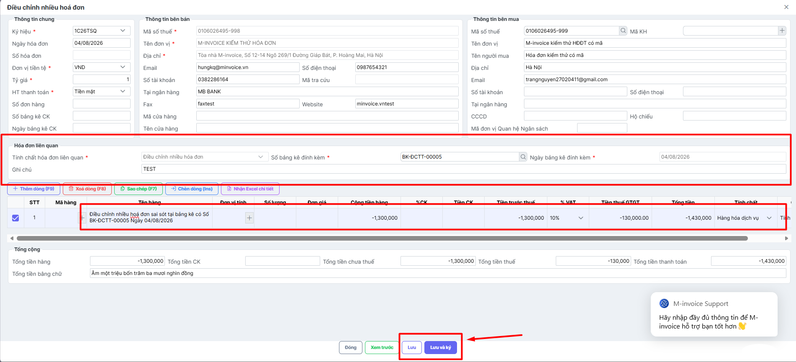
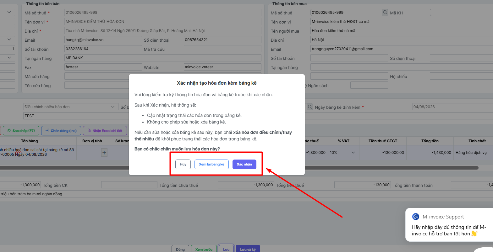
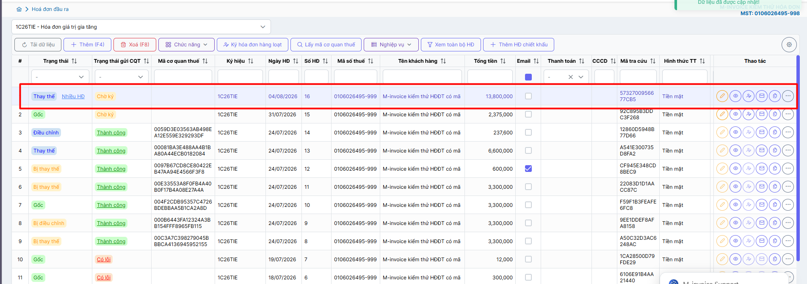
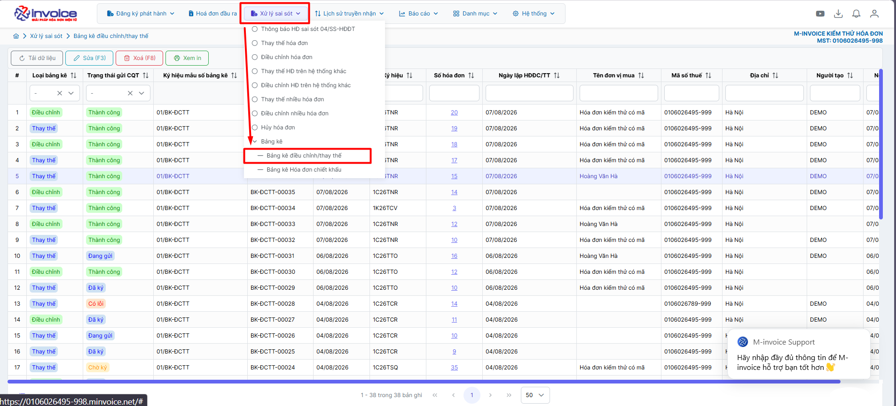

# **ĐIỀU CHỈNH/THAY THẾ NHIỀU HÓA ĐƠN ĐÍNH KÈM BẢNG KÊ**

???+ Note "Ghi chú"

    📘 **Căn cứ Điểm b.2, Khoản 1, Điều 10 Thông tư 91/2026/TT-BTC:**

    Trường hợp trong tháng người bán đã lập sai cùng thông tin về người mua, tên hàng, đơn giá, số lượng, thuế suất trên nhiều hóa đơn của cùng một người mua hàng trong cùng tháng, thì người bán được lập một hóa đơn điều chỉnh hoặc thay thế cho nhiều hóa đơn điện tử đã lập sai trong cùng tháng và đính kèm bảng kê các hóa đơn điện tử đã lập sai theo Mẫu số 01/BK-ĐCTT.

    Thao tác tạo hóa đơn Điều chỉnh gồm 2 bước sau:

    - **Bước 1:** Lập bảng kê chứa danh sách chi tiết hóa đơn sai sót cần điều chỉnh
    - **Bước 2:** Tạo hóa đơn Điều chỉnh với Số bảng kê, Ngày bảng kê đã lập

## **Hướng dẫn điều chỉnh/thay thế nhiều hóa đơn có sai sót có đính kèm bảng kê**

???+ Warning "Lưu ý"

    
    CQT chỉ cho phép làm điều chỉnh/ thay thế cho hóa đơn **Có mã, Không mã**. **Hóa đơn máy tính tiền không dùng được chức năng này**

    Chỉ chọn hóa đơn trong cùng 1 tháng lên bảng kê. Nếu khác tháng thì tách thành 2 hóa đơn

    Chỉ lập được bảng kê điều chỉnh thay thế cho đơn vị mua có Mã số thuế. **Khách không có mã số thuế, khách lẻ không sử dụng được**

    Khi tạo bảng kê mà chưa tạo hóa đơn gắn với bảng kê thì vẫn sửa được bảng kê

    Khi tạo bảng kê và đã gán vào hóa đơn, nếu cần sửa bảng kê thì vui lòng xóa hóa đơn tạo lại

###**Anh / chị thao tác và thực hiện theo video sau:**

<iframe style="width: 43rem; height: 380px"
    src="https://www.youtube.com/embed/kfVAfCGy83E" 
    frameborder="0" allowfullscreen>
</iframe>

###**Hướng dẫn chi tiết các bước như sau:**

#### **Bước 1: Anh/chị chọn nghiệp vụ => Điều chỉnh / Thay thế nhiều hóa đơn**
Người dùng chọn **Nghiệp vụ => Điều chỉnh/Thay thế nhiều hóa đơn**, lúc đó hệ thống hiển thị thông báo **Lập hóa đơn/Lập bảng kê**

#### **Bước 2: Anh/chị chọn lập bảng kê đính kèm**

#### **Bước 3: Chọn thêm hóa đơn**

Anh/chị có thể lọc ra thông tin những hóa đơn cần thay thế rồi tích chọn những hóa đơn cần thay thế đó. Khi tích chọn xong, anh/chị bấm **tạo bảng kê**

#### **Bước 4: Anh/chị nhập lý do sai sót và thông tin anh/chị muốn thay thế => lưu và tạo hóa đơn**

???+ Warning "Lưu ý"
    Anh/chị nhập thông tin cần chỉnh sửa như tên hàng hóa dịch vụ, số lượng, đơn giá, ... vào **phần thông tin sau thay thế / điều chỉnh** => Phần mềm sẽ **tự động tính phần tiền chênh lệnh**

#### **Bước 5: Phần mềm sẽ tự tạo ra bảng kê dựa theo số bảng kê và ngày bảng kê đính kèm**
Anh/chị **kiểm tra lại thông tin** bảng kê và chỉnh sửa lại **diễn giải tại tên hàng (Nếu cần)** => **Lưu** hoặc **lưu và ký**
    

Phần mềm sẽ có **thông báo** để xác nhận **lưu hóa đơn và bảng kê**. Anh/chị bấm **Xác nhận** để lưu lại

Khi lưu thành công, hóa đơn sẽ trạng thái thay thế hoặc điều chỉnh và có thông tin **Nhiều HĐ** ở bên cạnh để cảnh báo đây là hóa đơn thay thế / điều chỉnh cho nhiều hóa đơn

#### **Bước 6: Anh/chị bấm "ký và gửi cqt" để hoàn thành điều chỉnh/thay thế cho nhiều hóa đơn**

???+ Note
    **Anh/chị có thể xem bảng kê của các hóa đơn điều chỉnh/thay thế**

    Chọn **Xử lý sai sót => Bảng kê điều chỉnh/thay thế**

    

???+ info "Xin chân thành cảm ơn quý khách hàng đã tin dùng sản phẩm của M-Invoice"

    Có bất kỳ vướng mắc nào trong quá trình sử dụng hãy liên hệ với M-Invoice tại mục Hỗ trợ kỹ thuật góc phải bên dưới màn hình hoặc gọi tổng đài kỹ thuật của M-Invoice (1900.955.557 Nhánh 1)

Last updated on <strong>Aug 04, 2026</strong> by <strong>DATVT</strong>

