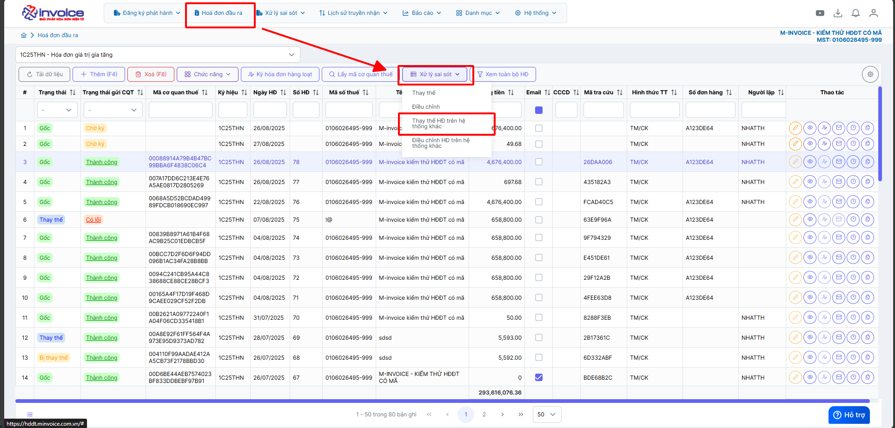
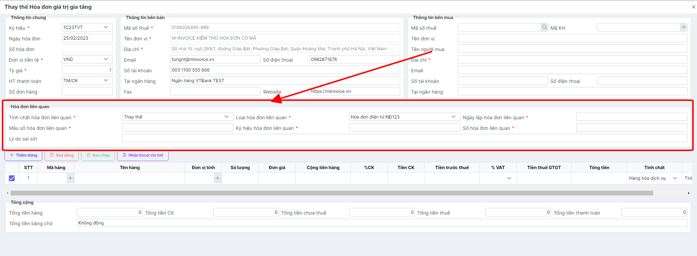
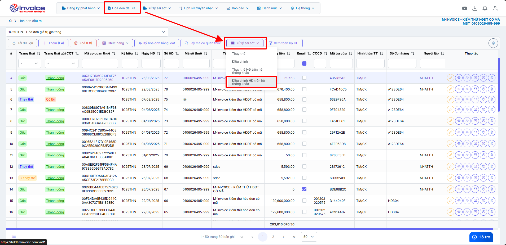

# **Điều chỉnh / Thay thế hoá đơn trên hệ thống khác**

???+ Note "Ghi chú"

    📘 **CĂN CỨ TẠI NGHỊ ĐỊNH 70/2025/NĐ-CP**, SỬA ĐỔI **NGHỊ ĐỊNH 123/2020/NĐ-CP**, QUY ĐỊNH VỀ VIỆC LẬP **HÓA ĐƠN, CHỨNG TỪ** NHƯ SAU:

    ---

    🧾 **Khi người bán phát hiện hóa đơn điện tử đã lập sai** *(bao gồm:)*

    – Hóa đơn điện tử **đã được cấp mã của cơ quan thuế**;

    – Hóa đơn điện tử **không có mã nhưng đã gửi dữ liệu đến cơ quan thuế**;

    → Thì xử lý theo các trường hợp:

    ---

    1. Sai sót nhỏ – **Không làm thay đổi nội dung nghĩa vụ thuế:**

    ✅ **Sai tên người mua**
    → Không cần lập lại hóa đơn.
    → Gửi **Mẫu 04/SS-HĐĐT** cho **Cơ quan thuế** và **thông báo cho bên mua**.

    ✅ **Sai địa chỉ người mua**
    → Không cần lập lại hóa đơn.
    → Gửi **Mẫu 04/SS-HĐĐT** cho **Cơ quan thuế** và **thông báo cho bên mua**.

    ✅ **Sai cả tên và địa chỉ nhưng đúng mã số thuế**
    → Không cần lập lại hóa đơn.
    → Gửi **Mẫu 04/SS-HĐĐT** cho **Cơ quan thuế** và **thông báo cho bên mua**.

    🖱️ **Click vào đây để xem hướng dẫn lập thông báo 04/SS:**
    📄 [Thông báo 04/SS](giai-trinh-mau04ss.md#attribute-lists){ data-preview }

    ---

    ⚠️ 2. Sai sót lớn – **Làm thay đổi nghĩa vụ thuế hoặc thông tin trọng yếu:**

    ❌ **Sai mã số thuế người mua**
    → Phải lập **hóa đơn thay thế**, kèm **biên bản thỏa thuận giữa hai bên**.

    ❌ **Sai thuế suất, số tiền, tiền thuế, đơn giá, thành tiền**
    → Phải lập **hóa đơn điều chỉnh** hoặc **hóa đơn thay thế**, kèm **biên bản thỏa thuận**.

    ❌ **Sai mặt hàng, quy cách, số lượng, đơn vị tính**
    → Phải lập **hóa đơn điều chỉnh** hoặc **hóa đơn thay thế**, kèm **biên bản thỏa thuận**.

    ❌ **Sai mã hàng hóa, mã vạch, thông tin kỹ thuật**
    → Phải lập **hóa đơn điều chỉnh** hoặc **hóa đơn thay thế**, kèm **biên bản thỏa thuận**.

    🖱️ **Click vào đây để xem hướng dẫn điều chỉnh:**
    📄 [Điều chỉnh hóa đơn](dieu-chinh-hoa-don.md#attribute-lists){ data-preview }

    🖱️ **Click vào đây để xem hướng dẫn thay thế:**
    📄 [Thay thế hóa đơn](thay-the-hoa-don.md#attribute-lists){ data-preview }

    ---

    🛑 **GHI NHỚ TỪ 01/06/2025**:

    🚫 **Bỏ nghiệp vụ "Hủy hóa đơn".**

    📌 **Trường hợp hóa đơn đã phát hành nhưng giao dịch bị hủy bỏ, hay bị sai thông tin cần hủy bỏ để lập hóa đơn mới**

    - 📝 **Anh chị làm điều chỉnh giảm về 0 (tương đương hủy) theo hướng dẫn sau**

    🖱️ **Click vào đây để xem hướng dẫn:**
    📄 [Hướng dẫn điều chỉnh giảm về 0](dieu-chinh-giam-ve-0.md#attribute-lists){ data-preview }

    ---

## **Hướng dẫn điều chỉnh và thay thế hóa đơn có sai sót trên hệ thống khác**

=== "Thay thế hoá đơn trên hệ thống khác"

    #### **Thay thế hoá đơn trên hệ thống khác**

    ???+ note "Mục đích"

        Thay thế hóa đơn trên hệ thống cũ (ví du: hóa đơn từ hệ thống phần mềm Newinvoice hay bất cứ phần mềm nào khác mà muốn thay thế hóa đơn đó trên M-invoice)

        Đây là việc phát hành một hóa đơn điện tử mới để thay thế cho hóa đơn đã lập trên một hệ thống khác (ví dụ: hóa đơn do nhà cung cấp A phát hành trên phần mềm A, sau đó doanh nghiệp chuyển sang phần mềm B và muốn phát hành hóa đơn thay thế trên hệ thống B).

    ???+ Warning "Lưu ý"

        Thay thế hoá đơn (Áp dụng cho HĐ trong kỳ kê khai(chưa kê khai)) và chỉ được phép sử dụng nghiệp vụ thay thế hóa đơn với các điều kiện sau:

        1. Hóa đơn cần thay thế đã được gửi CQT thành công hoặc hóa đơn đã có mã CQT cấp
        2. Hóa đơn cần thay thế ở Trạng thái Gốc (Mới) hoặc Thay thế

        Nếu đã lựa chọn nghiệp vụ thay thế thì không được điều chỉnh hóa đơn thay thế. Từ NGHỊ ĐỊNH 70/2025/NĐ-CP nghiệp vụ này không phải lập kèm 04/SS

    **Thao tác cài đặt và thực hiện như sau**

    Bước 1: Ở giao diện **"Hóa đơn đầu ra"** chọn phần **"Nghiệp vụ"** --> **Thay thế hóa đơn trên hệ thống khác**

    

    Bước 2 : Lập hóa đơn thay thế

    

    Ở mục hóa đơn liên quan

    + **Tính chất hóa đơn liên quan** : Thay thế hoặc điều chỉnh

    + **Loại hóa đơn liên quan** : Chọn hóa đơn điện tử NĐ123 (Chọn NĐ51 nếu hóa đơn ở thông tư cũ)

    + **Ngày lập hóa đơn liên quan** : Ngày của hóa đơn cần thay thế

    + **Mẫu số hóa đơn liên quan**: Mẫu số tương ứng với loại hóa đơn (Ví dụ: hóa đơn GTGT là `1`, hóa đơn bán hàng là `2`)

    + **Ký hiệu hóa đơn liên quan** :  Nhập đúng ký hiệu của hóa đơn cần thay thế (ví dụ: C25TYY)

    + **Số hóa đơn liên quan** : Số hóa đơn cần thay thế

    + **Lý do sai sót** : Nhập lý do sai sót

    Ở mục chi tiết hóa đơn nhập lại nội dung hóa đơn cần thay thế

    Bước 4 : Nhấn lưu và ký gửi hóa đơn, như thế là bạn đã hoàn thành việc thay thế hóa đơn trên hệ thống khác

=== "Điều chỉnh hoá đơn trên hệ thống khác"

    #### **Điều chỉnh hoá đơn trên hệ thống khác**

    ???+ note "Mục đích"

        Điều chỉnh hóa đơn trên hệ thống cũ (ví du: hóa đơn từ hệ thống phần mềm Newinvoice hay bất cứ phần mềm nào khác mà muốn điều chỉnh hóa đơn đó trên M-invoice)

        Đây là việc phát hành một hóa đơn điện tử mới để điều chỉnh cho hóa đơn đã lập trên một hệ thống khác (ví dụ: hóa đơn do nhà cung cấp A phát hành trên phần mềm A, sau đó doanh nghiệp chuyển sang phần mềm B và muốn phát hành hóa đơn điều chỉnh trên hệ thống B).

    ???+ Warning "Lưu ý"

        Điều chỉnh hoá đơn(Áp dụng HĐ trong kỳ (nhưng đã kê khai)hoặc qua kỳ kê khai) và chỉ được phép sử dụng nghiệp vụ điều chỉnh hóa đơn với các điều kiện sau:

        1. Hóa đơn cần điều chỉnh đã được gửi CQT thành công hoặc hóa đơn đã có mã CQT cấp
        2. Hóa đơn cần điều chỉnh ở Trạng thái Gốc (Mới) hoặc bị điều chỉnh

        Nếu đã lựa chọn nghiệp vụ điều chỉnh thì không được thay thế hóa đơn điều chỉnh. Từ NGHỊ ĐỊNH 70/2025/NĐ-CP nghiệp vụ này không phải lập kèm 04/SS

    ???+ Tip

        Quý anh chị có thể xem chi tiết các trường hợp điều chỉnh hóa đơn qua đây 📄 [Các trường hợp điều chỉnh hóa đơn](../xu-ly-sai-sot/dieu-chinh-hoa-don.md#attribute-lists){ data-preview }

    Bước 1: Ở giao diện **"Hóa đơn đầu ra"** chọn phần **"Nghiệp vụ"** --> **Điều chỉnh hóa đơn trên hệ thống khác**

    

    Bước 3 : Lập hóa đơn điều chỉnh

    

    Ở mục hóa đơn liên quan

    + **Tính chất hóa đơn liên quan** : Thay thế hoặc điều chỉnh

    + **Loại hóa đơn liên quan** : Chọn hóa đơn điện tử NĐ123 (Chọn NĐ51 nếu hóa đơn ở thông tư cũ)

    + **Ngày lập hóa đơn liên quan** : Ngày của hóa đơn cần điều chỉnh

    + **Mẫu số hóa đơn liên quan**: Mẫu số tương ứng với loại hóa đơn (Ví dụ: hóa đơn GTGT là `1`, hóa đơn bán hàng là `2`)

    + **Ký hiệu hóa đơn liên quan** :  Nhập đúng ký hiệu của hóa đơn cần điều chỉnh (ví dụ: C25TYY)

    + **Số hóa đơn liên quan** : Số hóa đơn cần điều chỉnh

    + **Lý do sai sót** : Nhập lý do sai sót

    Ở mục chi tiết hóa đơn nhập nội dung hóa đơn cần điều chỉnh 📄 [hướng dẫn chi tiết các trường hợp điều chỉnh](../xu-ly-sai-sot/dieu-chinh-hoa-don.md#attribute-lists){ data-preview }

    Bước 4 : Nhấn lưu và ký gửi hóa đơn, như thế là bạn đã hoàn thành việc điều chỉnh hóa đơn trên hệ thống khác

## Hướng dẫn lập biên bản hoá đơn điều chỉnh / thay thế

???+ Note "Căn cứ"

    Theo Nghị định 70/2025/NĐ-CP, việc lập Biên bản là bắt buộc trong các trường hợp làm nghiệp vụ điêu chỉnh/thay thế.

    Người sử dụng có thể sử dụng thao tác này để lập biên bản khi làm nghiệp vụ thay thế hay điều chỉnh hóa đơn

!!! warning "Lưu ý"

    Chỉ lập được khi hóa đơn ở trạng thái thay thế hoặc điều chỉnh

#### Hướng dẫn bằng hình ảnh chi tiết

**Bước 1: Ở mục Hóa đơn đầu ra**

Sau khi đã làm thay thế hoặc điều chỉnh

**Chọn biên bản liên quan**

**Bước 2: Kiểm tra thông tin người bán, người mua, điền lý do thay thế hoặc lý do điều chỉnh**

**Bước 3 : Lưu biên bản thay thế, điều chỉnh hoặc lưu và ký**

???+ Danger "Lưu ý"

    Để ký được biên bản bằng cks usb máy tính phải được cài đặt plugin ký số, nếu đã cài đặt thì bỏ qua bước này

    🖱️ **Click vào đây để cài đặt:**
    📄 [Hướng dẫn tải plugin](../huong-dan/plugin.md#attribute-lists){ data-preview }

??? Bug "Trường hợp ký báo lỗi "Vui lòng nâng cấp phiên bản Plugin ký" - Anh chị bấm vào đây để xem hướng dẫn"

    Anh chị vui lòng gỡ plugin ra cài lại để có thể ký được

    Bấm 'WINDOWS + R' gõ lệnh 'appwiz.cpl'

    

    Chọn đến minvoice plugin 2.0 kích đúp để gỡ bỏ

    

    Gỡ xong bấm vào đây để xem hướng dẫn cài lại plugin

    🖱️ **Click vào đây để cài đặt:**
    📄 [Hướng dẫn tải plugin](../huong-dan/plugin.md#attribute-lists){ data-preview }

**Bước 4 : Xem in PDF và gửi mail cho người mua để ký biên bản**

Bấm nút in ở trình duyệt hoặc bấm ctrl + P để in

**Gửi mail cho người mua để người mua ký biên bản**

???+ info "Xin chân thành cảm ơn quý khách hàng đã tin dùng sản phẩm của M-Invoice"

    Có bất kỳ vướng mắc nào trong quá trình sử dụng hãy liên hệ với M-Invoice tại mục Hỗ trợ kỹ thuật góc phải bên dưới màn hình hoặc gọi tổng đài kỹ thuật của M-Invoice (1900.955.557 Nhánh 1)

Last updated on <strong>Dec 08, 2025</strong> by <strong>NHATTH</strong>

