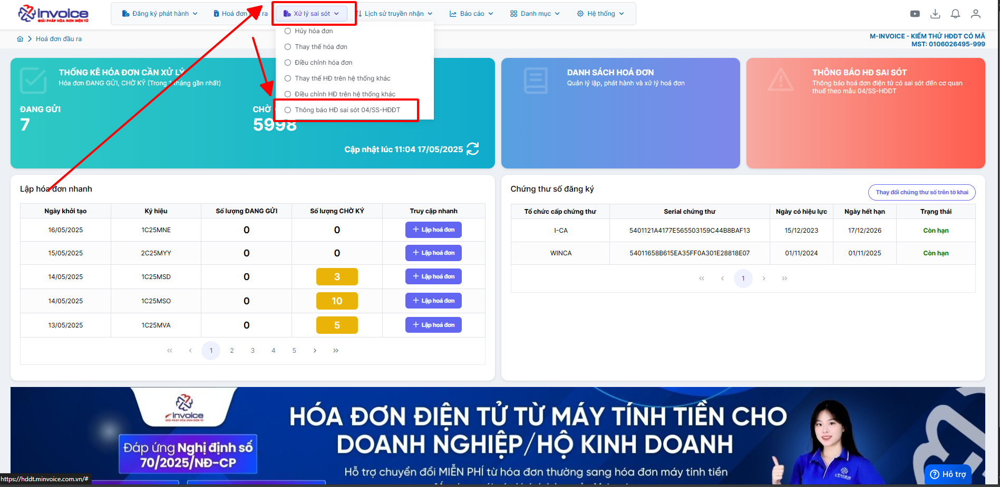
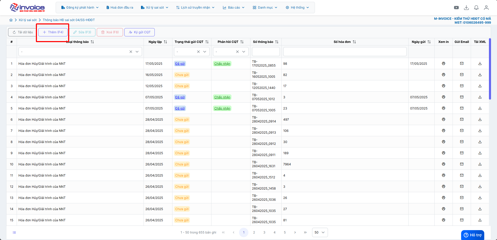
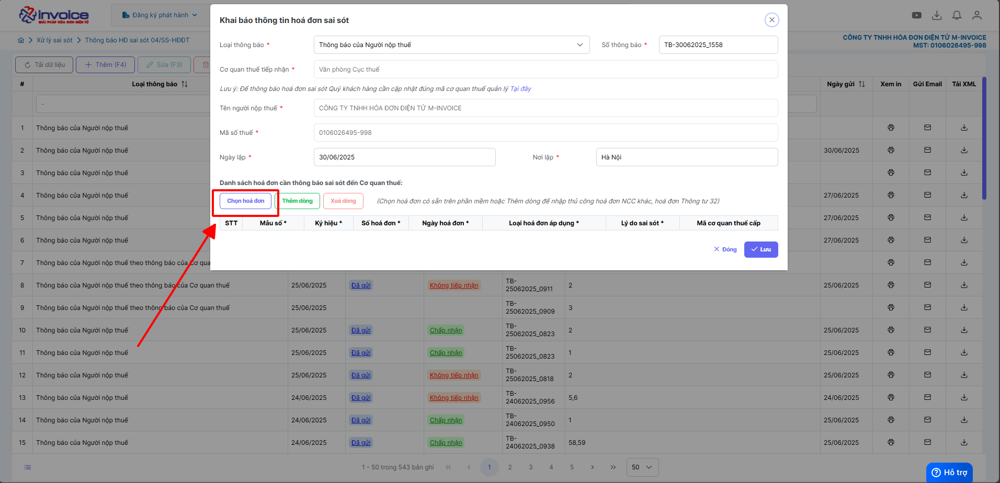
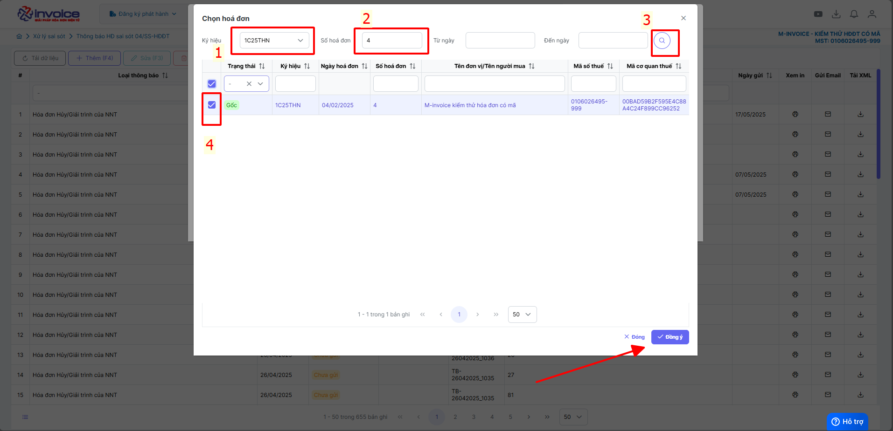
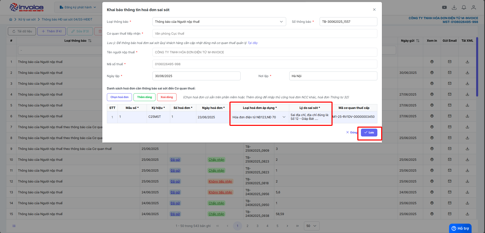
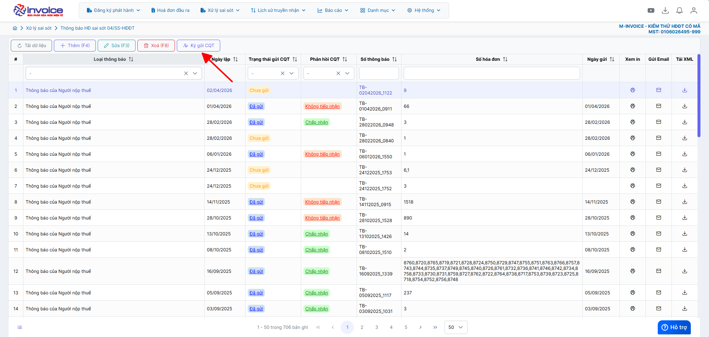
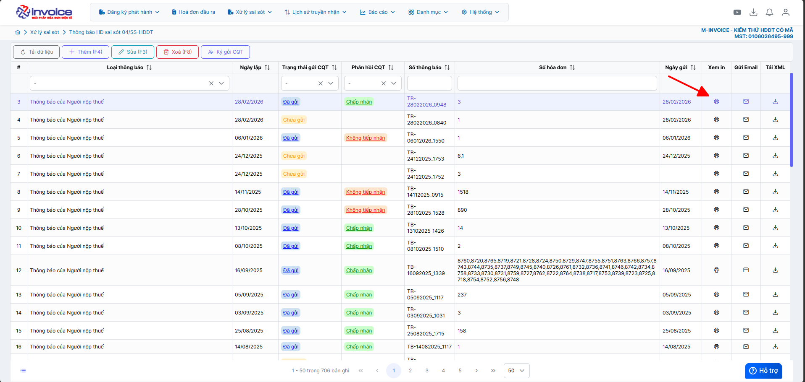
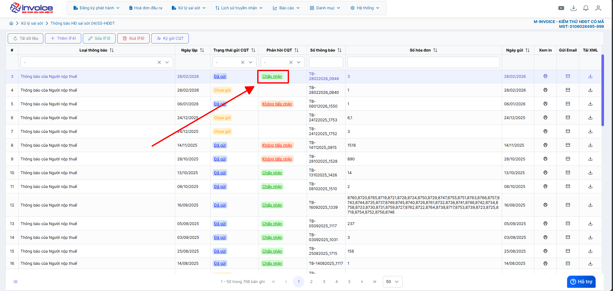
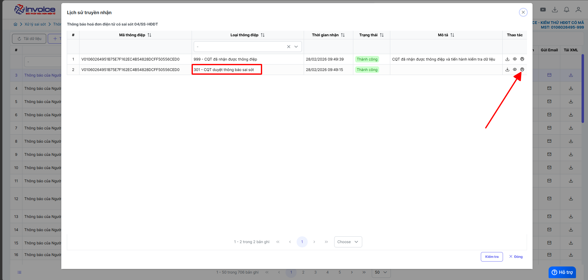
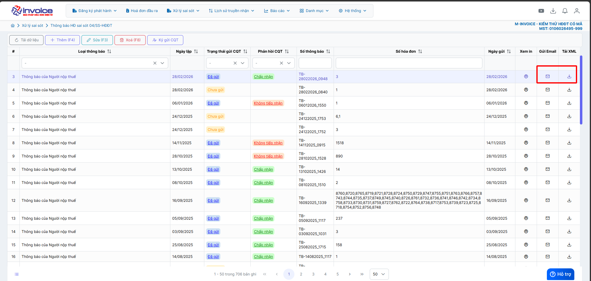

# **Lập Thông báo xử lý sai sót (04/SS-HĐĐT)**

???+ Note "Ghi chú"

    📘 **CĂN CỨ TẠI NGHỊ ĐỊNH 70/2025/NĐ-CP**, SỬA ĐỔI **NGHỊ ĐỊNH 123/2020/NĐ-CP**, QUY ĐỊNH VỀ VIỆC LẬP **HÓA ĐƠN, CHỨNG TỪ** NHƯ SAU:

    ---

    🧾 **Khi người bán phát hiện hóa đơn điện tử đã lập sai** *(bao gồm:)*

    – Hóa đơn điện tử **đã được cấp mã của cơ quan thuế**;

    – Hóa đơn điện tử **không có mã nhưng đã gửi dữ liệu đến cơ quan thuế**;

    → Thì xử lý theo các trường hợp:

    ---

    1. Sai sót nhỏ – **Không làm thay đổi nội dung nghĩa vụ thuế:**

    ✅ **Sai tên người mua**
    → Không cần lập lại hóa đơn.
    → Gửi **Mẫu 04/SS-HĐĐT** cho **Cơ quan thuế** và **thông báo cho bên mua**.

    ✅ **Sai địa chỉ người mua**
    → Không cần lập lại hóa đơn.
    → Gửi **Mẫu 04/SS-HĐĐT** cho **Cơ quan thuế** và **thông báo cho bên mua**.

    ✅ **Sai cả tên và địa chỉ nhưng đúng mã số thuế**
    → Không cần lập lại hóa đơn.
    → Gửi **Mẫu 04/SS-HĐĐT** cho **Cơ quan thuế** và **thông báo cho bên mua**.\

    - 📝 **Anh chị có thể làm thông báo 04/SS theo hướng dẫn dưới nội dung này ⬇️**

    ---

    ⚠️ 2. Sai sót lớn – **Làm thay đổi nghĩa vụ thuế hoặc thông tin trọng yếu:**

    ❌ **Sai mã số thuế người mua**
    → Phải lập **hóa đơn thay thế**, kèm **biên bản thỏa thuận giữa hai bên**.

    ❌ **Sai thuế suất, số tiền, tiền thuế, đơn giá, thành tiền**
    → Phải lập **hóa đơn điều chỉnh** hoặc **hóa đơn thay thế**, kèm **biên bản thỏa thuận**.

    ❌ **Sai mặt hàng, quy cách, số lượng, đơn vị tính**
    → Phải lập **hóa đơn điều chỉnh** hoặc **hóa đơn thay thế**, kèm **biên bản thỏa thuận**.

    ❌ **Sai mã hàng hóa, mã vạch, thông tin kỹ thuật**
    → Phải lập **hóa đơn điều chỉnh** hoặc **hóa đơn thay thế**, kèm **biên bản thỏa thuận**.

    🖱️ **Click vào đây để xem hướng dẫn điều chỉnh:**
    📄 [Điều chỉnh hóa đơn](dieu-chinh-hoa-don.md#attribute-lists){ data-preview }

    🖱️ **Click vào đây để xem hướng dẫn thay thế:**
    📄 [Thay thế hóa đơn](thay-the-hoa-don.md#attribute-lists){ data-preview }

    ---

    🛑 **GHI NHỚ TỪ 01/06/2025**:

    🚫 **Bỏ nghiệp vụ "Hủy hóa đơn".**

    📌 **Trường hợp hóa đơn đã phát hành nhưng giao dịch bị hủy bỏ, hay bị sai thông tin cần hủy bỏ để lập hóa đơn mới**

    - 📝 **Anh chị làm điều chỉnh giảm về 0 (tương đương hủy) theo hướng dẫn sau**

    🖱️ **Click vào đây để xem hướng dẫn:**
    📄 [Hướng dẫn điều chỉnh giảm về 0](dieu-chinh-giam-ve-0.md#attribute-lists){ data-preview }

    ---

## **Hướng dẫn lập thông báo Mẫu 04/SS-HĐĐT**

???+ Note "Các sai sót nhỏ có thể làm 04/SS dưới đây"

    Sai sót nhỏ – Không làm thay đổi nội dung nghĩa vụ thuế:

    ✅ Sai tên người mua hàng → Không cần lập lại hóa đơn. → Gửi Mẫu 04/SS-HĐĐT cho Cơ quan thuế và thông báo cho bên mua.

    ✅ Sai địa chỉ người mua → Không cần lập lại hóa đơn. → Gửi Mẫu 04/SS-HĐĐT cho Cơ quan thuế và thông báo cho bên mua.

    ✅ Sai cả tên và địa chỉ nhưng đúng mã số thuế → Không cần lập lại hóa đơn. → Gửi Mẫu 04/SS-HĐĐT cho Cơ quan thuế và thông báo cho bên mua.\

    Sai địa chỉ, Số điện thoại, email, ... và một số sai sót nhỏ không ảnh hưởng đến phần tiền.

    📝 Anh chị có thể làm thông báo 04/SS theo hướng dẫn dưới nội dung này ⬇️

**Thao tác cài đặt và thực hiện như sau**

### **Bước 1: Nhấn vào xử lý sai sót => Thông báo HĐ sai sót 04ss-HDDT**

### **Bước 2: Bấm thêm**

### **Bước 3 : Click chọn hoá đơn**

### **Bước 4 : Chọn ký hiệu, số hoá đơn cần thông báo Mẫu 04/SS-HĐĐT**

### **Bước 5 : Điền lý do sai sót cụ thể và điên thông tin đúng**

### **Bước 6 : Bấm lưu và ký thông báo 04ss**

### **Bước 7 : Xem in PDF 04ss và thông báo PDF 04ss của Thuế**

- Xem in PDF trên phần mềm

- Xem in PDF trực tiếp được trả về từ CQT

**Chọn đúng thông điệp 301**

### **Bước 8 : Gửi email hoặc tải xml thông báo 04ss**

???+ info "Xin chân thành cảm ơn quý khách hàng đã tin dùng sản phẩm của M-Invoice"

    Có bất kỳ vướng mắc nào trong quá trình sử dụng hãy liên hệ với M-Invoice tại mục Hỗ trợ kỹ thuật góc phải bên dưới màn hình hoặc gọi tổng đài kỹ thuật của M-Invoice (1900.955.557 Nhánh 1)

Last updated on <strong>Apr 02, 2026</strong> by <strong>NHATTH</strong>

