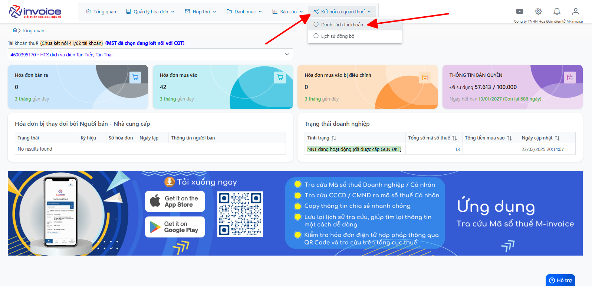
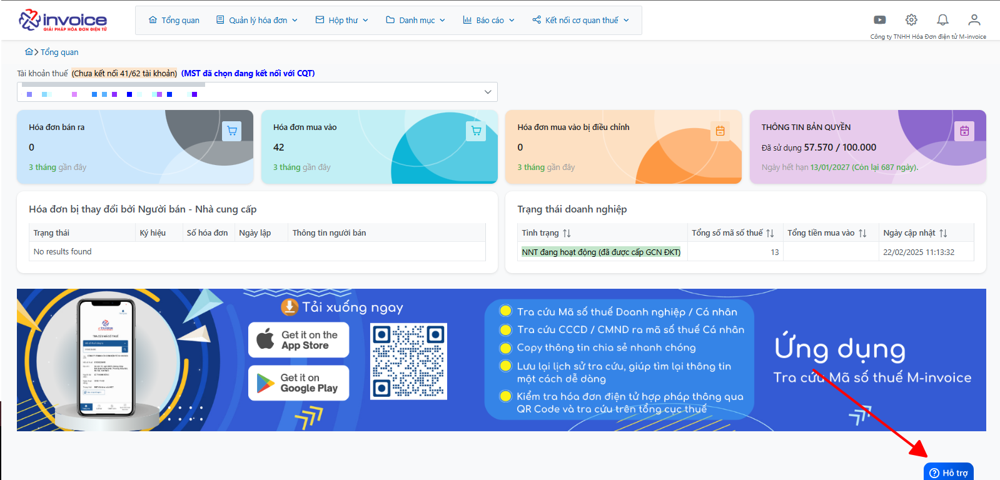

# **Thông báo tình trạng mật khẩu đã hết hạn**

## **Cảnh báo tình trạng mật khẩu hết hạn**

???+ Info "🔌 Thông báo mật khẩu đã hết hạn"

    > **📢 Thông báo quan trọng:**
    > Để tăng tính bảo mật và tránh để người sử dụng bị gián đoạn trong quá trình sử dụng hệ thống đã có thêm tính năng  **cảnh báo mật khẩu hết hạn**, hỗ trợ người dùng có thể nhận biết được khi nào **mật khẩu đã hết hạn** trên trang  **https://hoadondientu.gdt.gov.vn/**.

**Hướng dẫn người sử dụng khi nhận dược thông báo *Mật khẩu hết hạn* từ phần mềm**

Khi mật khẩu kết nối tới cơ quan thuế của người dùng **hết hạn**, phần mềm sẽ hiển thị 1 thông báo ở màn hình sau khi đăng nhập

### Anh/chị đổi mật khẩu của của trang  **https://hoadondientu.gdt.gov.vn/** theo hướng dẫn sau: 

#### Bước 1: Quý khách hàng đăng nhập vào trang thuế => Chọn tài khoản => Đổi mật khẩu

#### Bước 2: Anh/chị điền mật khẩu cũ và mật khẩu mới => Bấm **Đổi mật khẩu**

???+ Abstract "Nội dung"

    Trong trường hợp anh/chị quên mật khẩu của trang **https://hoadondientu.gdt.gov.vn/**, anh/chị lấy lại theo hướng dẫn sau: **https://hdsd.minvoice.com.vn/msmi/lay-mat-khau-hddt/**

### Sau khi đổi mật khẩu xong, anh/chị trở lại trang quản lý hóa đơn để đăng nhập lại tài khoản đồng bộ

#### Bước 1: Anh/chị vào Kết nối cơ quan thuế => Danh sách tài khoản

#### Bước 2: Đăng xuất tài khoản có cảnh báo hết hạn 

#### Bước 3: Bấm **đăng nhập lại**

#### Bước 4: Nhập mật khẩu đã đổi trên trang hóa đơn của thuế => Bấm nút **đăng nhập**

Khi bấm đăng nhập, anh/chị chờ một chút để phần mềm có thể kết nối được tài khoản với cơ quan thuế

!!! info "Xin chân thành cảm ơn Quý khách hàng đã tin dùng sản phẩm của M-Invoice"

    Có bất kỳ vướng mắc nào trong quá trình sử dụng hãy liên hệ với M-Invoice tại mục Hỗ trợ kỹ thuật góc phải bên dưới màn hình hoặc gọi tổng đài kỹ thuật của M-Invoice (1900.955.557 Nhánh 1)

Last updated on <strong>July 11, 2026</strong> by <strong>Datvt</strong>

