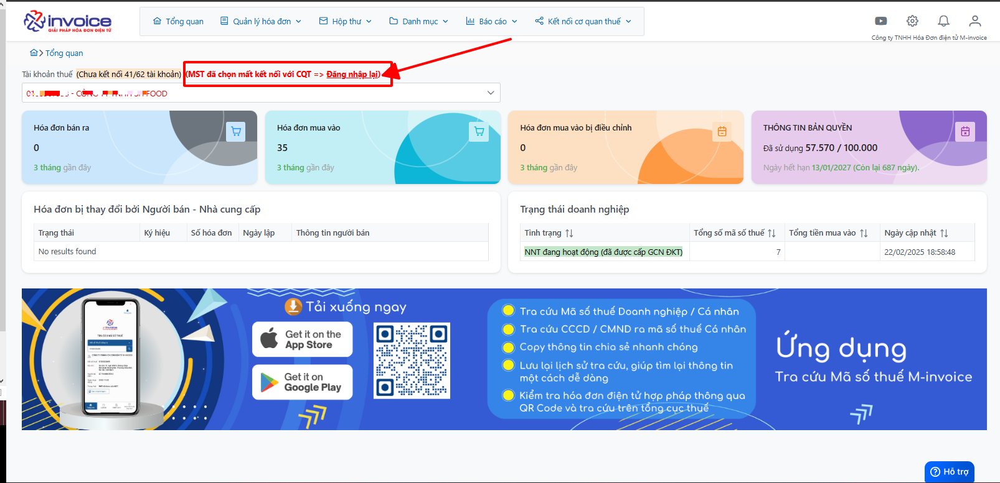
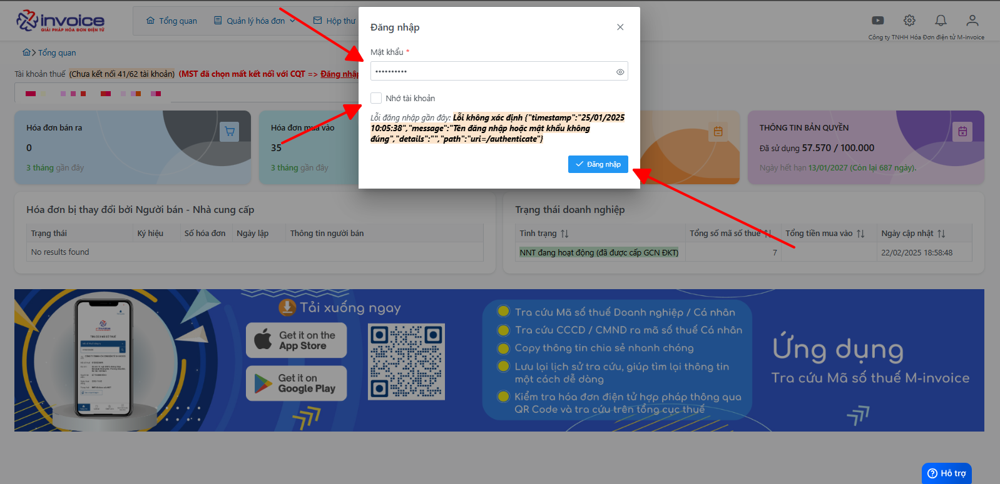

# **Đăng nhập lại tài khoản bị mất kết nối**

## **Hướng dẫn đăng nhập lại tài khoản bị mất kết nối**

### Bước 1: Truy cập vào phần mềm mSMI, ngay ở giao diện anh chị bấm vào đăng nhập lại

### Bước 2: Điền lại thông tin mật khẩu chính xác vào phần mềm

Tích thêm vào nhớ tài khoản để có thể kích hoạt tự động đồng bộ

???+ Warning "Lưu ý"

    Nếu đã điền lại mật khẩu nhưng không đăng nhập lại được, anh chị có thể lấy lại mật khẩu tại trang [Hoadondientu](https://hoadondientu.gdt.gov.vn){:target="_blank"} theo [Hướng dẫn](lay-mat-khau-hddt.md)

!!! info "Xin chân thành cảm ơn Quý khách hàng đã tin dùng sản phẩm của M-Invoice"

    Có bất kỳ vướng mắc nào trong quá trình sử dụng hãy liên hệ với M-Invoice tại mục Hỗ trợ kỹ thuật góc phải bên dưới màn hình hoặc gọi tổng đài kỹ thuật của M-Invoice (1900.955.557 Nhánh 1)

Last updated on <strong>Mar 10, 2025</strong> by <strong>Trinh Hoai Nhat</strong>

