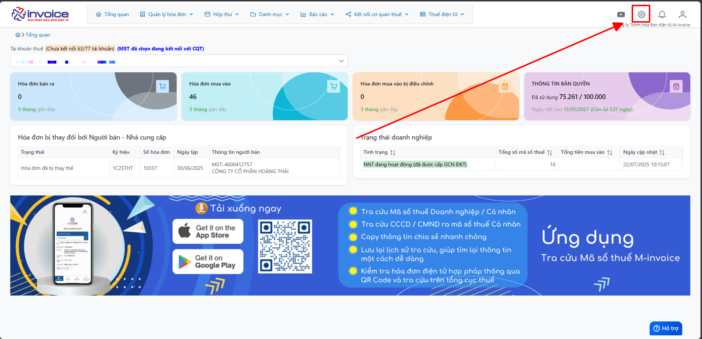
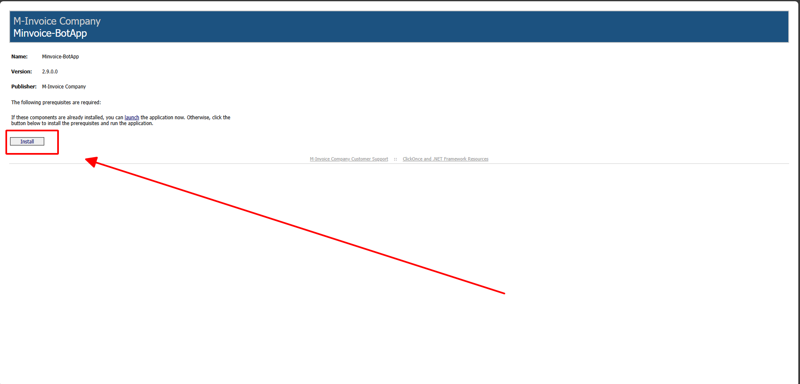
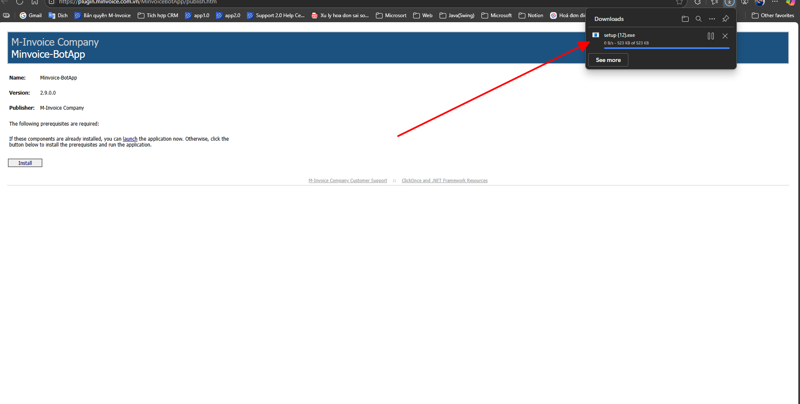
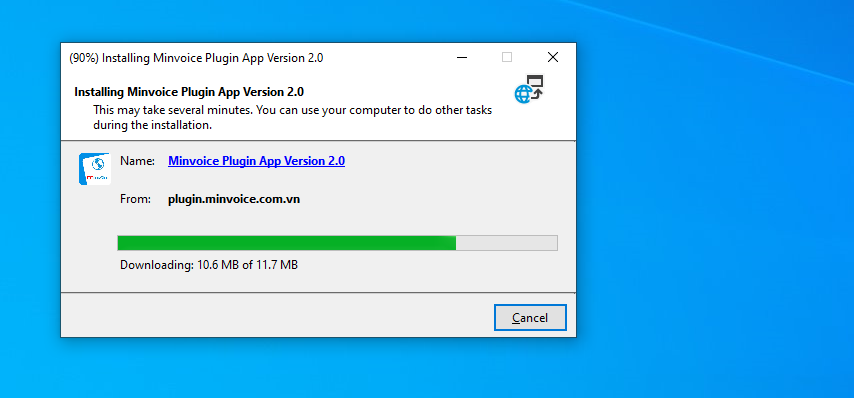

# **Cài đặt plugin**

## **Hướng dẫn cài đặt plugin**

???+ Note "Nội dung"

    🔌 Hướng dẫn tải Plugin hỗ trợ đồng bộ nhanh hơn

    > **📢 Thông báo quan trọng:**
    > Để giúp quá trình **đồng bộ hóa đơn từ trang Thuế diễn ra nhanh chóng và ổn định hơn**, chúng tôi đã phát triển một **Plugin hỗ trợ đồng bộ chuyên dụng**.
    > Plugin này giúp cải thiện tốc độ kết nối, giảm thiểu lỗi trong quá trình lấy dữ liệu

    ---

    ### 🚀 Lợi ích khi sử dụng Plugin:
    - **Tăng tốc độ đồng bộ** dữ liệu hóa đơn lên nhiều lần so với cách thông thường.
    - **Ổn định hơn** khi kết nối tới hệ thống của Tổng cục Thuế.

### Bước 1: Truy cập phần mềm bấm hình cài đặt để tải file plugin

### Bước 2: Chọn Install

**Kích đúp vào file vừa tải về**

### Bước 3: Chờ quá trình tải xuống thành công

!!! info "Xin chân thành cảm ơn Quý khách hàng đã tin dùng sản phẩm của M-Invoice"

    Có bất kỳ vướng mắc nào trong quá trình sử dụng hãy liên hệ với M-Invoice tại mục Hỗ trợ kỹ thuật góc phải bên dưới màn hình hoặc gọi tổng đài kỹ thuật của M-Invoice (1900.955.557 Nhánh 1)

Last updated on <strong>Jun 24, 2025</strong> by <strong>NHATTH</strong>

