# **ĐỒNG BỘ HÓA ĐƠN QUA EMAIL**

## **TÀI LIỆU HƯỚNG DẪN ĐỒNG BỘ HÓA ĐƠN QUA EMAIL**

## **A. TỔNG QUAN**

### **1. Mục đích**

- Cung cấp tài liệu cho các đơn vị tạo và sử dụng ứng dụng mSMI để nhận, đồng bộ hóa đơn từ email bằng các phương thức imap, outlook, …

### **2. Đối tượng sử dụng**

- Lập trình viên nắm bắt mô hình để xây dựng api đáp ứng yêu cầu gửi và nhận dữ liệu giao dịch bơm

- Kỹ thuật nắm bắt nghiệp vụ để kiểm tra hỗ trợ trong quá trình tích hợp

### **3. Thuật ngữ viết tắt**

<table style="width:100%;border-collapse:collapse;font-family:sans-serif;">
  <thead>
    <tr>
      <th style="border:1px solid #ccc;padding:8px 12px;text-align:left;background:#f2f2f2;font-weight:bold;">
        Thuật ngữ
      </th>
      <th style="border:1px solid #ccc;padding:8px 12px;text-align:left;background:#f2f2f2;font-weight:bold;">
        Ý nghĩa
      </th>
    </tr>
  </thead>
  <tbody>
    <tr style="background:#ffffff;">
      <td style="border:1px solid #ccc;padding:8px 12px;">SSL/TLS</td>
      <td style="border:1px solid #ccc;padding:8px 12px;">
        Công nghệ mã hoá thông tin trong quá trình truyền tải dữ liệu trên internet để đảm bảo tính bảo mật và an toàn.
      </td>
    </tr>
  </tbody>
</table>

## **B. ĐỒNG BỘ HÓA ĐƠN TỪ GMAIL**

### **I. Tạo Mật khẩu ứng dụng cho email**

- Tại trang Google click vào biểu tượng tài khoản ở góc trên bên phải màn hình

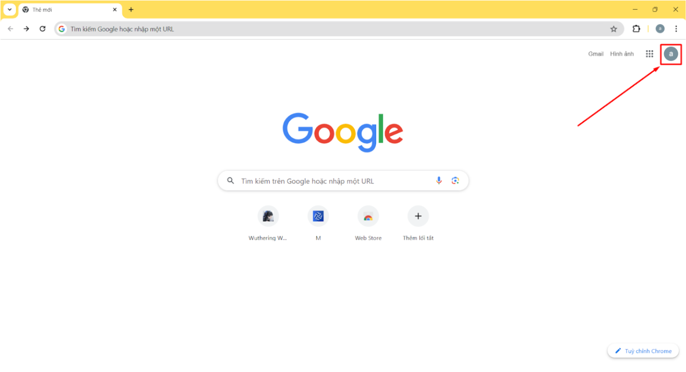

- Chọn **Quản lý tài khoản Google của bạn**

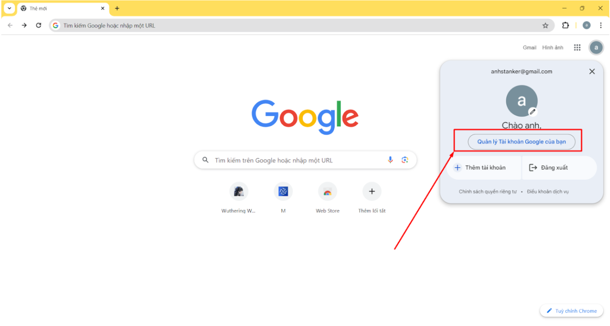

- Sau khi màn hình đổi đến giao diện **Quản lý tài khoản** click vào phần **Bảo mật**

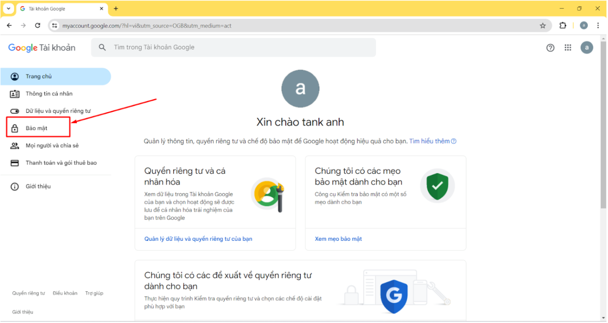

- Chọn **Xác minh 2 bước** trong phần **Bảo mật** và bật nó lên

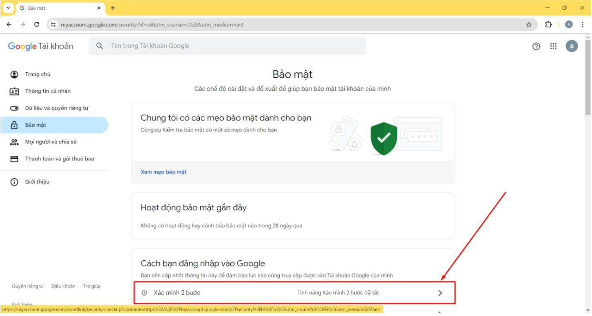

- Khi click vào **Xác minh 2 bước** Google có thể yêu cầu nhập mật khẩu đăng nhập gmail. Sau khi đăng nhập sẽ hiển thị màn hình bật **Xác minh 2 bước**

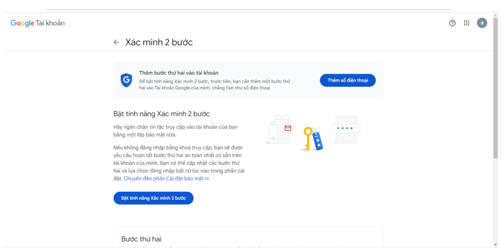

- Thêm số điện thoại và các khóa khác ta có thể click vào nút **Bật tính năng Xác minh 2 bước** để khởi động tính năng xác minh 2 bước

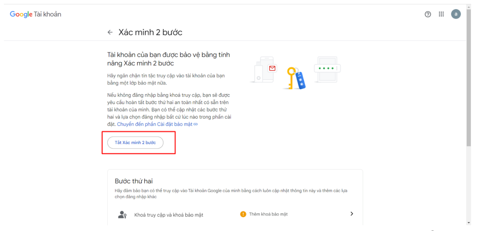

- Quay lại phần tìm kiếm trong quản lý tài khoản và tìm từ khóa **Mật khẩu ứng dụng** và click vào đó

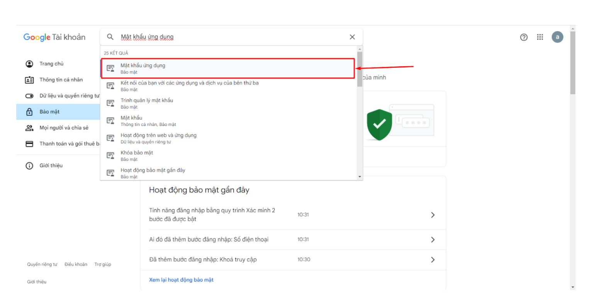

- Sau khi click vào **Mật khẩu ứng dụng** web sẽ hiển thị màn hình **Mật khẩu ứng dụng**

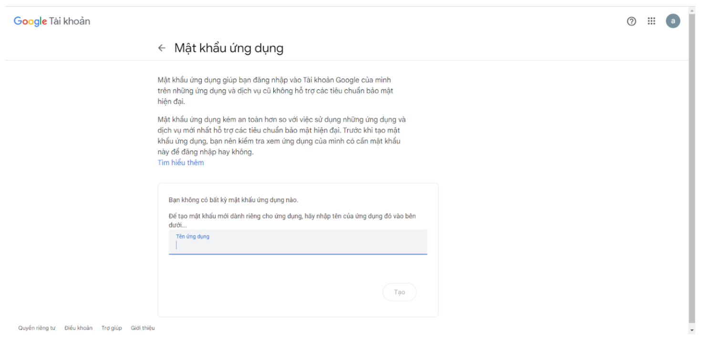

- Nhập tên của ứng dụng cần tạo mật khẩu ứng dụng. Ví dụ nhập tên ứng dụng mSMI là Quanlyhoadon và click nút **Tạo**. Màn hình sẽ hiển thị mật khẩu ứng dụng được tạo cho ứng dụng này.

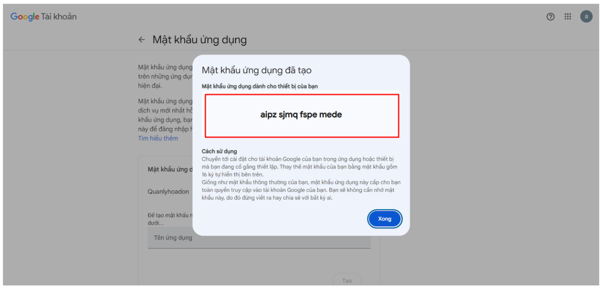

### **II. Tạo tài khoản nhận mail trên mSMI**

- Sau khi tạo mật khẩu ứng dụng cho gmail ta sẽ tạo tài khoản nhận mail trên mSMI

- Đăng nhập vào trang Quản lý hóa đơn mSMI chọn Hộp thư -> **Danh sách tài khoản**

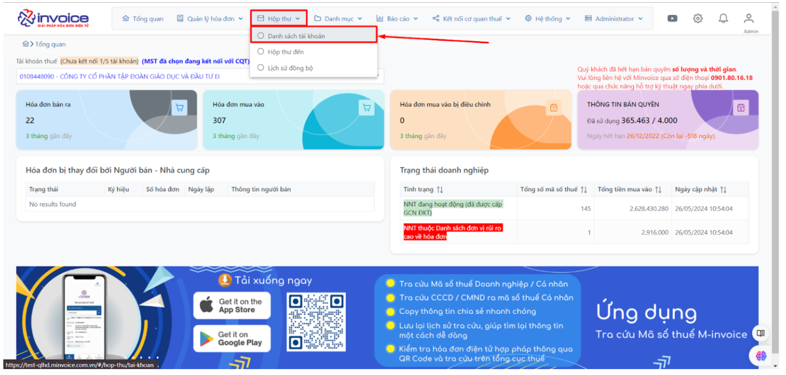

- Sau khi màn hình hiển thị danh sách tài khoản mail chọn nút **Thêm** để hiện ra form thêm tài khoản nhận mail

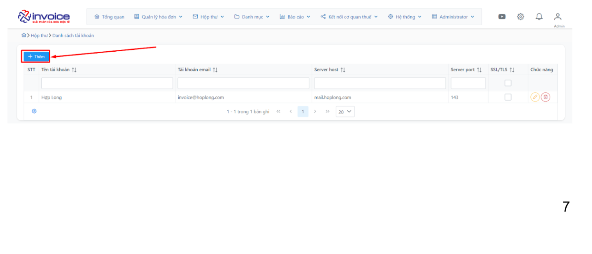

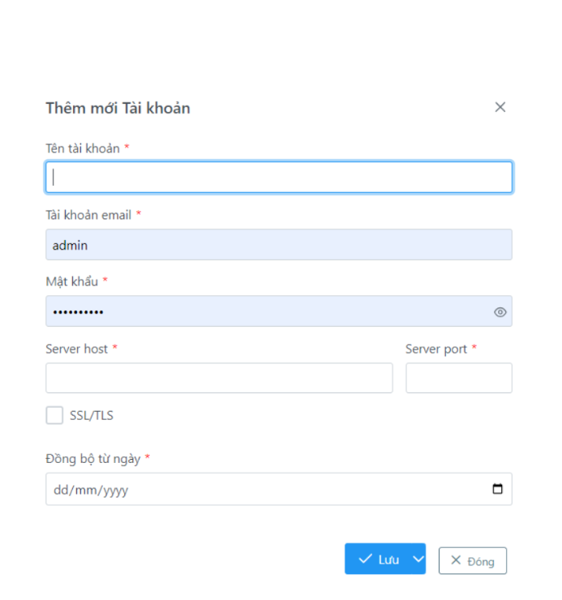

- Chi tiết các tham số khi thêm GMAIL vào phần mềm

<table style="width:100%;border-collapse:collapse;font-family:Arial,Helvetica,sans-serif;">
  <thead>
    <tr>
      <th style="border:1px solid #ccc;padding:8px 10px;text-align:left;background:#007BFF;color:#fff;font-weight:700;">Tham số</th>
      <th style="border:1px solid #ccc;padding:8px 10px;text-align:left;background:#007BFF;color:#fff;font-weight:700;">Ý nghĩa</th>
      <th style="border:1px solid #ccc;padding:8px 10px;text-align:left;background:#007BFF;color:#fff;font-weight:700;">Ví dụ</th>
    </tr>
  </thead>
  <tbody>
    <tr style="background:#ffffff;">
      <td style="border:1px solid #ccc;padding:8px 10px;vertical-align:top;">Tên tài khoản</td>
      <td style="border:1px solid #ccc;padding:8px 10px;vertical-align:top;">Tên tài khoản đồng bộ mail</td>
      <td style="border:1px solid #ccc;padding:8px 10px;vertical-align:top;">TA</td>
    </tr>
    <tr style="background:#fafafa;">
      <td style="border:1px solid #ccc;padding:8px 10px;vertical-align:top;">Tài khoản Email</td>
      <td style="border:1px solid #ccc;padding:8px 10px;vertical-align:top;">Tài khoản Email sử dụng để đồng bộ mail</td>
      <td style="border:1px solid #ccc;padding:8px 10px;vertical-align:top;">anhstanker@gmail.com</td>
    </tr>
    <tr style="background:#ffffff;">
      <td style="border:1px solid #ccc;padding:8px 10px;vertical-align:top;">Mật khẩu</td>
      <td style="border:1px solid #ccc;padding:8px 10px;vertical-align:top;">Mật khẩu của ứng dụng được lấy ở mục B.1 bên trên</td>
      <td style="border:1px solid #ccc;padding:8px 10px;vertical-align:top;">aipz sjmq fspe mede</td>
    </tr>
    <tr style="background:#fafafa;">
      <td style="border:1px solid #ccc;padding:8px 10px;vertical-align:top;">Server host / Server port</td>
      <td style="border:1px solid #ccc;padding:8px 10px;vertical-align:top;">Là server của giao thức IMAP nhận mail</td>
      <td style="border:1px solid #ccc;padding:8px 10px;vertical-align:top;">imap.gmail.com / 993</td>
    </tr>
    <tr style="background:#ffffff;">
      <td style="border:1px solid #ccc;padding:8px 10px;vertical-align:top;">SSL/TLS</td>
      <td style="border:1px solid #ccc;padding:8px 10px;vertical-align:top;">Là một công nghệ mã hóa dùng để bảo vệ thông tin truyền qua internet</td>
      <td style="border:1px solid #ccc;padding:8px 10px;vertical-align:top;">Email cá nhân cần sử dụng SSL/TLS nên sẽ tích vào phần này</td>
    </tr>
    <tr style="background:#fafafa;">
      <td style="border:1px solid #ccc;padding:8px 10px;vertical-align:top;">Đồng bộ từ ngày</td>
      <td style="border:1px solid #ccc;padding:8px 10px;vertical-align:top;">Là ngày bắt đầu đồng bộ dữ liệu mail</td>
      <td style="border:1px solid #ccc;padding:8px 10px;vertical-align:top;"></td>
    </tr>
  </tbody>
</table>

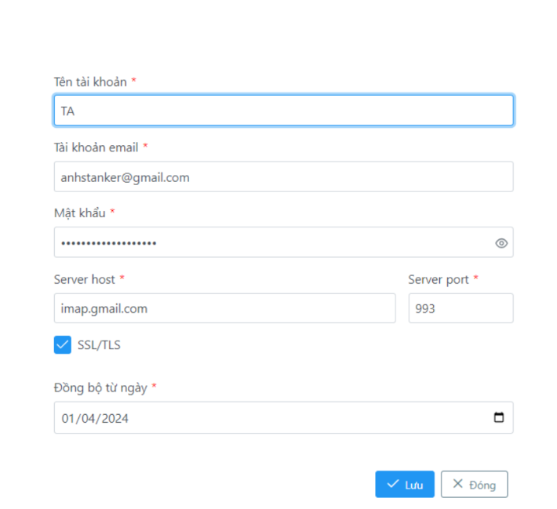

- Sau khi lưu màn hình trả về giao diện **Danh sách tài khoản**, có thông báo thành công ở góc trên bên phải màn hình và có thông tin tài khoản nhận mail mới được tạo trên danh sách tài khoản

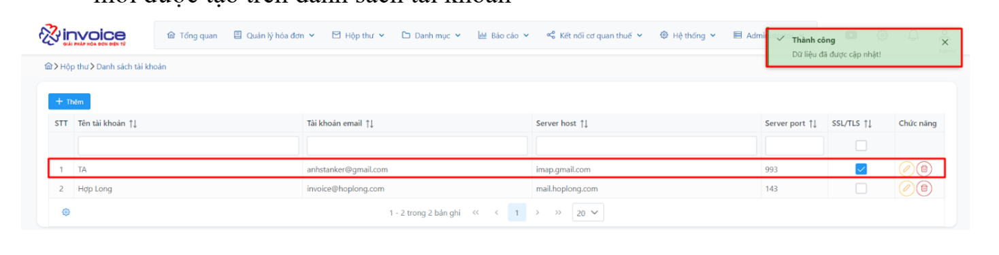

## **C. ĐỒNG BỘ HÓA ĐƠN TỪ GMAIL**

**Tạo tài khoản nhận mail từ Email Server**

- Sau khi màn hình hiển thị danh sách tài khoản mail chọn nút **Thêm** để hiện ra form thêm tài khoản nhận mail

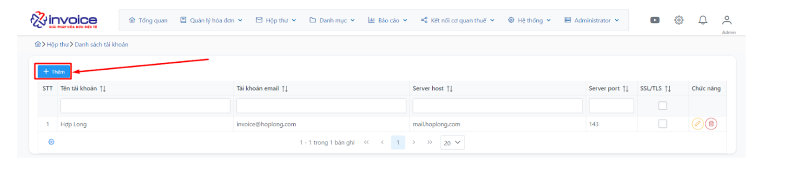

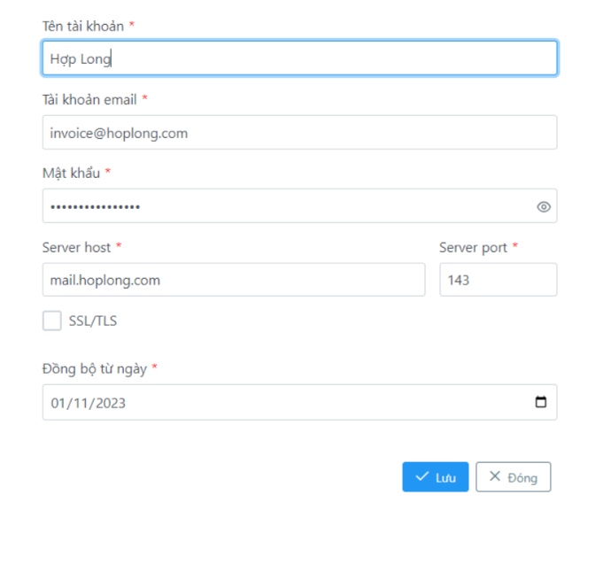

- Chi tiết các tham số khi thêm GMAIL vào phần mềm

<table style="width:100%;border-collapse:collapse;font-family:Arial,Helvetica,sans-serif;">
  <thead>
    <tr>
      <th style="border:1px solid #ccc;padding:8px 10px;text-align:left;background:#007BFF;font-weight:700;">Tham số</th>
      <th style="border:1px solid #ccc;padding:8px 10px;text-align:left;background:#007BFF;font-weight:700;">Ý nghĩa</th>
      <th style="border:1px solid #ccc;padding:8px 10px;text-align:left;background:#007BFF;font-weight:700;">Ví dụ</th>
    </tr>
  </thead>
  <tbody>
    <tr style="background:#ffffff;">
      <td style="border:1px solid #ccc;padding:8px 10px;vertical-align:top;">Tên tài khoản</td>
      <td style="border:1px solid #ccc;padding:8px 10px;vertical-align:top;">Tên tài khoản nhận mail</td>
      <td style="border:1px solid #ccc;padding:8px 10px;vertical-align:top;">Hợp Long</td>
    </tr>
    <tr style="background:#fafafa;">
      <td style="border:1px solid #ccc;padding:8px 10px;vertical-align:top;">Tài khoản Email</td>
      <td style="border:1px solid #ccc;padding:8px 10px;vertical-align:top;">Tài khoản Email sử dụng để đồng bộ mail</td>
      <td style="border:1px solid #ccc;padding:8px 10px;vertical-align:top;">invoice@hoplong.com</td>
    </tr>
    <tr style="background:#ffffff;">
      <td style="border:1px solid #ccc;padding:8px 10px;vertical-align:top;">Mật khẩu</td>
      <td style="border:1px solid #ccc;padding:8px 10px;vertical-align:top;">Mật khẩu đăng nhập của email server</td>
      <td style="border:1px solid #ccc;padding:8px 10px;vertical-align:top;"></td>
    </tr>
    <tr style="background:#fafafa;">
      <td style="border:1px solid #ccc;padding:8px 10px;vertical-align:top;">Server host / Server port</td>
      <td style="border:1px solid #ccc;padding:8px 10px;vertical-align:top;">Là server của giao thức IMAP nhận mail</td>
      <td style="border:1px solid #ccc;padding:8px 10px;vertical-align:top;">mail.hoplong.com / 143</td>
    </tr>
    <tr style="background:#ffffff;">
      <td style="border:1px solid #ccc;padding:8px 10px;vertical-align:top;">SSL/TLS</td>
      <td style="border:1px solid #ccc;padding:8px 10px;vertical-align:top;">Là một công nghệ mã hóa dùng để bảo vệ thông tin truyền qua internet; với email server này sẽ không sử dụng SSL/TLS</td>
      <td style="border:1px solid #ccc;padding:8px 10px;vertical-align:top;">Với email server sẽ không sử dụng SSL/TLS nên không tích vào phần này</td>
    </tr>
    <tr style="background:#fafafa;">
      <td style="border:1px solid #ccc;padding:8px 10px;vertical-align:top;">Đồng bộ từ ngày</td>
      <td style="border:1px solid #ccc;padding:8px 10px;vertical-align:top;">Là ngày bắt đầu đồng bộ dữ liệu mail</td>
      <td style="border:1px solid #ccc;padding:8px 10px;vertical-align:top;"></td>
    </tr>
  </tbody>
</table>

- Sau khi lưu màn hình trả về giao diện **Danh sách tài khoản**, có thông báo thành công ở góc trên bên phải màn hình và có thông tin tài khoản nhận mail mới được tạo trên danh sách tài khoản

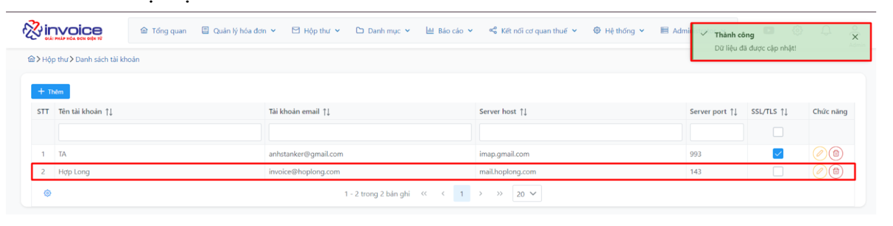

!!! info "Xin chân thành cảm ơn Quý khách hàng đã tin dùng sản phẩm của M-Invoice"

    Có bất kỳ vướng mắc nào trong quá trình sử dụng hãy liên hệ với M-Invoice tại mục Hỗ trợ kỹ thuật góc phải bên dưới màn hình hoặc gọi tổng đài kỹ thuật của M-Invoice (1900.955.557 Nhánh 1)

Last updated on <strong>Oct 1 , 2025</strong> by <strong>NHATTH</strong>

