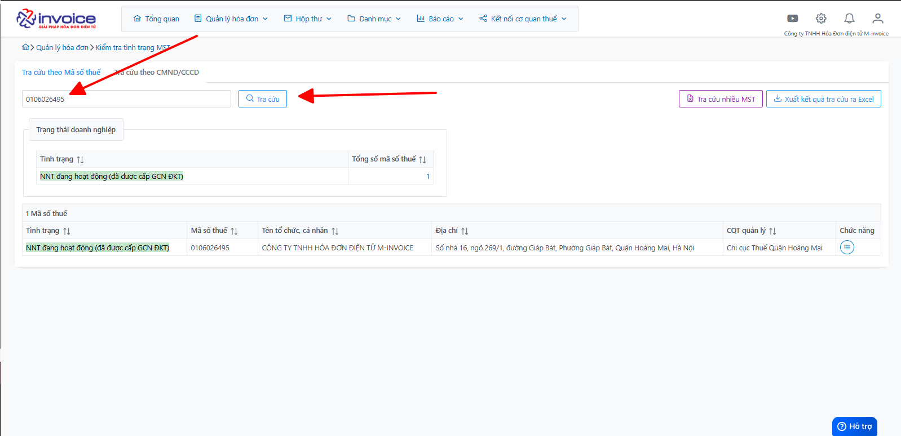
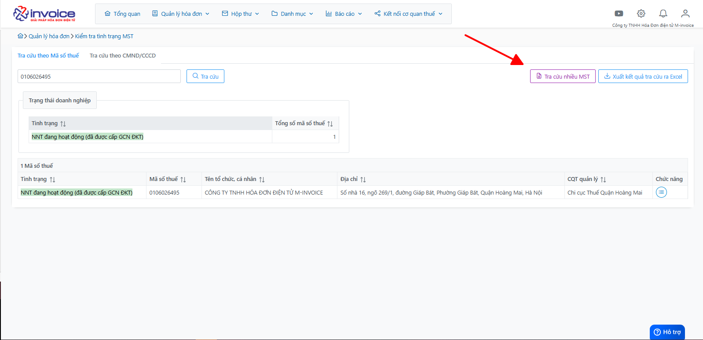
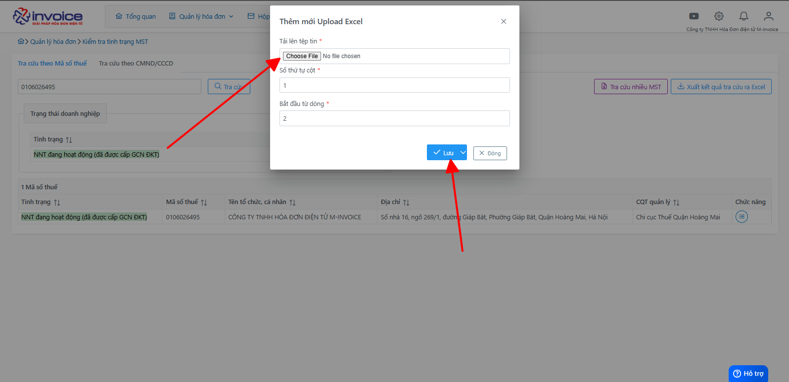
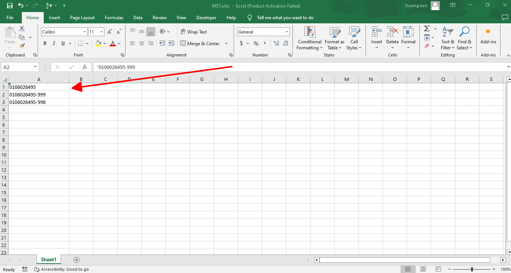
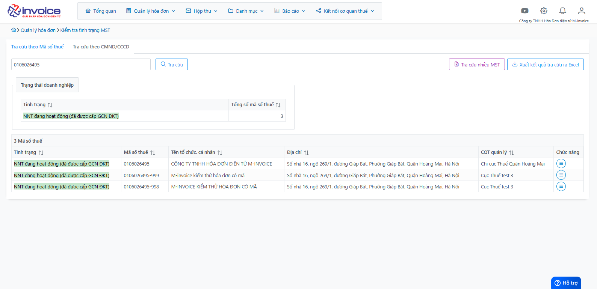

# **Kiểm tra tình trạng Mã số thuế**

## **Hướng dẫn kiểm tra tình trạng một hoặc nhiều Mã số thuế**

### Bước 1: Click chọn Quản lý hóa đơn >> Kiểm tra tình trạng Mã số thuế :

### Bước 2: Tiến hành tra cứu mã số thuế theo 2 trường hợp

- Đối với tra cứu riêng lẻ, anh chị điền mã số thuế cần tra cứu vào và chọn nút Tra cứu

- Đối với tra cứu hàng loạt, anh chị chọn vào Tra cứu nhiều MST

- Chúng ta sẽ tra cứu hàng loạt theo danh sách ở trong file Excel

[![Hình 3]][Hình 3]

[Hình 3]: ../../assets/images/mSMI/msmi_kiemTraMST_3.png

- Chúng ta sẽ tra cứu hàng loạt theo danh sách ở trong file Excel

[![Hình 4]][Hình 4]

[Hình 4]: ../../assets/images/mSMI/msmi_kiemTraMST_5.png

- Anh chị điền số dòng và số cột tương ứng với ô bắt đầu dữ liệu trong file excel của mình, tải file lên và sau đó bấm Lưu

[Hình 5]: ../../assets/images/mSMI/msmi_kiemTraMST_4.png

[![Hình 6]][Hình 6]

[Hình 6]: ../../assets/images/mSMI/msmi_kiemTraMST_3.png

Như vậy, chúng ta đã thành công kiểm tra tình trạng mã số thuế.

!!! Note "Chú ý"

    Đối với tra cứu bằng CCCD, CMND anh chị thực hiện tương tự với MST

!!! info "Xin chân thành cảm ơn Quý khách hàng đã tin dùng sản phẩm của M-Invoice"

    Có bất kỳ vướng mắc nào trong quá trình sử dụng hãy liên hệ với M-Invoice tại mục Hỗ trợ kỹ thuật góc phải bên dưới màn hình hoặc gọi tổng đài kỹ thuật của M-Invoice (1900.955.557 Nhánh 1)

Last updated on <strong>Mar 27, 2025</strong> by <strong>Trịnh Hoài Nhất</strong>

