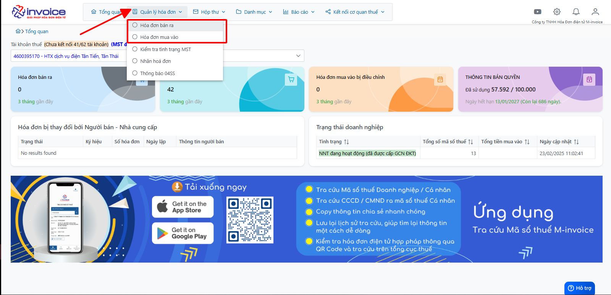
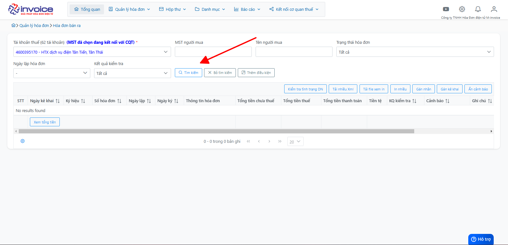
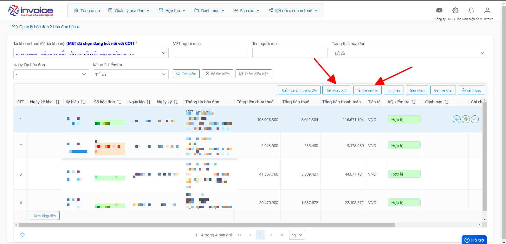

# **Tra cứu hóa đơn và tải về lưu trữ mua vào - bán ra**

## **Hướng dẫn tra cứu và lưu trữ hóa đơn mua vào - bán ra**

### Bước 1: Click chọn Quản lý hóa đơn :

Chọn mục Bán ra hoặc Mua vào tùy thuộc nhu cầu đang cần sử dụng

### Bước 2: Anh chị điền vào các điều kiện mình muốn tra cứu, sau đó bấm nút tìm kiếm

### Bước 3: Chọn vào Tải nhiêu XML hoặc Tải nhiều PDF để có thể lưu trữ về máy

!!! info "Xin chân thành cảm ơn Quý khách hàng đã tin dùng sản phẩm của M-Invoice"

    Có bất kỳ vướng mắc nào trong quá trình sử dụng hãy liên hệ với M-Invoice tại mục Hỗ trợ kỹ thuật góc phải bên dưới màn hình hoặc gọi tổng đài kỹ thuật của M-Invoice (1900.955.557 Nhánh 1)

Last updated on <strong>Dec 12, 2025</strong> by <strong>Nhatth</strong>

