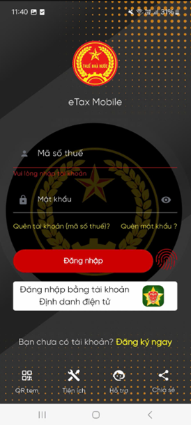
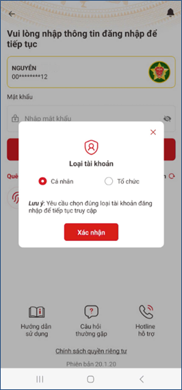
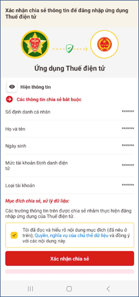
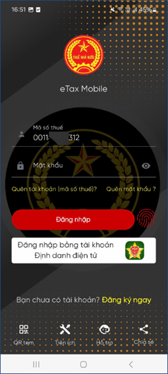

# **Hướng dẫn đăng nhập eTax Mobile**

Trong quá trình đăng nhập sẽ có hai trường hợp hợp đăng nhập khác nhau

=== "**Trường hợp 1**"
    #### Trường hợp 1: Đại diện tổ chức đăng nhập bằng tài khoản định danh điện tử VNeID mức 2

    Chọn Đăng nhập bằng tài khoản Định danh điện tử
    <figure markdown="span">
      
    </figure>

    **Bước 1**: Chọn Loại tài khoản cá nhân >> Nhấn xác nhận >> Xác nhận chia sẻ thông tin để đăng nhập ứng dụng Thuế điện tử
    <figure markdown="span">
    
    </figure>

    **Bước 2**: Tích chọn “Tôi đã đọc và hiểu rõ nội dung mục đích (đã nêu ở trên); Quyền, nghĩa vụ của chủ thể dữ liệu và đồng ý với các nội dung này
    
    - Nhấn Xác nhận chia sẻ  >> Hệ thống hiển thị màn hình nhập passcode
    <figure markdown="span">
      
    </figure>

    **Bước 3**: Nhập passcode > Hệ thống hiển thị màn hình chức năng, bổ sung thêm chức năng Hóa đơn điện tử

    <figure markdown="span">
    
    </figure>

=== "**Trường hợp 2**"
    ####Trường hợp 2: Đại diện tổ chức đăng nhập bằng MST và mật khẩu được cấp bởi CQT
    ???+ warring "Lưu ý"
        Áp dụng đối với NNT đã có CCCD
    
    **Bước 1**: Thực hiện lần lượt các thao tác

      1. NSD nhập MST 12 số là CCCD (thay cho MST 10 số trước đó)
      2. Nhập mật khẩu do CQT cấp
      3. Nhấn nút “Đăng nhập” > Hệ thống hiển thị màn hình chức năng, bổ sung thêm chức năng **Hóa đơn điện tử**

    <figure markdown="span">
    
    </figure>

Last updated on <strong>May, 2026</strong> by <strong>manhdd</strong>

    