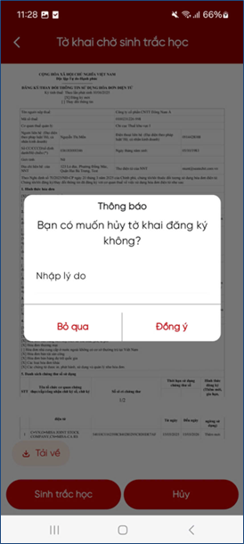

# Hủy tờ khai chờ xác thực

Nếu người đại diện không muốn thực hiện Xác thực Sinh trắc học hoặc xác thực OTP hoặc không muốn gửi tờ khai đến hệ thống HĐĐT thì thực hiện các bước Hủy hồ sơ như sau:

**Bước 1**: Nhấn nút “**Hủy**”. Hệ thống hiển thị màn hình thông báo “**Bạn có muốn hủy tờ khai đăng ký không?**”.

**Bước 2**: Nhập lý do hủy.

**Bước 3**: Nhấn nút “**Đồng ý**”. Hệ thống gửi yêu cầu Hủy tới HĐĐT.

<figure markdown="span">
        
</figure>

???+ Warning "Cảnh báo các trường hợp được hủy và không được hủy"

    - **Trường hợp được phép Hủy**: Hệ thông hiển thị màn hình Hủy hồ sơ thành công. Và cập nhật trạng thái hồ sơ đã hủy trên hệ thống.

    - **Trường hợp không được phép hủy**: hiển thị màn hình hủy không thành công.

**Bước 4**: Nhấn “**Bỏ qua**”, hệ thống quay trở lại màn hình **Xác thực Sinh trắc học/Xác thực OTP**.

Last updated on <strong>May, 2026</strong> by <strong>manhdd</strong>
