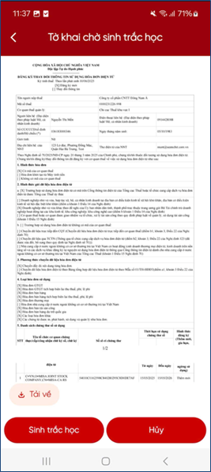
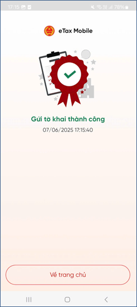
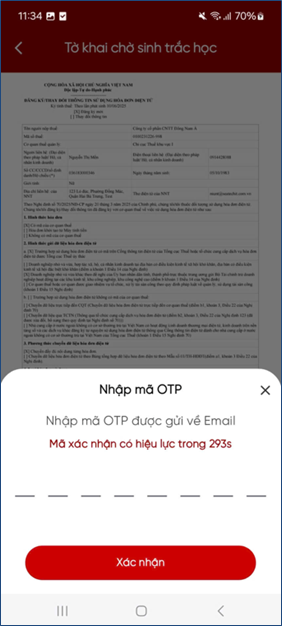

# Tờ khai chờ xác thực

!!! Warning

    - Hệ thống chỉ hiển thị tờ khai chờ Xác thực trong chức năng “Tờ khai chờ xác thực” đối với các đối tượng sau đăng nhập theo hướng dẫn được mô tả tại bước 1:
        + Đại diện tổ chức (Kê khai trực tiếp tờ khai trên eTax Mobile hoặc TTHC)
        + Đại diện hộ kinh doanh (Kê khai trực tiếp tờ khai trên eTax Mobile hoặc TTHC)
        + Đại diện tổ chức (Kê khai tờ khai từ TVAN)
        + Nếu còn hạn Xác thực Sinh trắc học/Xác thực OTP, hệ thống hiển thị nút Sinh trắc học/Xác thực OTP và nút Hủy
        + Nếu quá hạn Xác thực Sinh trắc học/Xác thực OTP (quá 1 ngày làm việc kể từ ngày NSD nhận được email thông báo có hồ sơ cần Sinh trắc học/Xác thực OTP), hệ thống sẽ thực hiện gửi email thông báo quá hạn cho NSD thông qua email đăng ký trên tờ khai 01/ĐKTĐ-HĐĐT và gửi thông báo quá hạn cho hệ thống HĐĐT.

    <figure markdown="span">
        
    </figure>
    <!--  -->

=== "Trường hợp sinh trắc học"
     
    **Bước 1**: Người đại diện pháp luật nhấn nút “Sinh trắc học”, hệ thống hiển thị màn hình “Xác nhận xác thực ảnh khuôn mặt”.

    **Bước 2**: NSD tích “Tôi đã đọc và hiểu rõ nội dung mục đích (đã nêu ở trên), Quyền, nghĩa vụ của chủ thể dữ liệu và đồng ý với các nội dung này.

    **Bước 3**: Nhấn Xác nhận chia sẻ
            
    <figure markdown="span">
        
    </figure>

    **Bước 4**: Nhập passcode, hệ thống hiển thị màn hình chia sẻ thông tin thành công

    <figure markdown="span">
        
    </figure>

    **Bước 5**: NSD thực hiện các bước xác thực gương mặt theo hướng dẫn. Hệ thống hiển thị màn hình kết quả xác thực khuôn mặt với BCA:

    * Trường hợp không khớp thông tin với BCA: Hiển thị màn hình “Xác thực sinh trắc học không thành công”. Hiển thị thêm nút “Xác thực lại” cho phép người đại diện thực hiện Sinh trắc học lại

    * Trường hợp khớp thông tin với BCA: Hiển thị màn hình “Xác thực sinh trắc học thành công”. Hiển thị thêm nút “Gửi tờ khai”
        
    <figure markdown="span">
        
     </figure>

    **Bước 6**: NSD nhấn nút Gửi tờ khai, hệ thống hiển thị màn hình Gửi tờ khai thành công và gửi tờ khai 01/ĐKTĐ-HĐĐT đến hệ thống HĐĐT

    <figure markdown="span">
        
    </figure>

=== "Trường hợp xác thực OTP"
          
    **Bước 1**: Người đại diện pháp luật nhấn nút “**Xác thực OTP**”, hệ thống gửi mã OTP về:

    - Email trên tờ khai 01/ĐKTĐ-HĐĐT của NNT
    - Email của Người đại diện pháp luật đăng ký eTax Mobile
    - Notify trên app eTax Mobile

    <figure markdown="span">
        
    </figure>

    **Bước 2**: Nhập mã OTP hợp lệ. Hệ thống hiển thị màn hình Xác thực OTP thành công. Hiển thị thêm nút “**Gửi tờ khai**”

    <figure markdown="span">
        
    </figure>

    **Bước 3**: Nhấn nút Gửi tờ khai, hệ thống hiển thị màn hình Gửi tờ khai thành công và gửi tờ khai 01/ĐKTĐ-HĐĐT đến hệ thống HĐĐT.

    <figure markdown="span">
        
    </figure>

Last updated on <strong>May, 2026</strong> by <strong>manhdd</strong>

    
    

