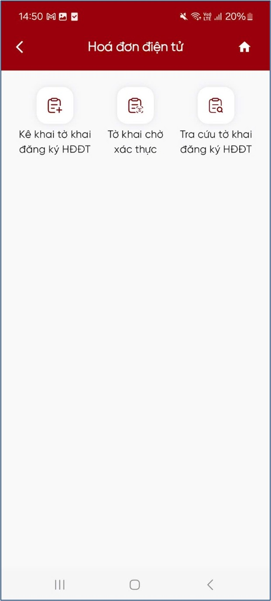
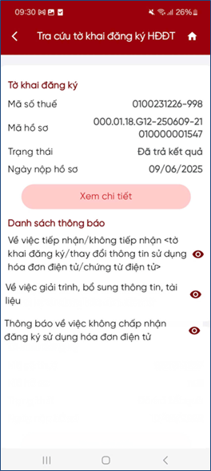
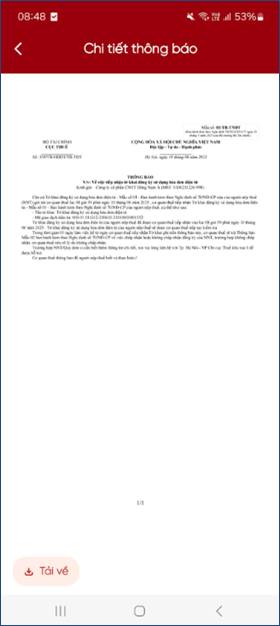

# Tra cứu thông báo

### Trường hợp NSD đã kê khai tờ khai đăng ký/thay đổi thông tin sử dụng hóa đơn điện tử mẫu số 01/ĐKTĐ-HĐĐT trực tiếp trên eTax Mobile

**Bước 1**: NSD chọn chức năng **Tra cứu tờ khai**, hệ thống hiển thị danh sách thông báo tương ứng với các tờ khai được nộp trực tiếp trên eTax Mobile.

<figure markdown="span">
    
</figure>

**Bước 2**: NSD kiểm tra danh sách thông báo, bao gồm:

- Thông báo tiếp nhận/không tiếp nhận tờ khai
- Thông báo chấp nhận/không chấp nhận tờ khai
- Thông báo giải trình, bổ sung thông tin
- Thông báo ngừng sử dụng hóa đơn điện tử

<figure markdown="span">
    
</figure>

**Bước 3**: Nhấn vào biểu tượng :eye: (con mắt), hệ thống hiển thị chi tiết nội dung thông báo

<figure markdown="span">
    
</figure>

Last updated on <strong>May, 2026</strong> by <strong>manhdd</strong>

