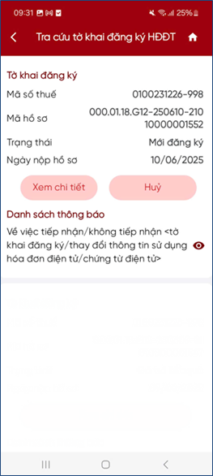
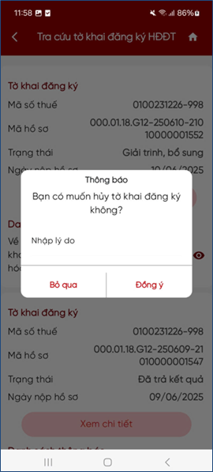

# Tra cứu tờ khai chưa có kết quả

**Bước 1**: Chọn Tra cứu tờ khai. Hệ thống hiển thị thông tin:

<figure markdown="span">
    
</figure>

- Mã số thuế: Hiển thị mã số thuế trên tờ khai
- Mã hồ sơ: Hiển thị mã hồ sơ
- Trạng thái: Bao gồm Mới đăng ký, Chờ chấp nhận, Đang giải quyết, Đã giải trình bổ sung
- Ngày nộp hồ sơ: Hiển thị ngày nộp hồ sơ
- Danh sách thông báo

**Bước 2**: Nhấn “Xem chi tiết”, hệ thống hiển thị chi tiết tờ khai 01/ĐKTĐ-HĐĐT

**Bước 3**: Nếu muốn hủy hồ sơ, NSD nhấn nút “**Hủy**”, hệ thống hiển thị màn hình thông báo “Bạn có muốn hủy tờ khai đăng ký không”

**Bước 4**: NSD nhập Lý do hủy và nhấn “Đồng ý”. Hệ thống gửi yêu cầu Hủy tới HĐĐT.

- Nếu được phép Hủy: Hiển thị thông báo Hủy hồ sơ thành công
- Nếu không được phép Hủy: Hiển thị thông báo “Không thể hủy giao dịch này” trên màn hình.

<figure markdown="span">
    
</figure>

Last updated on <strong>May, 2026</strong> by <strong>manhdd</strong>

