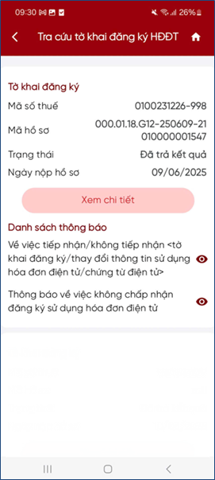
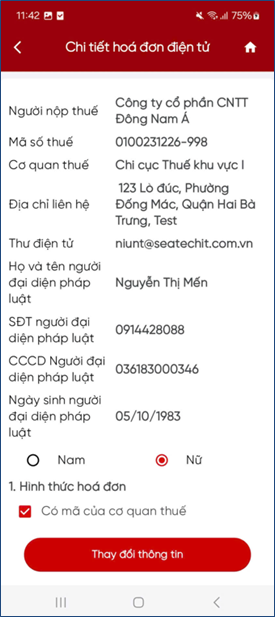
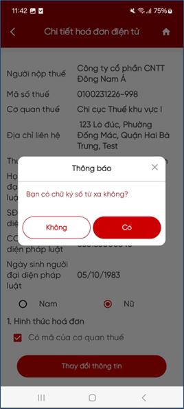

# Tra cứu tờ khai đã trả kết quả

**Bước 1**: Chọn Tra cứu tờ khai. Hệ thống hiển thị thông tin:

- Mã số thuế: Hiển thị mã số thuế trên tờ khai
- Mã hồ sơ: Hiển thị mã hồ sơ
- Trạng thái: Đã trả kết quả
- Ngày nộp hồ sơ: Hiển thị ngày nộp hồ sơ
- Danh sách thông báo

**Bước 2**: Nhấn “**Xem chi tiết**”, hệ thống hiển thị chi tiết tờ khai 01/ĐKTĐ-HĐĐT

<figure markdown="span">
    
</figure>

**Bước 3**: Nhấn “**Thay đổi thông tin**”, hệ thống hiển thị thông báo “Bạn có chữ ký số từ xa không?”. NSD nhấn chọn:

<figure markdown="span">
    
   
</figure>
    
- Nếu chọn “**Không**”: Hệ thống quay lại màn hình kết quả tra cứu.

- Nếu chọn “Có”: Hệ thống kiểm tra MST có được phép kê khai tờ khai thay đổi thông tin hay không.

    - Nếu không được phép kê khai: Hiển thị thông báo lỗi ngay trên màn hình
    - Nếu được phép kê khai: Hiển thị dữ liệu tờ khai gần nhất, cho phép NSD thay đổi thông tin tờ khai 01/ĐKTĐ-HĐĐT. (Xem chi tiết tại Bước 8)

<figure markdown="span">
    
</figure>

Last updated on <strong>May, 2026</strong> by <strong>manhdd</strong>
