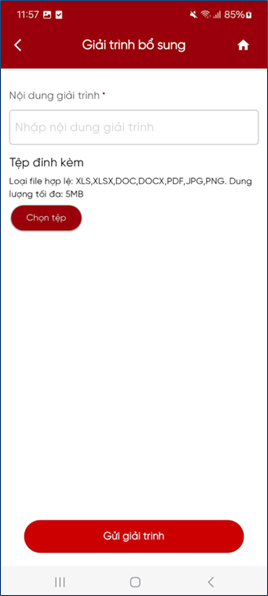

# Tra cứu tờ khai giải trình, bổ sung thông tin

**Bước 1**: Chọn Tra cứu tờ khai. Hệ thống hiển thị thông tin:

- Mã số thuế: Hiển thị mã số thuế trên tờ khai
- Mã hồ sơ: Hiển thị mã hồ sơ
- Trạng thái: Giải trình, bổ sung
- Ngày nộp hồ sơ: Hiển thị ngày nộp hồ sơ
- Danh sách thông báo

<figure markdown="span">
    
</figure>

**Bước 2**: Nhấn “**Xem chi tiết**”, hệ thống hiển thị chi tiết tờ khai 01/ĐKTĐ-HĐĐT

**Bước 3**: Nếu muốn hủy hồ sơ, NSD nhấn nút “**Hủy**”, hệ thống hiển thị màn hình thông báo “Bạn có muốn hủy tờ khai đăng ký không?”

- NSD nhập Lý do hủy và nhấn “Đồng ý”. Hệ thống gửi yêu cầu Hủy tới HĐĐT.
    - Nếu được phép Hủy: Hiển thị thông báo Hủy hồ sơ thành công.
    - Nếu không được phép Hủy: Hiển thị thông báo “Không thể hủy giao dịch này” trên màn hình.

- NSD nhấn “Bỏ qua”, hệ thống quay lại màn hình kết quả tra cứu.

<figure markdown="span">
    
</figure>

**Bước 4**: Nhấn “Giải trình”, hệ thống hiển thị màn hình nhập nội dung giải trình và đính kèm hồ sơ giải trình, bổ sung thông tin

<figure markdown="span">
    
</figure>

**Bước 5**: Nhập nội dung giải trình, bổ sung thông tin

**Bước 6**: Nhấn “Chọn tệp”, hệ thống hiển thị đường dẫn chọn file. NSD tải file hồ sơ cần đính kèm, gửi đến HDDT định dạng .xlsx, .xls, .docx, .doc, .pdf, .png, .jpg

???+ tip "Cách chọn nhiều tệp"
    Nếu muốn tải nhiều file đính kèm, NSD nhấn “Chọn tệp” nhiều lần để thêm tệp.

**Bước 7**: Nhấn nút “**Gửi giải trình**”, hệ thống gửi giải trình, bổ sung của NNT đến hệ thống HDĐT, đồng thời cập nhật trạng thái tờ khai là “Đã giải trình, bổ sung”

<figure markdown="span">
    
</figure>

Last updated on <strong>May, 2026</strong> by <strong>manhdd</strong>

