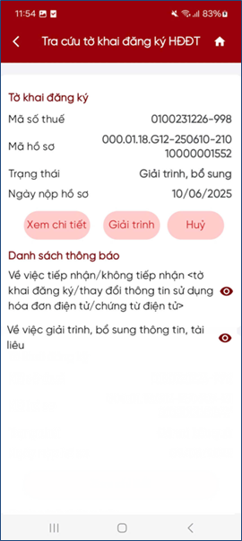
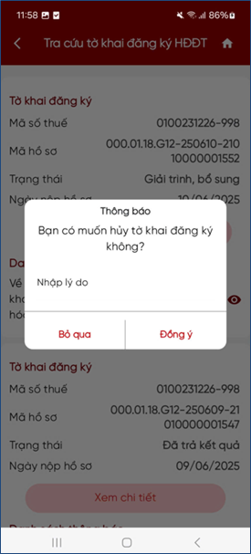

# Trường hợp chưa có tờ khai đăng ký 

## Trường hợp chưa có tờ khai đăng ký theo NĐ70 trên cổng TTHC, đã kê khai đăng ký sử dụng HĐĐT theo NĐ123 trên HĐĐT, mong muốn kê khai tờ khai thay đổi thông tin theo NĐ70 trên cổng TTHC

### Hệ thống hiển thị màn hình bắt buộc nhập MST cần tra cứu. 

<figure markdown="span">
    
</figure>

**Bước 1**: Nhập MST cần kê khai thay đổi thông tin. 

**Bước 2**: Hệ thống kiểm tra quyền tra cứu tờ khai của người đăng nhập:

- Nếu được phép tra cứu tờ khai: Hệ thống hiển thị thông tin tờ khai gần nhất có trạng thái Đã trả kết quả và hiển thị kết quả lên màn hình.
- Nếu không được phép tra cứu tờ khai: Hiển thị thông báo “Bạn không có quyền tra cứu hồ sơ của MST này”

<figure markdown="span">
    
</figure>

Last updated on <strong>May, 2026</strong> by <strong>manhdd</strong>
