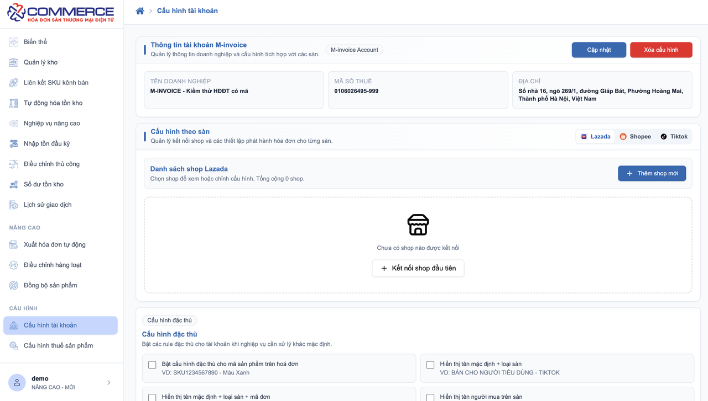
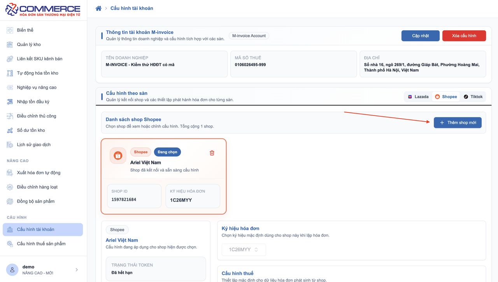

# **Tài liệu hướng dẫn sử dụng E-com kết nối TikTok Shop – Shopee – Lazada và Xuất hóa đơn Minvoice**

???+ Note "Mục đích"

    Tài liệu này hướng dẫn người dùng cách thao tác trên hệ thống E‑COM để kết nối nhiều shop, đồng bộ đơn hàng và xuất hóa đơn điện tử M-invoice 

## **1, Bắt đầu sử dụng**

### 1.1, Đăng nhập vào hệ thống E-com

1, Truy cập hệ thống E‑com https://ecommerce.minvoice.com.vn/

2, Nhập tài khoản và mật khẩu E-com do bên M-invoice cung cấp

3, Sau khi đăng nhập thành công, bạn sẽ thấy trang quản trị chính.

### 1.2, Đăng nhập vào hệ thống M-invoice

Để xuất hóa đơn lên M-invoice, bạn phải đăng nhập tài khoản hóa đơn điện tử M-invoice ngay trong hệ thống E‑com

#### Các bước

Bước 1: Vào Cấu hình tài khoản

Bước 2: Nhập tài khoản & mật khẩu Minvoice

Bước 3: Nhấn Kết nối

Bước 4: Hệ thống hiển thị "Đã kết nối" và thông tin tài khoản

## **2, Kết nối các sàn (TikTok Shop, Shopee, Lazada)**

Hệ thống cho phép bạn kết nối nhiều sàn và nhiều shop trên mỗi sàn.

### 2.1, Kết nối shop

1, Sau khi đăng nhập thành công tài khoản M-invoice , Tiếp tục thực hiện **Kết nối sàn**

2, Chọn sàn muốn kết nối (TikTok, Shopee, Lazada)

3, Nhấn **Kết nối Shop** hoặc **Thêm shop mới** (khi đã có shop)

4, Đăng nhập tài khoản sàn và **cấp quyền**

5, Sau khi kết nối thành công, shop sẽ hiển thị trong danh sách

Lưu ý: Muốn kết nối shop khác → lặp lại các bước trên.

## **3, Các bước cấu hình**

Mỗi shop cần cấu hình thông tin trước khi xuất hóa đơn

### 3.1, Các bước cấu hình

Bước 1: Chọn shop trong danh sách cần cấu hình

Bước 2: Nhấn **Cập nhật** ở dưới cùng để chỉnh sửa cấu hình (mặc định tất cả đều chưa có nội dung)

Bước 3: Nhập các thông tin cần thiết:

  - Ký hiệu hóa đơn

  - Thuế suất mặc định

  - Đơn vị tính mặc định

  - Đơn giá trên sản phẩm đã bao gồm thuế suất hay chưa (tích chọn)

  - Tách phần giảm giá ra thành một dòng riêng biệt hay không (tích chọn)

  - Áp dụng giảm thuế nếu là HKD có giảm thuế

  - Đối với các cấu hình đặc thù thì KH có nhu cầu nào thì tick chọn vào và lưu lại

Bước 4: Nhấn **Lưu**

Bước 5: Tùy chỉnh riêng cho từng sản phẩm (nếu có) 

- Truy cập vào trang cấu hình thuế sản phẩm

- Chọn sàn và shop tương ứng cần cấu hình sản phẩm riêng biệt

- Nhập mã sản phẩm (tương ứng trên sàn), tên sản phẩm, thuế suất và đơn vị muốn hiển thị trong hóa đơn - (nhập thủ công hoặc bằng excel) và lưu - có thể tải mẫu khi nhập bằng excel

Sau khi **lưu**, shop đã sẵn sàng để xuất hóa đơn

## **4, Đồng bộ đơn hàng**

Bước 1: Vào Danh sách đơn hàng

Bước 2: Chọn Shop muốn xem

Bước 3: Nhấn Đồng bộ đơn hàng để dồng bộ ( thời gian đồng bộ sẽ phụ thuộc vào số lượng đơn hàng) - mặc định đồng bộ ngay lập tức khi có phát sinh đơn

Bước 4: Danh sách đơn hàng sẽ hiển thị gồm:

- Trạng thái hóa đơn (gốc - điều chỉnh)

- Trạng thái tạo hóa đơn (chưa tạo, đã tạo)

- Trạng thái gửi CQT (chờ ký, đã gửi, đã ký, thành công, có lỗi) 

- Số hóa đơn 

- KHHD 

- Mã đơn hàng 

- Ngày đơn hàng 

- Ngày cập nhật

- Khách hàng 

- Giảm giá

- Tổng tiền hàng 

- Trạng thái đơn hàng 

## **5, Xuất hóa đơn điện tử**

### 5.1, Các bước cấu hình

Bước 1: Vào danh sách đơn hàng

Bước 2: Chọn một hoặc nhiều đơn muốn xuất hóa đơn

Bước 3: Nhấn Tạo hóa đơn

Bước 4: Xác nhận các thông tin hóa đơn - có thể chọn ngày tạo hóa đơn

Bước 5: Hệ thống gửi dữ liệu sang Minvoice

Bước 6: Kết quả hiển thị:

- Đã tạo thành công → Có mã hóa đơn

- Lỗi xuất hóa đơn → Hiển thị nguyên nhân để bạn xử lý

## **6, Điều chỉnh hóa đơn về 0**

Hệ thống hỗ trợ điều chỉnh hóa đơn đã ký, chỉ theo dạng điều chỉnh giảm về 0

### 6.1, Sử dụng khi

Khi đơn hàng bị hoàn trả và bạn muốn xóa giá trị hóa đơn, không chỉnh từng dòng

### 6.2, Các bước điều chỉnh giảm về 0

Bước 1: Vào danh sách hóa đơn

Bước 2: Tích chọn các hóa đơn đã ký cần điều chỉnh

Bước 3: Nhấn Điều chỉnh hóa đơn

Bước 4: Xác nhận các hóa đơn cần điều chỉnh

Bước 5: Hệ thống gửi yêu cầu sang Minvoice

Bước 6: Trạng thái trả về sẽ hiển thị trong danh sách

### 6.3, Hiển thị kết quả trên hệ thống

Hệ thống thêm một hóa đơn điều chỉnh mới

Ở danh sách hóa đơn có cột Trạng thái hóa đơn:

- Tờ gốc

- Tờ điều chỉnh

### 6.4, Điều chỉnh hóa đơn hàng loạt

Bước 1: Vào điều chỉnh hàng loạt

Bước 2: Chọn sàn cần điều chỉnh rồi nhấn vào nút "Tải mẫu"  để tải tệp mẫu Excel về máy tính

Bước 3: Sau khi đã chuẩn bị xong file (nhập mã đơn hàng ), nhấn nút "Chọn file Excel"

Bước 4: Khi dữ liệu đã sẵn sàng, nhấn nút "Điều chỉnh hàng loạt"  để hệ thống bắt đầu xử lý

Bước 5: Sau khi hệ thống chạy xong, kết quả sẽ hiển thị chi tiết tại bảng "Kết quả xử lý"

!!!warning "Lưu ý"
    Hiện tại hệ thống xử lý song song tối đa 10 đơn khi tra cứu và gửi điều chỉnh theo lô 50 đơn để tránh dồn tải lên server. Mỗi lần tải lên tối đa 500 dòng dữ liệu và 500 mã đơn hợp lệ.

## **7, Cấu hình xuất hoá đơn tự động**

### 7.1, Cấu hình chung

Giải thích các **trường cấu hình**:

- **Ngày bắt đầu**: Hệ thống sẽ lấy theo ngày tạo đơn hàng

- **Khoảng thời gian đồng bộ**: Hệ thống sẽ quét theo khoảng thời gian tính từ ngày hiện tại đổ về trước. Ví dụ khoảng thời gian là 30 ngày. Hệ thống sẽ lấy đơn hàng từ ngày hiện tại quay lại 30 ngày.

- **Lấy đơn theo ngày cập nhật**: Hệ thống sẽ dựa vào thời gian cập nhật của đơn hàng và trạng thái đơn hàng để lấy ra đơn hàng phù hợp để xuất hoá đơn. Ví dụ KH muốn xuất hoá đơn cho các đơn hàng có thời gian giao hàng bắt đầu từ ngày hiện tại => hệ thống sẽ lấy đơn hàng và lọc theo điều kiện ngày cập nhật là ngày hiện tại để xuất hoá đơn.

- **Trạng thái đơn hàng**: Chọn trạng thái đơn hàng theo yêu cầu của khách hàng để hệ thống lọc theo điều kiện trạng thái đó.

- **Cấu hình đặc thù**: Trường hợp trong mục cấu hình tài khoản có cấu hình đặc thù thì cần tick chọn lại trong phần cấu hình này để áp dụng.

=> Sau khi cấu hình xong thì nhấn nút tạo cấu hình và bật xuất tự động

## **8, Theo dõi trạng thái hóa đơn**

1, Vào **danh sách hóa đơn**

2, Hệ thống hiển thị

- Trạng thái hóa đơn 

- Trạng thái tạo hóa đơn

- Trạng thái gửi CQT

- Số hóa đơn

- KHHD 

## **9, Các lỗi thường gặp**

- **Không kết nối được sàn**: Kiểm tra lại tài khoản đăng nhập sàn

- **Không đồng bộ được đơn hàng**: Token truy cập có thể hết hạn → kết nối lại

- **Lỗi xuất hóa đơn**: Thường do thiếu thông tin cấu hình (ký hiệu hóa đơn, thuế suất…)

- **Lỗi điều chỉnh**: Hóa đơn chưa ký hoặc không hợp lệ để điều chỉnh về 0

???+ info "Xin chân thành cảm ơn quý khách hàng đã tin dùng sản phẩm của M-Invoice"

    Có bất kỳ vướng mắc nào trong quá trình sử dụng hãy liên hệ với M-Invoice tại mục Hỗ trợ kỹ thuật góc phải bên dưới màn hình hoặc gọi tổng đài kỹ thuật của M-Invoice (0909 500 126 nhấn phím 2)

Last updated on <strong>Apr 27, 2026</strong> by <strong>DATVT</strong>

