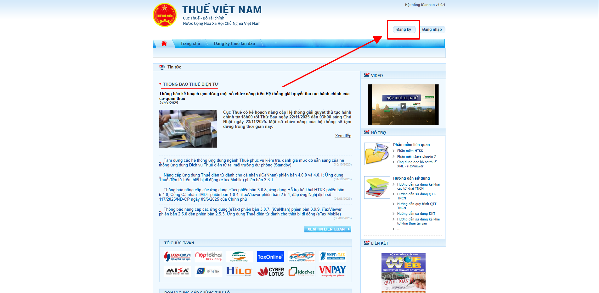
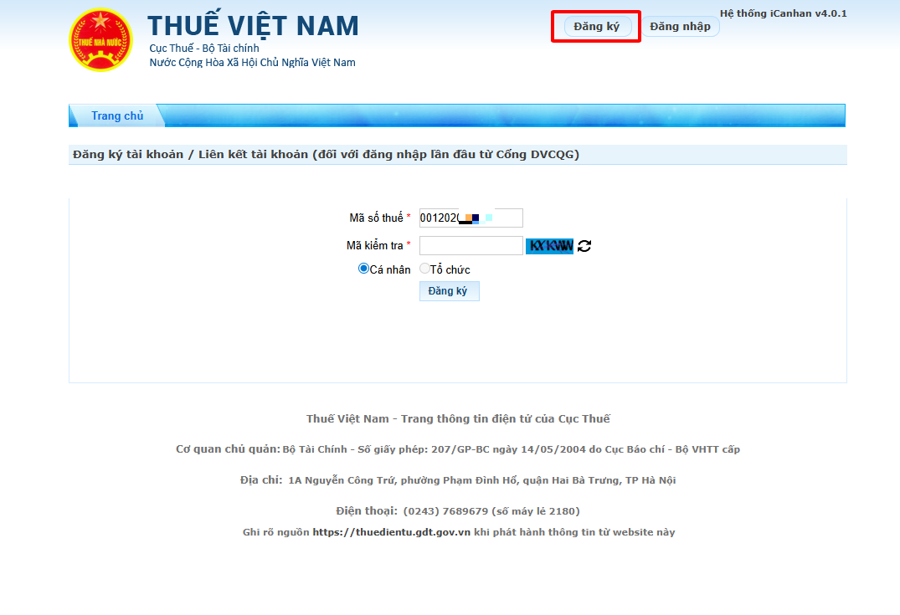
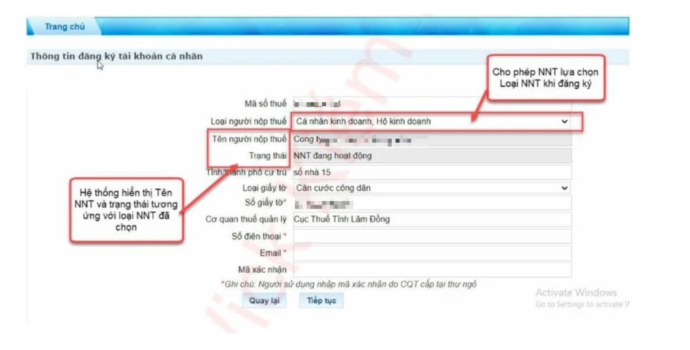
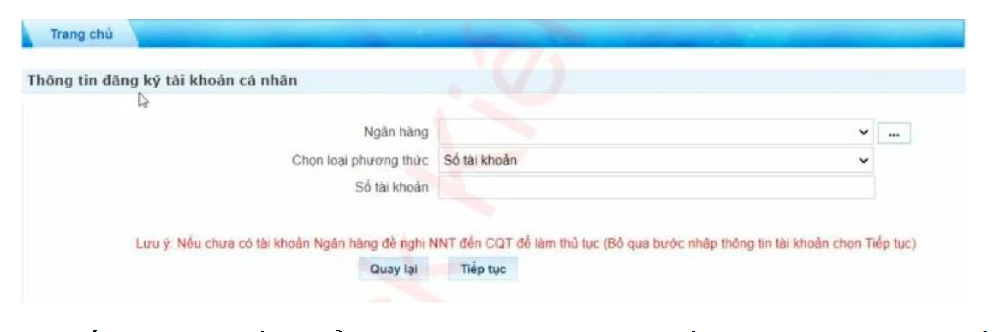
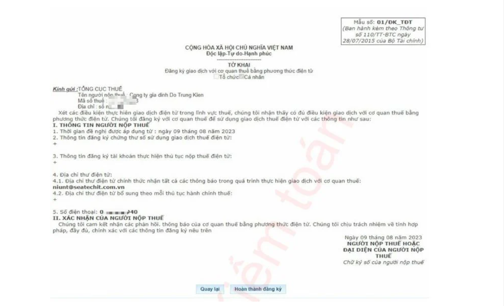

# **Hướng dẫn đăng ký tạo tài khoản giao dịch thuế điện tử cho hộ kinh doanh**

???+ Note "Mục đích"

    Bài viết dưới đây hướng dẫn đăng ký tạo tài khoản giao dịch thuế điện tử dành cho hộ kinh doanh qua Cổng Thuế điện tử.

    Hướng dẫn đăng ký tạo tài khoản giao dịch thuế điện tử cho hộ kinh doanh
    Hướng dẫn đăng ký tạo tài khoản giao dịch thuế điện tử cho hộ kinh doanh qua Cổng Thuế điện tử phân hệ “CÁ NHÂN”.

### **Bước 1: Truy cập vào Cổng Thuế điện tử tại đỉa chỉ: https://canhan.gdt.gov.vn**

### **Bước 2: Người nộp thuế (NNT) nhấp vào Đăng ký**

### **Bước 3: Hệ thống hiển thị màn hình đăng ký tài khoản, NNT nhập các thông tin sau đây:**

- **Mã số thuế**: Nhập mã đúng cấu trúc

- **Mã kiểm tra**: Nhập mã kiểm tra trên màn hình.

### **Bước 4: Chọn Đăng ký, hệ thống hiển thị màn hình thông tin đăng ký tài khoản cá nhân.**

- **Mã số thuế**: Tự động hiển thị MST đã nhập ở bước trước.

- **Loại người nộp thuế**: Mặc định hiển thị danh mục cho phép NNT bao gồm:

* Cá nhân kinh doanh, hộ kinh doanh

* Cá nhân

- **Tên người nộp thuế**: Hiển thị tên theo loài người nộp thuế đã chọn, không cho sửa.

- **Tỉnh/thành phố cư trú**: Tự động hiển thị theo thông tin MST.

- **Loại giấy tờ**: Hiển thị danh mục loại giấy tờ cho phép NNT lựa chọn, bao gồm CCCD/CMND/Hộ chiếu.

- **Số giấy tờ**: Hiển thị số giấy theo loại giấy tờ đã chọn, không cho sửa.

- **Cơ quan thuế quản lý**: Tự động hiển thị theo thông tin MST.

- **Số điện thoại**: Cho phép NNT nhập số điện thoại 10 số

- **Email**: Cho phép NNT nhập email đúng cấu trúc.

- **Mã xác nhận**: Là mã do cơ quan thuế cấp (Trường hợp NNT đăng ký trực tiếp với cơ quan thuế nhưng chưa đủ thông tin thì nhập mã xác nhận)

???+ Warning "Lưu ý"

    Hệ thống kiểm tra trùng số điện thoại trên hệ thống trừ trạng thái đã ngừng sử dụng dịch vụ. Trường hợp nhập trùng số điện thoại đã tồn tại trên hệ thống thì hiển thị thông báo Số điện thoại đã được sử dụng và không cho phép NNT thực hiện bước tiếp theo.

### **Bước 5: Chọn Tiếp tục, hệ thống hiển thị màn hình liên kết tài khoản ngân hàng, NNT nhập thông tin ngân hàng, loại phương thức và số tài khoản ngân hàng,**

### **Bước 6: Chọn Tiếp tục, hệ thống kiểm tra thông tin đã nhập. Nếu không hợp lệ, hệ thống hiển thị thông báo lỗi. Nếu hợp lệ, hiển thị màn hình đăng ký mẫu 01/ĐK-TĐT.**

### **Bước 7: NNT nhấn Hoàn thành đăng ký, hệ thống hiển thị thông báo Bạn đã đăng ký tài khoản thành công. Hệ thống gửi thông tin tài khoản, mật khẩu về số điện thoại và email cho NNT.**

???+ info "Xin chân thành cảm ơn quý khách hàng đã tin dùng sản phẩm của M-Invoice"

    Có bất kỳ vướng mắc nào trong quá trình sử dụng hãy liên hệ với M-Invoice tại mục Hỗ trợ kỹ thuật góc phải bên dưới màn hình hoặc gọi tổng đài kỹ thuật của M-Invoice (1900.955.557 Nhánh 1)

Last updated on <strong>Dec 04, 2025</strong> by <strong>nhatth</strong>

