---
hide:
  - navigation
---

# **Tài liệu hướng dẫn sử dụng Tool mSupport**

## **THEO DÕI PHIÊN BẢN TÀI LIỆU**

<style>
.version-table {
  border-collapse: collapse;
  width: 100%;
  max-width: 900px;
  margin: 30px auto;
  background-color: #fff;
  box-shadow: 0 3px 10px rgba(0, 0, 0, 0.08);
  border-radius: 5px;
  overflow: hidden;
  font-family: "Segoe UI", Tahoma, sans-serif;
  table-layout: fixed; /* 👈 Giữ cố định độ rộng cột */
}

.version-table th,
.version-table td {
  padding: 10px 16px;
  border-bottom: 1px solid #e9edf3;
  color: #333;
  font-size: 14px;
  word-wrap: break-word; /* 👈 Tự xuống dòng khi quá dài */
}

.version-table th {
  background-color: #0078d7;
  color: #fff;
  text-align: left;
  padding: 12px 16px;
  font-size: 15px;
}

.version-table tr:last-child td {
  border-bottom: none;
}

.version-table tr:hover {
  background-color: #f6f9ff;
}

.version-caption {
  text-align: center;
  font-size: 18px;
  font-weight: 600;
  margin-bottom: 10px;
  color: #333;
}

/* 👇 Đặt độ rộng cụ thể cho từng cột */
.version-table th:nth-child(1),
.version-table td:nth-child(1) {
  width: 5%;
  text-align: center;
}

.version-table th:nth-child(2),
.version-table td:nth-child(2) {
  width: 20%;
}

.version-table th:nth-child(3),
.version-table td:nth-child(3) {
  width: 10%;
  text-align: center;
}

.version-table th:nth-child(4),
.version-table td:nth-child(4) {
  width: 15%;
  text-align: center;
}

.version-table th:nth-child(5),
.version-table td:nth-child(5) {
  width: 20%;
}

.version-table th:nth-child(6),
.version-table td:nth-child(6) {
  width: 30%;
}
</style>

<table class="version-table">
  <thead>
    <tr>
      <th>No</th>
      <th>Author</th>
      <th>Phiên bản</th>
      <th>Date</th>
      <th>Info</th>
      <th>Task</th>
    </tr>
  </thead>
  <tbody>
    <tr>
      <td>1</td>
      <td>Trịnh Hoài Nhất</td>
      <td>v1.0.0</td>
      <td>01/10/2025</td>
      <td>Create New</td>
      <td></td>
    </tr>
     <tr>
      <td>2</td>
      <td>Trịnh Hoài Nhất</td>
      <td>v1.0.1</td>
      <td>23/10/2025</td>
      <td>Edit</td>
      <td>Thêm KEY CACHE cần xóa khi xảy ra lỗi "Can't upload invoice because the system deleting or updating invoice" khi đẩy hóa đơn lên từ tích hợp</td>
    </tr>
     <tr>
      <td>3</td>
      <td>Trịnh Hoài Nhất</td>
      <td>v1.0.2</td>
      <td>04/11/2025</td>
      <td>Edit</td>
      <td>Thêm cách xóa CACHE KEY của mẫu hóa đơn</td>
    </tr>
     <tr>
      <td>4</td>
      <td>Trịnh Hoài Nhất</td>
      <td>v1.0.3</td>
      <td>03/01/2026</td>
      <td>Edit</td>
      <td>Thêm cách xóa CACHE email</td>
    </tr>
     <tr>
      <td>5</td>
      <td>Trịnh Hoài Nhất</td>
      <td>v1.0.4</td>
      <td>12/01/2026</td>
      <td>Edit</td>
      <td>Thêm key cố định (cache giao diện)</td>
    </tr>
  </tbody>
</table>

## **A. TỔNG QUAN**

### **1. Mục đích**

**Công cụ mSupport được phát triển nhằm hỗ trợ đội ngũ kỹ thuật trong quá trình làm việc, giúp:**

- Nâng cao hiệu quả xử lý các nghiệp vụ thường gặp.

- Đơn giản hóa các thao tác trước đây còn phụ thuộc vào phòng kỹ thuật HO.

- Rút ngắn thời gian hỗ trợ khách hàng và giảm thiểu sai sót trong quá trình xử lý.

- Tạo môi trường làm việc chuyên nghiệp và thống nhất trong toàn bộ đội ngũ kỹ thuật.

### **2. Đối tượng sử dụng**

- Nhân viên kỹ thuật HO và kỹ thuật chi nhánh

- Các bộ phận hỗ trợ liên quan (nếu được cấp tài khoản) – phối hợp cùng phòng kỹ thuật để xử lý sự cố nhanh chóng.

### **3. Thông tin truy cập**

- Đường link đăng nhập: https://msupport.minvoice.com.vn/

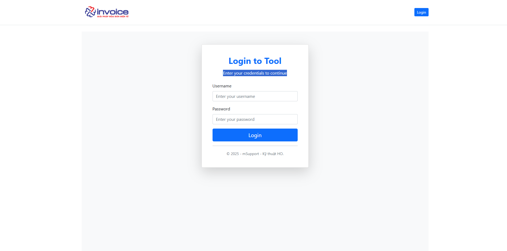

- Điền thông tin đăng nhập đã được cung cấp

## **B. HƯỚNG DẪN THAO TÁC CÁC CHỨC NĂNG TRÊN PHẦN MỀM**

!!! warning "Lưu ý"

    Mọi tác tác trên tool này đều **ảnh hưởng trực tiếp** đến dữ liệu **khách hàng** lên phải cẩn trọng trong mọi thao tác

    MỌI THAO TÁC ĐỀU LƯU LOG !

### **Mẫu hóa đơn**

???+ note "Mục đích"

    - Áp dụng cho các trường hợp mẫu hóa đơn bị mất, cần **upload** lại lên phần mềm

    - **Dowload file** về để chỉnh sửa mẫu cho các trường hợp không thể chỉnh sửa trực tiếp trên phần mềm

#### **1. Dowload mẫu**

Nhập key mẫu cần tải vào ô nhập và bấm **Dowload**

- **Key** được định dạng như sau: [ký hiệu hóa đơn]\_[mã số thuế].html

- VD: 1C25TTT_0106026495-999.html

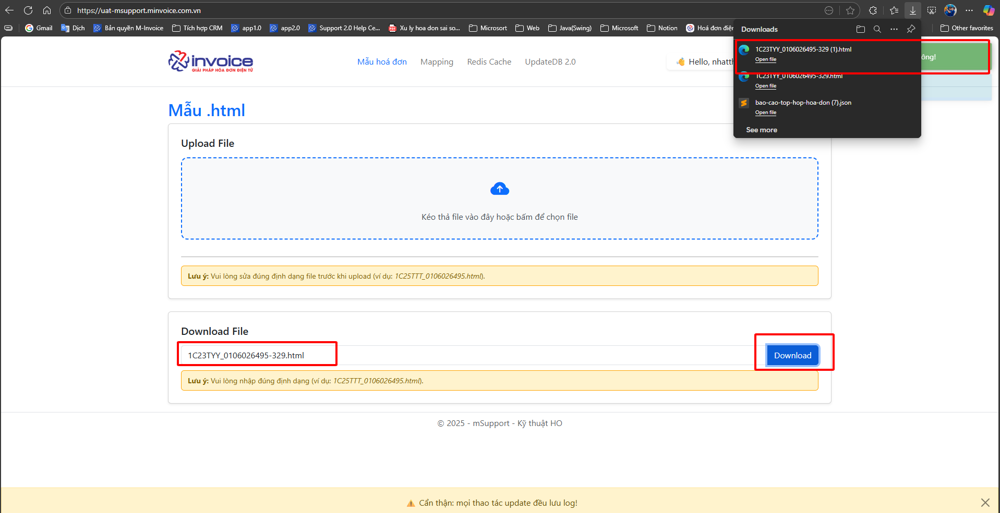

#### **2. Upload mẫu**

Chuẩn bị file cần **upload** lên tên file phải là `.html` và định dạng theo cấu trúc sau:

- Tên file: `[ký hiệu hóa đơn]\_[mã số thuế].html`

- VD: `1C25TTT_0106026495-999.html`

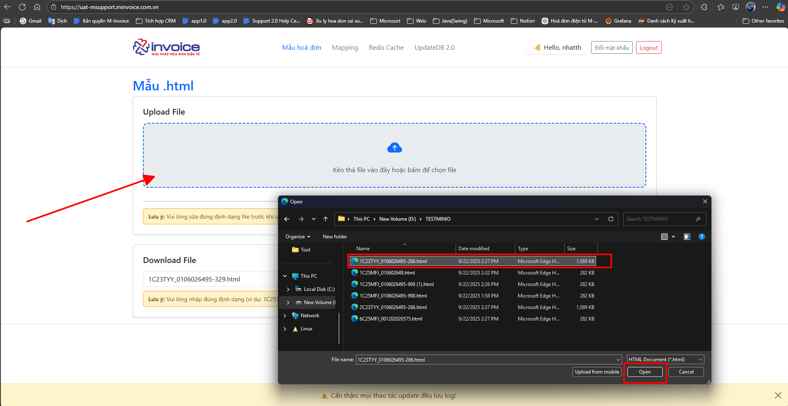

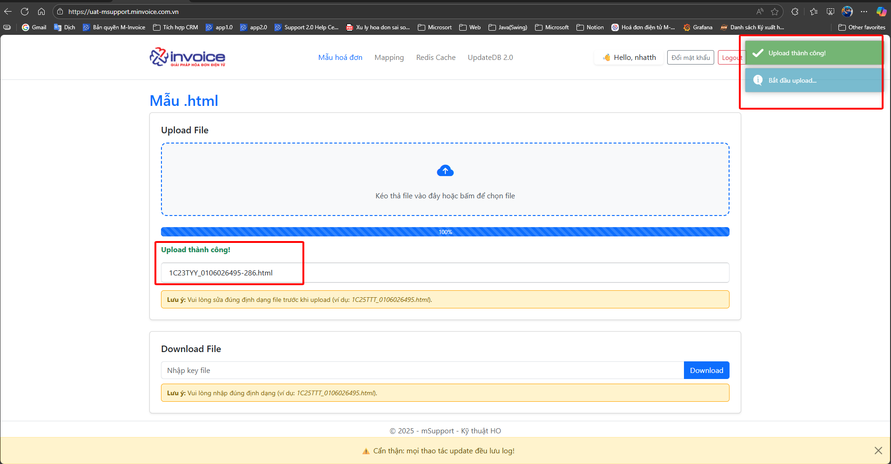

### **File Setting**

???+ note "Mục đích"

    **Áp dụng cho các trường hợp cần chỉnh sửa các file liên quan đến cấu hình của 1 mã số thuế, ví dụ như:**

    + Chỉnh sửa **file mapping** (liên quan đến các trường thông tin tích hợp để có thể đẩy từ tích hợp sang)

    + Chỉnh sửa thể hiện các trường đặc thù lên **báo cáo tổng hợp** hoặc **báo cáo chi tiết**

    + Chỉnh sửa file **cấu hình giao diện** hóa đơn

**Tên file mapping:**

- Hóa đơn giá trị gia tăng: `32_1_MappingAccounting.json`

- Hóa đơn bán hàng: `32_2_MappingAccounting.json`

- Phiếu xuất kho nội bộ: `32_6_MappingAccounting.json`

**Tên file báo cáo tổng hợp:** `bao-cao-top-hop-hoa-don.json`

**Tên file báo cáo chi tiết:** `bao-cao-chi-tiet-hoa-don.json`

**Tên file cấu hình giao diện hóa đơn đầu ra::**

- Hóa đơn giá trị gia tăng: `INVOICE_1CT.json`

- Hóa đơn giá trị gia tăng máy tính tiền: `INVOICE_1CM.json`

- Hóa đơn giá trị gia tăng máy tính tiền xăng dầu: `INVOICE_PETRO_1CM.json`

#### **Các bước thực hiện để dowload và upload file cấu hình 1 mã số thuế**

Truy cập tab **FileSetting** -> Nhập **mã số thuế** muốn chỉnh sửa -> Bấm **xem file**

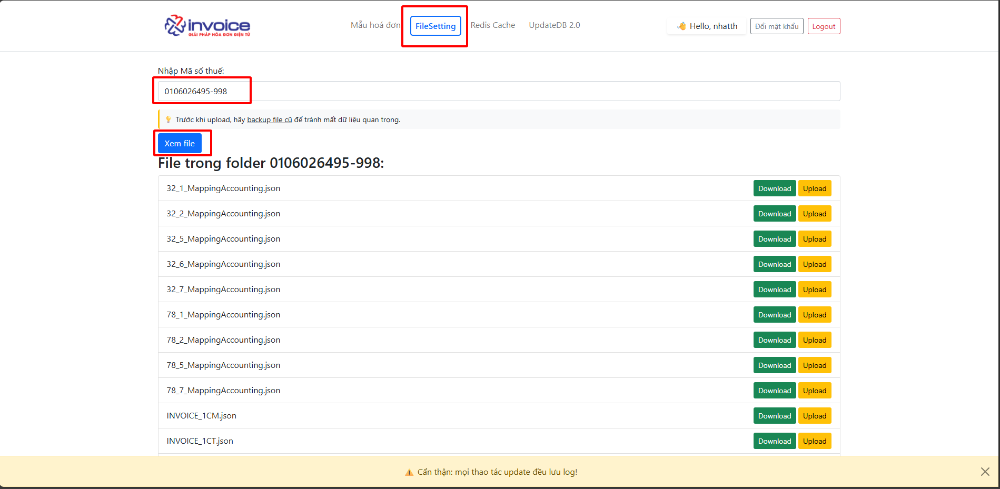

**Dowload và upload file**

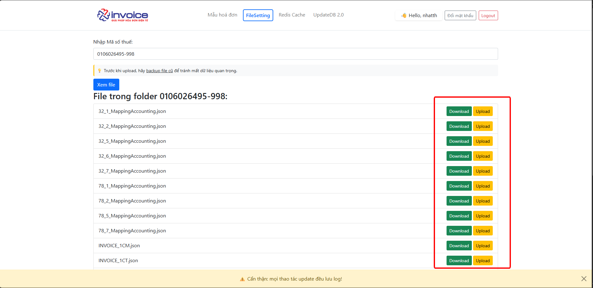

### **Xóa Cache**

???+ note "Mục đích"

    **Áp dụng cho các trường hợp ký hóa đơn lỗi F5 hay đẩy hóa đơn trùng key_api và 1 số case cần xóa cache**

#### **1. Xóa key cố định**

#### **A. Sign Cache**

- Cache ký của hóa đơn -> áp dụng cho các trường hợp **ký lỗi** do lưu cache (Vd: HÓA ĐƠN KỸ LỖI VUI LÒNG F5 TẢI LẠI TRANG, ...)

**Các bước để lấy và xóa được cache ký:**

1. Điền thông tin **mã số thuế**, **ký hiệu** hóa đơn và **số hóa đơn**

2. Bấm **lấy cache key** -> có thông báo thành công -> ra 3 thông tin **TenantID(ID của MST), InvoiceID(ID hóa đơn), Cache key** -> **Thành công**

3. Bấm xóa cache cố định

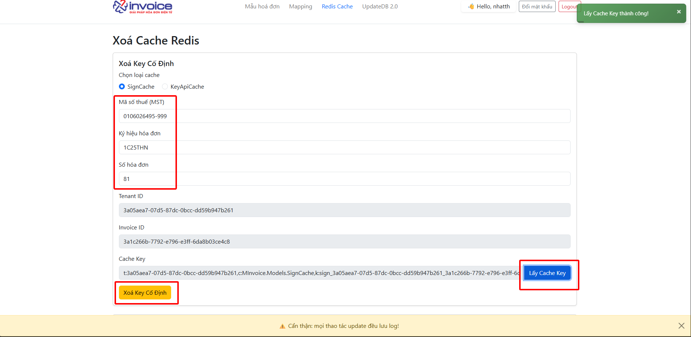

#### **B. Key_api Cache**

- Cache của key_api -> áp dụng cho các trường hợp đẩy hóa đơn từ bên tích hợp mà xảy ra lỗi **trùng key tích hợp** nhưng hóa đơn chưa có trên phần mềm hóa đơn

**Các bước để lấy và xóa được cache key_api:**

1. Điền thông tin mã số thuế, ký hiệu hóa đơn và **key_api**(được cung cấp từ đối tác tích hợp)

2. Bấm **lấy KeyApiCache** -> có thông báo thành công -> ra 3 thông tin **TenantID(ID của MST), RegisterInvoiceId(Id của ký hiệu), Cache Key_Api** -> **Thành công**

3. Bấm xóa cache cố định

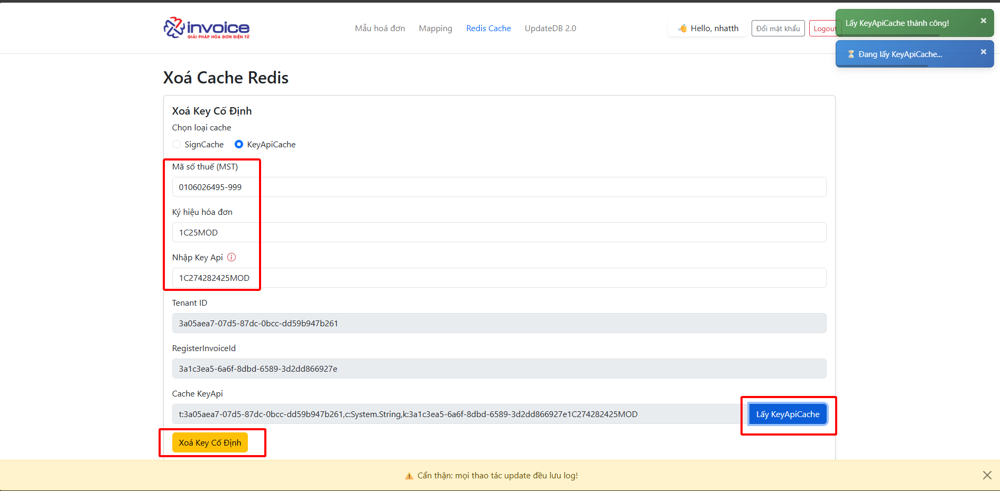

#### **C. Cache giao diện**

- Cache của giao diện -> áp dụng cho các trường hợp chỉnh sủa file map giao diện INVOICE_***.json muốn hiện theo ý của khách

**Các bước để lấy và xóa được cache key_api:**

1. Điền thông tin mã số thuế

2. Chọn loại hóa đơn tương ứng vì file giao diện sẽ phân biệt theo loại hóa đơn

3. Bấm **lấy key giao diện** -> có thông báo thành công -> ra thông tin **Cache giao diện** -> **Thành công**

4. Bấm xóa cache cố định

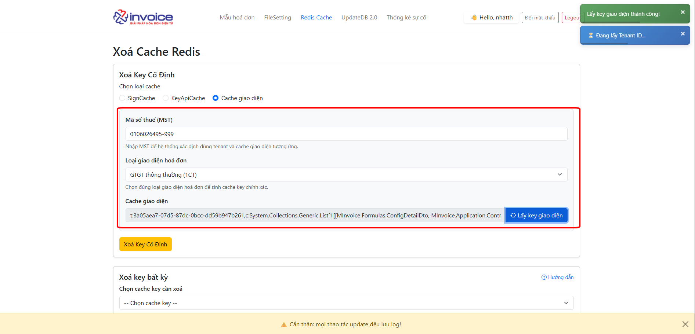

#### **2. Xóa key bất kỳ**

???+ note "Mục đích"

    **Áp dụng cho các trường hợp cần xóa những cache ít gặp như mapping (32_1_MappingAccounting.json) hay file giao diện (INVOICE_1CT.json), ...**

**Cấu trúc các key cache:**

??? abstract "Cấu trúc key mapping"

    #### Cấu trúc key mapping

    - Mapping: **32_1_MappingAccounting.json** --> Cấu trúc key:

    [Taxcode]: Mã số thuế

    ```text title="Cấu trúc key mapping"
    c:System.String,k:filemapping_32_1_mappingaccounting.json_[Taxcode]
    ```

??? abstract "Cấu trúc key cấu hình giao diện"

    #### Cấu trúc key cấu hình giao diện

    - File cấu hình giao diện: **INVOICE_1CT.json** --> Cấu trúc key:

    [tenantID]: ID của Mã số thuế.

    ```text title="Cấu trúc file giao diện"
    t:[tenantID],c:System.Collections.Generic.List`1[[MInvoice.Formulas.ConfigDetailDto, MInvoice.Application.Contracts, Version=1.0.0.0, Culture=neutral, PublicKeyToken=null]],k:[tenantID]_INVOICE_1CT.json
    ```

    VD: t:3a0d9f98-58d6-1846-925d-4975252e09d1,c:System.Collections.Generic.List`1[[MInvoice.Formulas.ConfigDetailDto, MInvoice.Application.Contracts, Version=1.0.0.0, Culture=neutral, PublicKeyToken=null]],k:3a0d9f98-58d6-1846-925d-4975252e09d1_INVOICE_1CT.json

    --> Chỗ **INVOICE_1CT.json** đổi sang **INVOICE_1CM.json** nếu là hóa đơn máy tính tiền.

    ??? Question "Cách để lấy tenantID"

        Chuột phải và mở inspect trên trình duyệt hoặc bấm  phím tắt F12:
        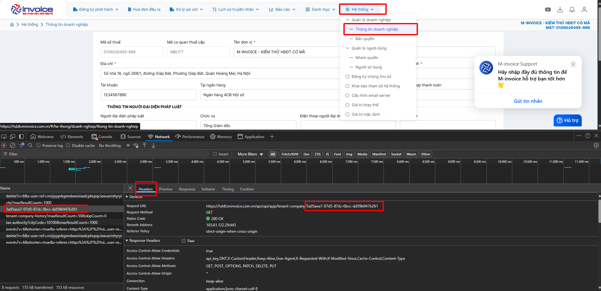

??? abstract "Cấu trúc key cần xóa khi gặp lỗi 'Can't upload invoice because the system deleting or updating invoice'"

    #### Cấu trúc key cần xóa khi gặp lỗi 'Can't upload invoice because the system deleting or updating invoice'

    [tenantID]: ID của Mã số thuế.

    [InvoiceSeri]: Ký hiệu hóa đơn đang đẩy lên từ tích hợp

    ```text title="Key cache"
    t:[tenantID],c:MInvoice.Models.SignServiceCache,k:updateinvoice_[InvoiceSeri]
    ```
    VD: t:3a09a3f6-753a-c20f-3e6e-5163edf94b93,c:MInvoice.Models.SignServiceCache,k:updateinvoice_1C25MYY

    ??? Question "Cách để lấy tenantID"

        Chuột phải và mở inspect trên trình duyệt hoặc bấm  phím tắt F12:
        

??? abstract "Cấu trúc cache mẫu"

    #### Cấu trúc cache mẫu

    **Mục đích**: Khi upload 1 mẫu mới thay thế mẫu hiện tại cần phải xóa cache để update mới

    [tenantID]: ID của Mã số thuế.

    [InvoiceSerial]: Ký hiệu tương ứng với mẫu

    ```text title="Cấu trúc key mapping"
    eInvoice20:[tenantID]:InvoiceTemplate:[InvoiceSerial]
    ```
    VD: eInvoice20:3a05aea7-07d5-87dc-0bcc-dd59b947b261:InvoiceTemplate:1C25TYY

    ??? Question "Cách để lấy tenantID"

        Chuột phải và mở inspect trên trình duyệt hoặc bấm  phím tắt F12:
        

??? abstract "Cấu trúc cache email"

    #### Cấu trúc cache email

    **Mục đích**: Khi bạn chỉnh sửa mẫu email trong DANH MỤC -> MẪU EMAIL cần phải xóa cache mới được update

    [tenantID]: ID của Mã số thuế.

    [TaxCode]: Mã số thuế

    ```text title="Cấu trúc key email"
    eInvoice20:[tenantID]:EmailSendInvoiceReleaseTemplate:[TaxCode]
    ```
    VD: eInvoice20:3a0863e7-f579-11f8-48bf-5c6ed5a37ac7:EmailSendInvoiceReleaseTemplate:2301210029

    ??? Question "Cách để lấy tenantID"

        Chuột phải và mở inspect trên trình duyệt hoặc bấm  phím tắt F12:
        

---> Và một số cache khác, ... **[đang cập nhật]**

### **Update 2.0**

#### **UD01. Update thành công với hóa đơn thường**

???+ note "Mục đích của UD01"

    Sử dụng cho loại hóa đơn có mã đã có trạng thái thành công trên CQT nhưng trên phần mềm hiện thị trạng thái **"Có lỗi"**. Chức năng này sẽ cập nhật mã CQT của hóa đơn ấy vào và đồng thời chuyển trạng thái của hóa đơn về **"Thành công"**

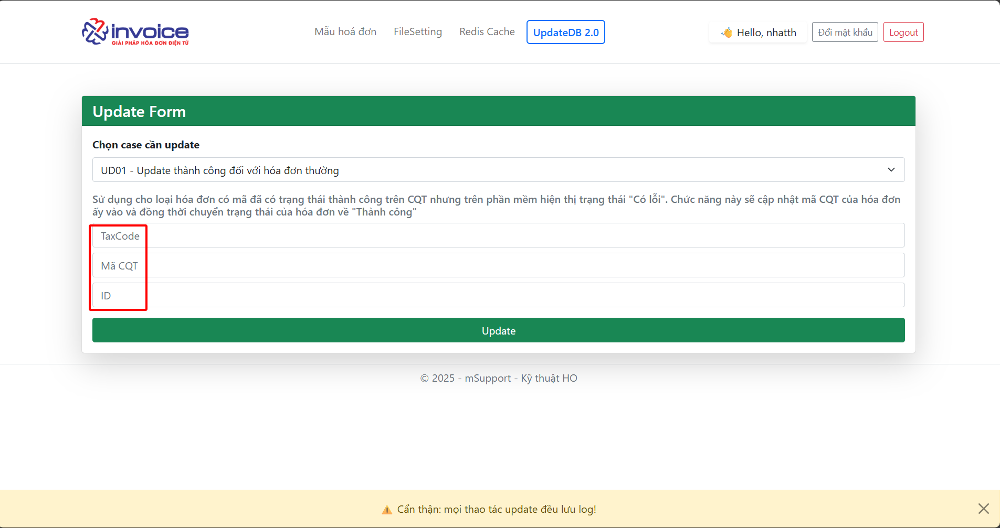

???+ info "Các trường liên quan"

    1. `Taxcode`: Mã số thuế người bán
    2. `Mã CQT`: Mã cơ quan thuế cấp (được lấy từ thông điệp thành công trên TVAN)
    3. `ID`: ID của hóa đơn

    ??? Question "Cách để lấy ID hóa đơn"

        Chuột phải và mở inspect trên trình duyệt hoặc bấm  phím tắt F12:
        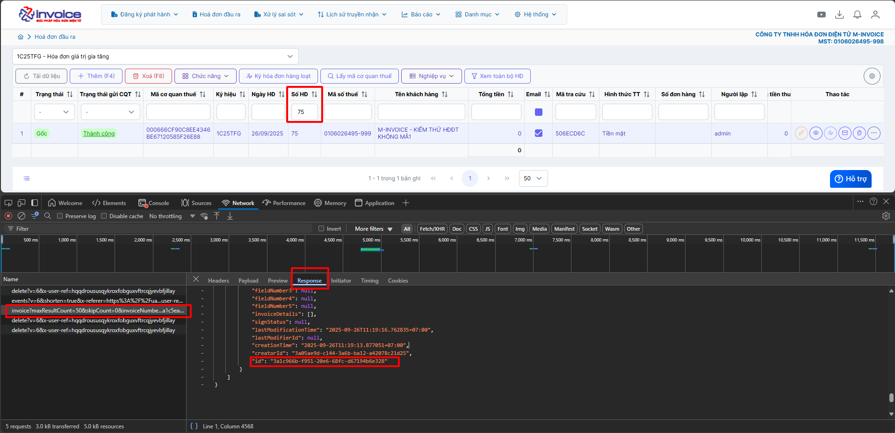

#### **UD02. Update thành công với hóa đơn MTT**

???+ note "Mục đích của UD02"

    Sử dụng cho loại hóa đơn có mã khởi tạo từ MTT đã có trạng thái thành công trên CQT nhưng trên phần mềm hiện thị trạng thái **"Có lỗi"**. Chức năng này sẽ cập nhật trạng thái của hóa đơn ấy về **"Thành công"**.

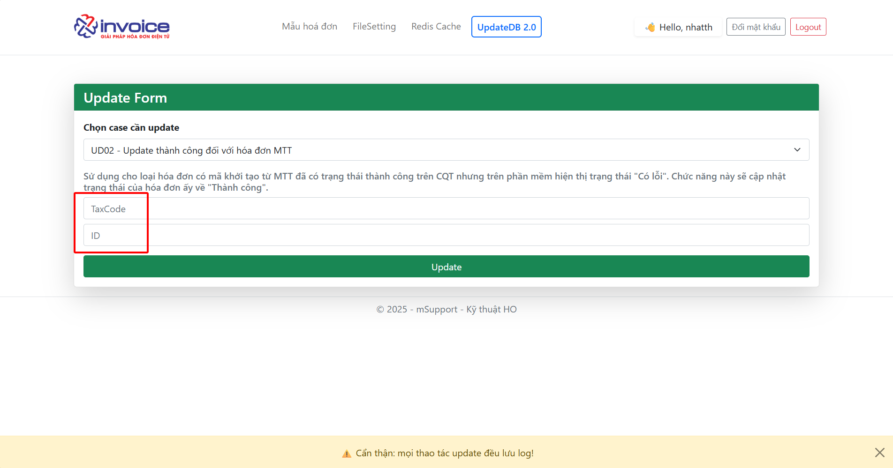

???+ info "Các trường liên quan"

    1. `Taxcode`: Mã số thuế người bán
    2. `ID`: ID của hóa đơn

    ??? Question "Cách để lấy ID hóa đơn"

        Chuột phải và mở inspect trên trình duyệt hoặc bấm  phím tắt F12:
        

#### **UD03. Update hóa đơn để khi ký về trạng thái "Có lỗi"**

???+ note "Mục đích của UD03"

    Sử dụng cho các hóa đơn ở trạng thái **"Chờ ký"** đã quá thời gian ký hợp lệ, khách hàng muốn sau khi ký thì chuyển về trạng thái **"Có lỗi"**.

    - Luồng update: chèn 1 ký tự đặc biệt vào mã số thuế người mua và người bán ký CQT sẽ trả về trạng thái **có lỗi**

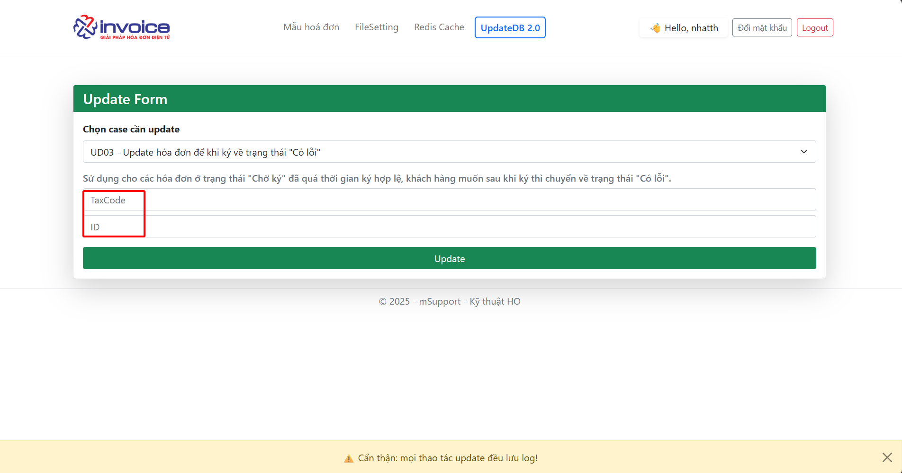

???+ info "Các trường liên quan"

    1. `Taxcode`: Mã số thuế người bán
    2. `ID`: ID của hóa đơn

    ??? Question "Cách để lấy ID hóa đơn"

        Chuột phải và mở inspect trên trình duyệt hoặc bấm  phím tắt F12:
        

#### **UD04. Update hóa đơn về trạng thái "Có lỗi"**

???+ note "Mục đích của UD04"

    Chức năng này cho phép người dùng cập nhật trạng thái của một hóa đơn cụ thể về trạng thái "Có lỗi".

    - Luồng update: thay đổi trạng thái **chờ ký** về **có lỗi** luôn không cần ký (khuyến nghị: chỉ khi hệ thống lỗi, không phải do khách yêu cầu thì làm cách này, VD: lủng số hóa đơn do phần mềm)

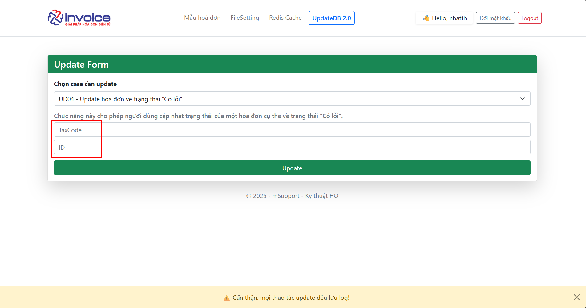

???+ info "Các trường liên quan"

    1. `Taxcode`: Mã số thuế người bán
    2. `ID`: ID của hóa đơn

    ??? Question "Cách để lấy ID hóa đơn"

        Chuột phải và mở inspect trên trình duyệt hoặc bấm  phím tắt F12:
        

#### **UD05. Lấp lủng số hóa đơn**

???+ note "Mục đích của UD05"

    Chức năng này được dùng để lấp lủng số hóa đơn khi số hóa đơn trong một ký hiệu không liên tục. Kỹ thuật sẽ tạo ra một hóa đơn chờ ký và điền các thông tin cần thiết phía dưới để cập nhật vào vị trí bị khuyết số.

    VD: Ở ký hiệu 1C25TYY có số hóa đơn 8 bị lủng số -> Tạo ra 1 ký hiệu mới là 1C25TAA thêm 1 hóa đơn chờ ký và update hóa đơn này vào số bị lủng kia

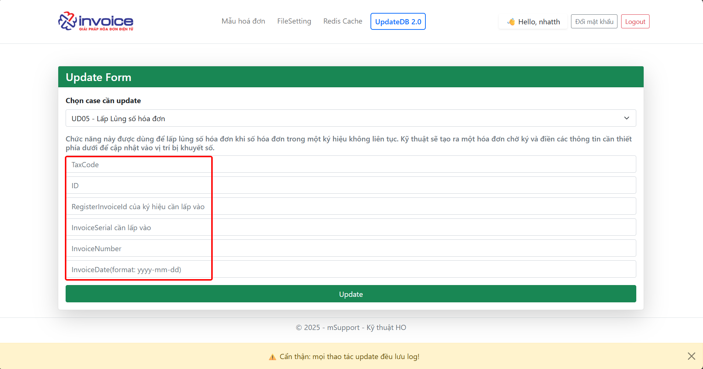

???+ info "Các trường liên quan"

    1. `Taxcode`: Mã số thuế người bán
    2. `ID`: ID của hóa đơn mới tạo ở ký hiệu mới để lấp vào số bị lủng
    3. `RegisterInvoiceId`: id ký hiệu của ký hiệu cần lấp vào
    4. `InvoiceSerial`: ký hiệu cần lấp vào
    5. `InvoiceNumber`: số hóa đơn cần lấp vào
    6. `InvoiceDate`: ngày lập hóa đơn cần lấp vào

    ??? Question "Cách để lấy ID hóa đơn"

        Chuột phải và mở inspect trên trình duyệt hoặc bấm  phím tắt F12:
        

    ??? Question "Cách để lấy RegisterInvoiceId"

        Chuột phải và mở inspect trên trình duyệt hoặc bấm  phím tắt F12:
        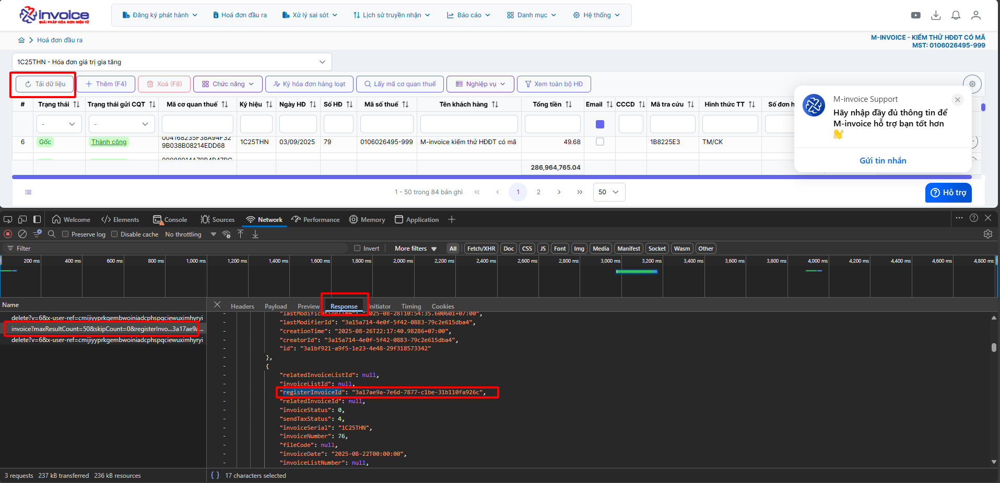

#### **UD06. Update giờ ký**

???+ note "Mục đích của UD06"

    Sử dụng cho các hóa đơn ở trạng thái **"Thành công"** nhưng ngày giờ ký hóa đơn lại bị trống.

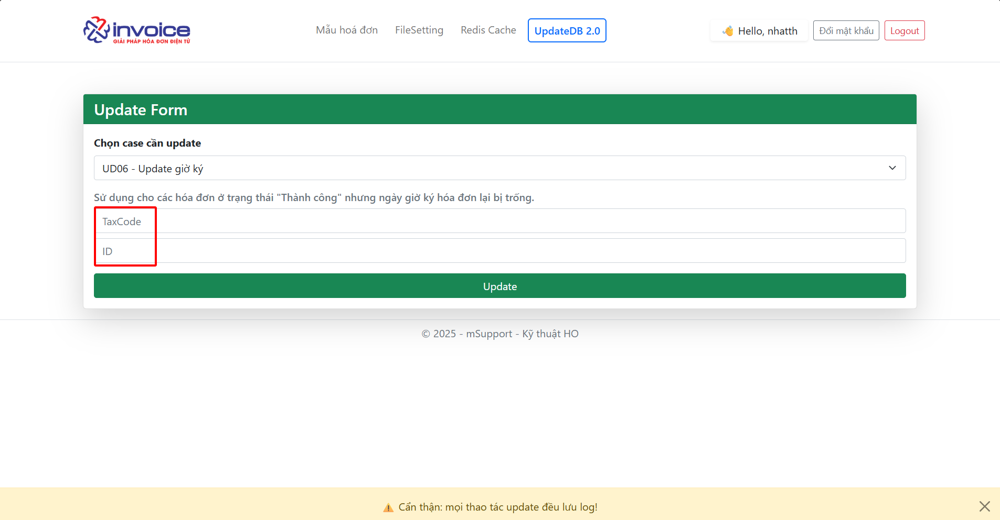

???+ info "Các trường liên quan"

    1. `Taxcode`: Mã số thuế người bán
    2. `ID`: ID của hóa đơn

    ??? Question "Cách để lấy ID hóa đơn"

        Chuột phải và mở inspect trên trình duyệt hoặc bấm  phím tắt F12:
        

#### **UD07. Update mã cơ quan thuế của một hóa đơn cụ thể**

???+ note "Mục đích của UD07"

    Chức năng này cho phép người dùng cập nhật lại mã cơ quan thuế của 1 hóa đơn cụ thể thành mã mà người dùng mong muốn.

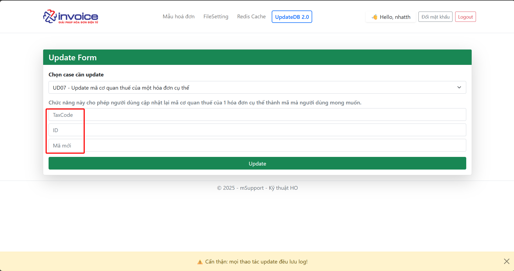

???+ info "Các trường liên quan"

    1. `Taxcode`: Mã số thuế người bán
    2. `ID`: ID của hóa đơn
    3. `Mã mới`: Mã cơ quan thuế mà người dùng cấn cập nhật

    ??? Question "Cách để lấy ID hóa đơn"

        Chuột phải và mở inspect trên trình duyệt hoặc bấm  phím tắt F12:
        

#### **UD08. Update trạng thái tờ khai 70**

???+ note "Mục đích của UD08"

    Chức năng này cho phép người dùng cập nhật lại trạng thái CQT của tờ khai nghị định 70. Dùng trong các trường hợp như CQT đã trả **"Không chấp nhận"** hoặc **"Không tiếp nhận"** nhưng phần mềm vẫn hiển thị **"Tiếp nhận"**.

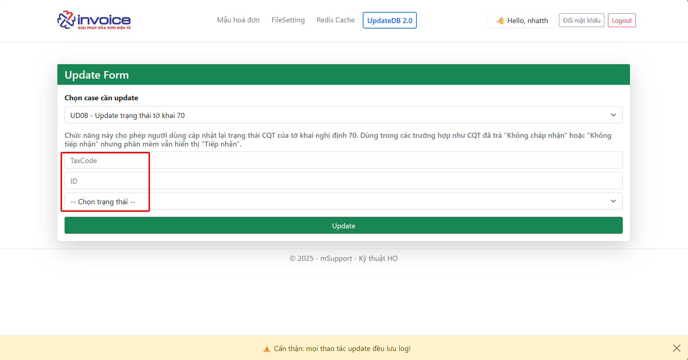

???+ info "Các trường liên quan"

    1. `Taxcode`: Mã số thuế người bán
    2. `ID`: ID của tờ khai
    3. `Chọn trạng thái`: trạng thái của tờ khai

    ??? Question "Cách để lấy ID tờ khai"

        Chuột phải và mở inspect trên trình duyệt hoặc bấm  phím tắt F12:
        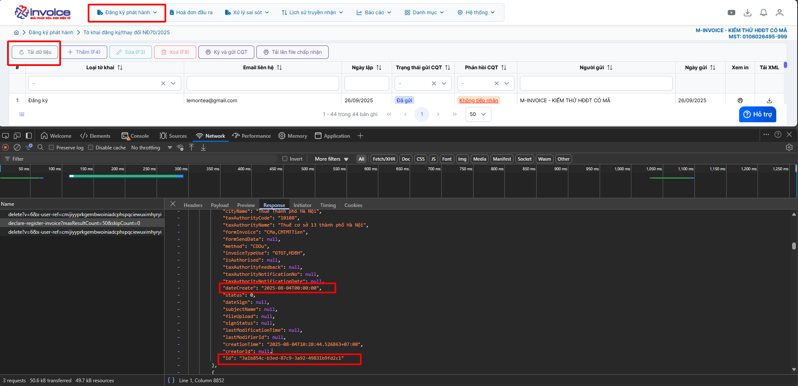
        Lưu ý: cách này sẽ lấy ra tất cả các tờ khai của mst đó, lên người dùng cần lọc ra những tờ khai lập theo dateCreate để lấy đúng ID của tờ khai đó

#### **UD09. Update trạng thái 1 giao dịch xăng dầu về ban đầu**

???+ note "Mục đích của UD09"

    Chức năng này cho phép người dùng cập nhật lại 1 giao dịch xăng dầu về trạng thái ban đầu để có thể tạo lại được thành hóa đơn. Dùng cho các trường hợp khi tạo hóa đơn từ giao dịch ấy gặp vấn đề và cột **"Trạng thái tạo HĐ"** có giá trị là **"2"** kèm nội dung lỗi tại cột **"Tên lỗi"**.

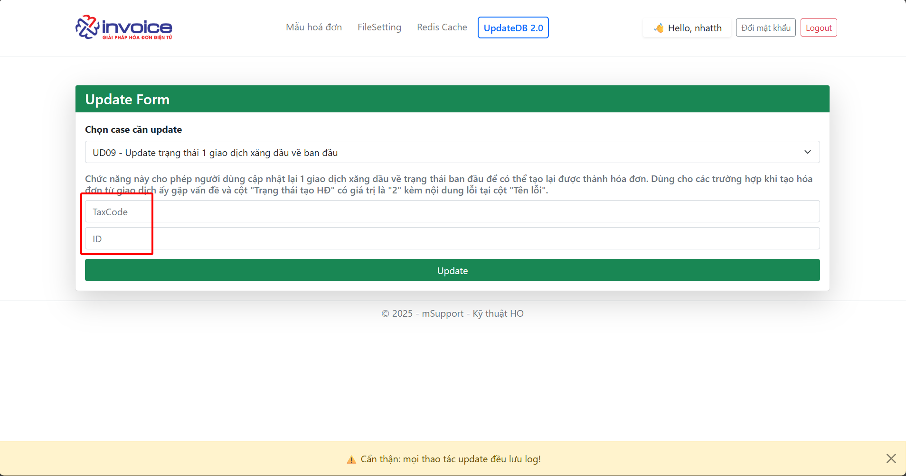

???+ info "Các trường liên quan"

    1. `Taxcode`: Mã số thuế người bán
    2. `ID`: ID của Log xăng dầu

    ??? Question "Cách để lấy ID log xăng dầu"

        Chuột phải và mở inspect trên trình duyệt hoặc bấm  phím tắt F12:
        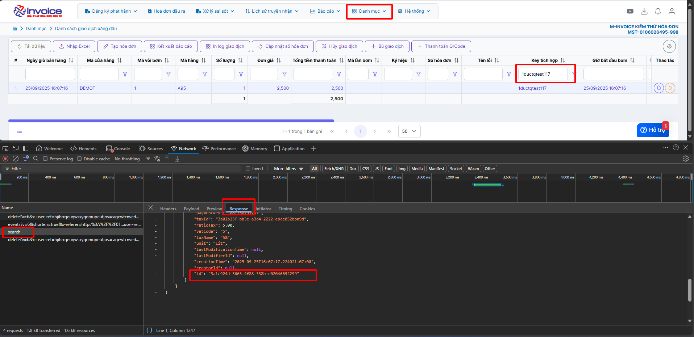
        Truy cập danh mục -> danh sách giao dịch xăng dầu -> kìm kiếm log theo key_api tích hợp theo ảnh trên.

<div class="last-updated">Last updated on <strong>Oct 1 , 2025</strong> by <strong>NHATTH</strong></div>
